# 2018年8月，子連れ座間味で小5の娘とファンダイビング！その14…ダイビング3日目，1本目のダイビング

📅 投稿日時: 2019-09-21 07:08:10

[Yetiのホームページ](https://www.yeti-resort.com/)に，

2020シーズンの情報が出始めましたね～．

シーズン券情報が出るとともに．

11月23日からオールナイト営業開始とか，

シーズン終了は4月5日とかは

出てますが．

今シーズンのオープン日については

「10月下旬」

とだけ書かれていて．

何日にオープンするか，まだ分かりません…（涙）

で．

このページを見て気づいたのですが．

なんと．

Yetiの駐車場料金が，

1000円⇒1200円にアーーーーップ！

そして．

Yetiにアクセスする有料道路も，

510円⇒520円に値上げ！！！！！

…駐車場1200円は痛い…

消費税の増税分をはるかに上回る

値上げとは，想定外…（涙）

ただ，リフト券料金は，昨年から

値上げ無しのようです．

しかし．来シーズンは消費税増税の

どさくさに紛れて，いろんなところが

値上げするだろうなぁ…（泣）

と，ちょっとだけスキーネタをやったら．

今日もダイビング旅行記です～！

-----

ってなことで．

1本目にエントリーしましたが…

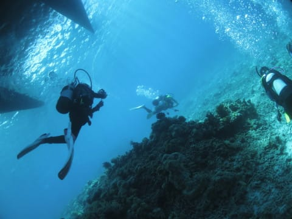

まずは，赤がきれいな

リュウキュウイソバナ．

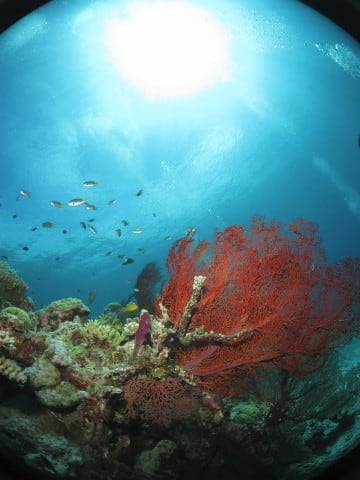

今回も，娘はカメラを

もって潜っているので．

必死に撮影中です…

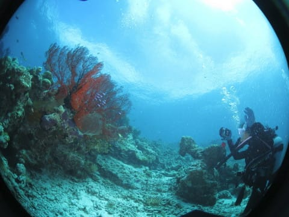

そこから，しばらく

サンゴの上を漂っていくと…

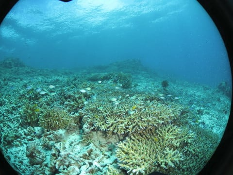

ウミガメさん発見！

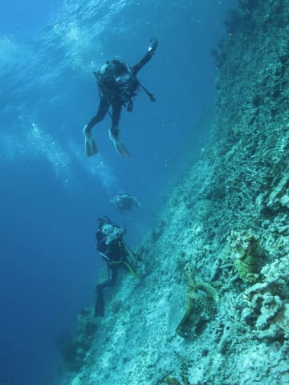

ボートでシュノーケリング

した時に見たカメさんかな…？

と思ったけど．

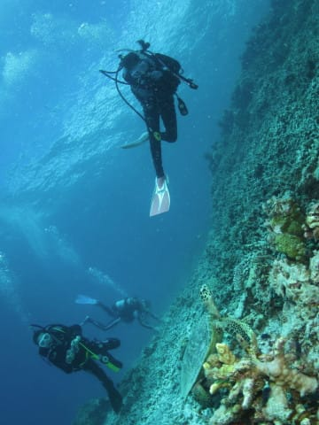

さっきのはアオウミガメ．

こいつはタイマイですね…

娘も必死に撮影してますが．

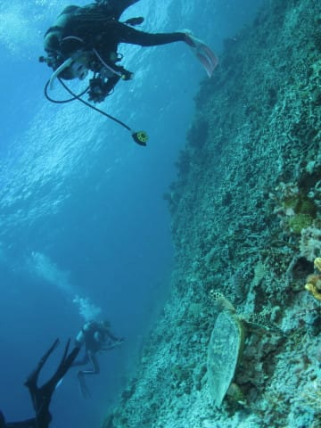

また，みんなに囲まれて居心地が

悪かったからか．

「もう～．なんだよ～」

って感じで，泳ぎ去って

行きました…

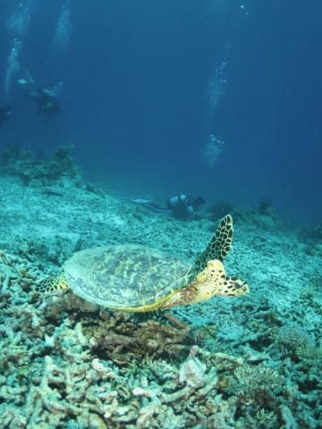

そのあとは，定番のデバスズメダイが

着いているサンゴやら．

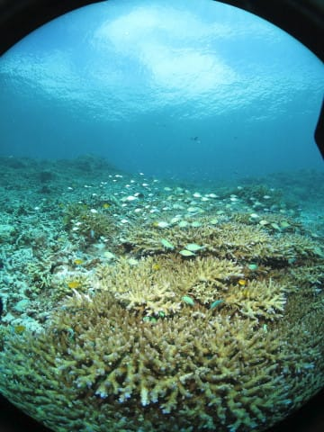

色鮮やかなイソバナが

なんかを眺めつつ．

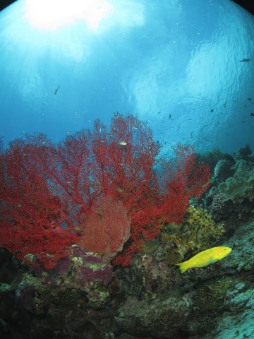

最後，浅瀬のボート下に

戻ってきました…

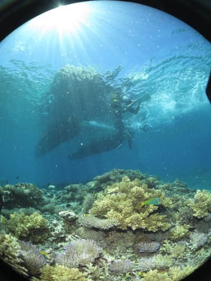

で．

ボート下の，せいぜい

深度4m程度のこの根．

カメラをもった娘が，

なんだかいろいろ嬉しそうに

撮影していますが…

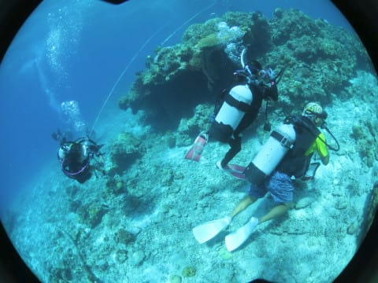

こいつを逆光気味に撮ると．

かなりの写真映え！

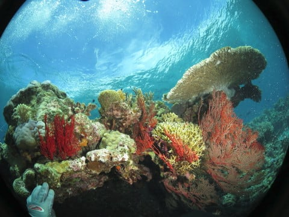

天気も回復したので．

日が射して，きれいな

写真になります！

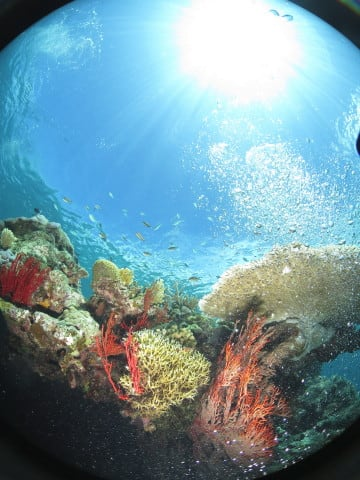

いやー．

海の中に入ったら．

雨が降ってても晴れてても

一緒でしょ…

と思うかもしれませんが．

私のようなワイド写真好きに

とっては，やっぱり晴れていると

いい写真が撮れるので，

ありがたいです…

ってな感じで．

今日の1本目，Exit．

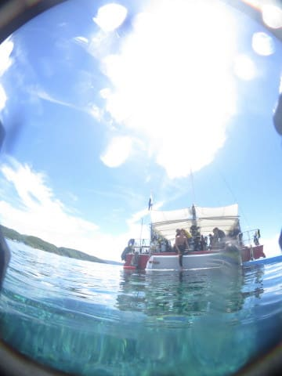

水面に出ると．

もう，朝の雨はどこに行ったのか？

というほどの，すっきり夏の

日差しが，ボートの周りを

照らしてました…

## 💬 コメント一覧

### 💬 コメント by (まいる)
**タイトル**: 衝動買い
**投稿日**: 2019-09-21 21:25:46

ご無沙汰してます。ダイビングのコメントではないのですが、昨年更新したI.MAGNUMがなんど1シーズンで剥離してしまい、消費税云々で考えていたところ2018-19オガサカKS-CXがかなり値下がりしており、ポチッとしてしまいました。

### 💬 コメント by (Skier_S)
**タイトル**: ＞まいるさま
**投稿日**: 2019-09-22 02:05:18

え！？？

1シーズンで剥離ですか！？

買った店にもっていけば，無償交換してくれるかも

しれませんよ…

しかし，もうポチっちゃったのですね(笑)．

