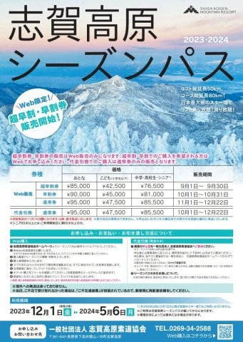
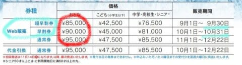
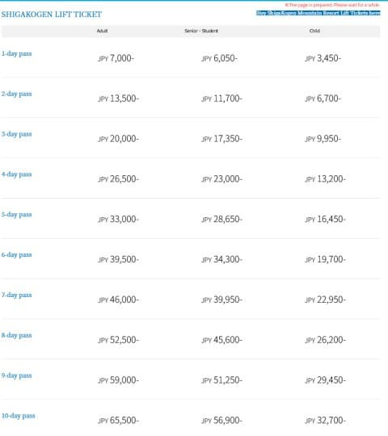
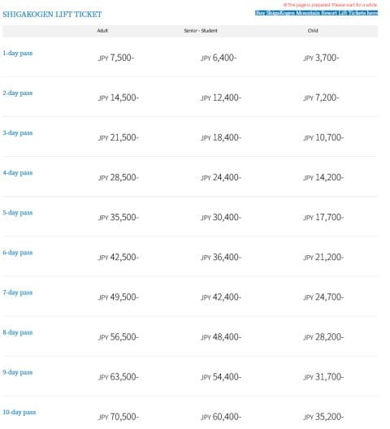
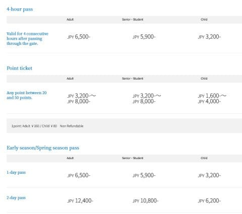
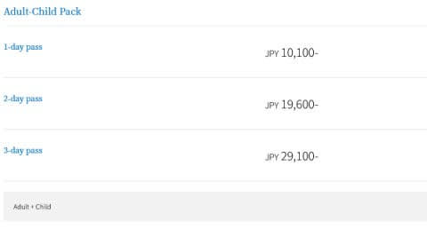

# 今度は2024シーズンの志賀高原スキー場の全山シーズン券＆日数券の情報が出たよ！ついに志賀も早割シーズン券登場！

📅 投稿日時: 2023-09-03 00:55:02

🏷️ カテゴリ: [スキー雑談](c1f9d2cb7478308da16419928ea3945e9.md)

ってなことで．

コメントでも情報をくださった方が

いらっしゃいましたが．

9月1日に，2024シーズンの焼額山の

リフト券情報のほかにも，

志賀高原全山リフト券の情報が出ていたようです～！！

例年なら，10月にならないとリフト券情報が

出てこない志賀高原索道協会ですが．

今シーズンは例年より情報が早いですね～…

ってなことで．

早速志賀高原全山リフト券の情報を見てみると…

まずは全山シーズン券の情報を見ると．

（[志賀高原索道協会ホームページ](https://shigakogen-ski.or.jp/kiji-images/seasonpass.jpg)より）

どうやら．

2024シーズンから，ついに志賀高原でも

早割シーズン券が発売されるようです！！

9月30日までなら超早割で大人85,000円

10月31日までなら早割で大人90,000円

それ以降は通常料金で大人95,000円

のようです…

昨シーズンのシーズン券が大人83,000円だったので，

通常料金だと12,000円と，1割以上の値上げですが．

早割なら2000円アップだけで済みますね…

ただ，超早割・早割はWeb販売しかないようなので，

ご注意を！！

そして．

志賀高原全山共通の日数券ですが…

来シーズンも，Web購入の価格と窓口購入の価格が違います！

こちらがWeb版の価格ですが…

1日券がついに7000円になってしまいました…（泣）

で，そのあとは．

利用可能日数が1日増えるごとに

6500円ずつ増えていく感じですね…

そして．

こちらが窓口価格の価格ですが…

なんと．

1日券が7500円！！！

昨シーズンの6500円から一気に1000円アップ！

昨シーズンも500円値上がりしたのに…

2シーズン連続での値上がりで，1500円上がったよ（激涙）

そして，こちらは利用日数が1日増えるごとに7000円

ずつアップですが…

10日券がついに70,500円と，昔の全山シーズン券の

値段を越えてきましたね…（泣）

（[志賀高原索道協会ホームページ](https://www.shigakogen-ski.or.jp/english/ticket/online.html)より）

あとは，4時間券．

こちらはWeb販売がないようで…

4時間券が大人6500円．

昔の一日券よりずっと高いですね（泣）

あとは，

シーズンイン時と春スキー時の

割引価格が大人1日券6500円のようで．

トップシーズンの4時間券と同じお値段ですね．

シーズンイン＆春スキー割引価格はWeb料金表に

乗ってないので…この割引価格は窓口限定

なのかな？

（[志賀高原索道協会ホームページ](https://www.shigakogen-ski.or.jp/english/ticket/index.html)より）

そして，これまで通り，大人1人，子供1人のリフト券を

買うと親子割引にできます．

大人・子供の2枚のリフト券が

1日なら10,100円，

3日で29,100円と，

こちらはかなりお得な価格

設定ですね…

ってな感じで．

またもや大きく値上がりする，2024シーズンの

志賀高原のリフト料金．

値上がりしたのに，動くリフトが昨シーズンより減る

とか言う悲しいことがないように願うばかり…

特に中央エリア．

ちゃんと毎日圧雪してくれるのか？

ファミリーの第3クワッドが動くのか？

果たして2024シーズンがどんなシーズンになるのか…

とりあえず，いいシーズンになることを願いましょう！！

## 💬 コメント一覧

### 💬 コメント by (アリス)
**タイトル**: 雪降れ降れ
**投稿日**: 2023-09-04 13:56:49

skier_S様

ご無沙汰しております♬

この時期にリフト券販売情報って早いですよね

！

やはり超早割りシーズン券がお得のようなので早速申し込もおうと思っています♬

それより心配は雪が降るかどうかです！

どうか12月中にヤケビロングコースが全面滑走出来るように、Sさんの念力を全力注入お願い申し上げます。

### 💬 コメント by (Skier_S)
**タイトル**: ＞アリスさま
**投稿日**: 2023-09-05 02:09:27

お久しぶりです～！

志賀高原もやっとシーズン券早割を始めてくれてよかった…

この冬の雪の降り始めは心配ですが…

また明日か明後日，長期の天気予想ネタを行く予定です．

