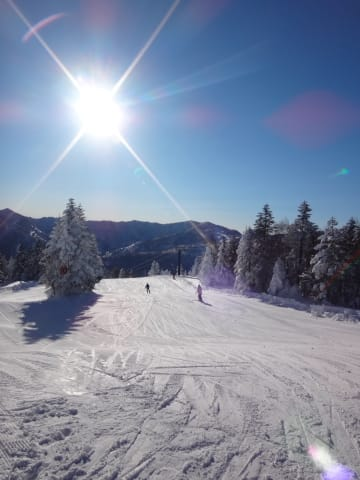
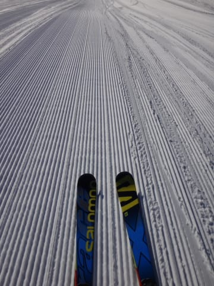

# 12月28日の志賀高原，焼額山は…晴天ピカピカ！絶好のスキー日和だけど…混んだよ（涙）．

📅 投稿日時: 2014-12-28 23:16:14

🏷️ カテゴリ: [2015スキー滑走日記](c09ea645cfc085f86dfcd80f49599dd89.md)

ということで．

ふははは！

今日は予告通り．

最高の天気の一日となったのだ！

8:30スタートの朝イチゴンドラに乗り込んだ時から…

もう，快晴の空が目の前に広がってます！

そして．

山頂の気温はいつもよりちょい高めだけど．

でも，マイナス6度と，そこそこの冷え込みで．

で．

ゲレンデに出ると．

晴天っ！！！

シマシマっ！！！

そして，朝イチはガラガラっ！！！

ニューアイテム，X-Race君で，歓喜の大回りだっ！！

いやー．

天気がいいって，素晴らしい…

…と，思っていたのもつかの間．

いつもより早い，9時40分には…

あう．

なんだ，これは．

ゴンドラ10分待ち…（涙）

その後，ゴンドラ待ちは伸びていき，

最大15分待ちまでのびました…（涙）

当然，これだけ待ち時間があるってことは．

ゲレンデの人も多いわけで．

…うーん．

快適度，かなりダウン…

雪はいいんだけどなぁ．

かなり人を避けて滑る感じになってきました．

でも．

ゴンドラの待ち時間はあっても，リフトはそんなに待たずに済むし．

9:30～11時まで，最大15分の待ち時間があった

焼額第1ゴンドラも．

なぜか，11時を過ぎると，待ちがほぼ0になるんですね～．

これが11:15の第1ゴンドラの待ち状態．

…こんな感じで，10時過ぎに15分待ちまで

伸びても，11時には混雑が解消されてしまうのが，

焼額第1ゴンドラの不思議なところ．

このあとは，ゴンドラ駅舎の外まで並ぶことなく．

営業終了まで，待ちなし～1分待ち程度ですみました．

ってことで．

昼からはまた快適にゴンドラぐるぐるを楽しむのだ．

昼になっても，雪質はいいままで．

いやーーーー．

天気，雪質ともに最高っ！！

…と，喜んでいた，午後2時ごろ．

なぬ？？？

…また，第2ゴンドラ，故障で止まっちゃったんですか…

私が出くわしただけで，もう今月3度目の運休なんですが…

っていうか，第2ゴンドラ，毎週末故障してないかい？？？

第2ゴンドラ，もうダメかも…（心配）

とりあえず．

私は第1ゴンドラぐるぐるしてたので，影響はなく．

午後3時ごろには，ちょっとゲレンデも荒れ始めてきたけど．

荒れ始めたゲレンデをものともせず，今日も

夕方まで滑っていたのでした…

しかし．

今日はゴンドラ待ちもあったし，

ゲレンデの人も，ちょっと多めで．

たくさんの人が滑ったので，午後のゲレンデも

荒れ気味だったし．

うーん．23日の方が，幸せだったかな～．

でも，晴天はやっぱり気持ちよかったな！

PS1.今日の晴天からは信じられないけど，明日の天気は

　やっぱり崩れます．

　…でも，ご安心を．

　雨にはならず，無事，雪になってくれそうです…（良かった…）

　ちょいと重めの雪が終日降ったりやんだりの感じかな．

PS2.今日の昼間の日差しで，登り道の雪が溶けて，ウェット路面に

　なってます…

　明日の朝はツルツルに凍り付いて，その上にうっすら雪が

　積もった状態になり，かなりエキサイティングな

　路面になってるかも．

　明日朝，志賀に登る方は注意して走って下さい…

## 💬 コメント一覧

### 💬 コメント by (いか)
**タイトル**: Unknown
**投稿日**: 2014-12-28 23:23:40

今日はいい天気でしたねー

こちら八方も朝からトップスピードを出してしまいました(´ー｀)

ただ、人は見たことないくらいいまして、3時過ぎてもゴンドラは7、8分待ちという状況でした…

### 💬 コメント by (Skier_S)
**タイトル**: いかさま
**投稿日**: 2014-12-29 00:45:23

八方もやっぱり混みましたか…

っていうか，八方の方が，志賀より混みますよね…

八方はいつまで滞在ですか？

明日以降，また天気が崩れて，

すっきり一日晴天は今日くらいだったのかも…

### 💬 コメント by (Goku)
**タイトル**: Unknown
**投稿日**: 2014-12-29 07:20:24

え～っと、私も八方でした。

朝一リーゼンは涙物でしたよ♪

上の方は混んでいたので、下で回していましたが、雪が最高だったのでまるで志賀で滑っているようでした（それは言い過ぎか）

### 💬 コメント by (Skier_S)
**タイトル**: Gokuさま
**投稿日**: 2014-12-29 19:59:46

八方も良かったみたいですね…

朝イチリーゼンですか．

空いていれば，朝イチ第1ゴンドラ並みの

気持ちよさですよね…

こちらは明日から6日間，またヤケビに

舞い戻ります！

### 💬 コメント by (いか)
**タイトル**: Unknown
**投稿日**: 2014-12-29 22:42:36

私は残念ながら、今日、明日はお仕事ですorz

リーゼン突入4番手だったので、完璧でした☆

目立つウエアなので目撃されていたかもしれません…笑

### 💬 コメント by (Skier_S)
**タイトル**: いかさま
**投稿日**: 2014-12-30 22:14:11

あいや～．

お仕事ですか…

お疲れ様です．

リーゼン突入4番目（笑）

気合が入ってますね．

また，仕事が終わったら八方でしょうか．

1日はパフパフパウダーですよ～

