# 11月18日（日）のイエティ詳細モード！…曇り空の一日．コース上はちょいと混み気味…雪はまぁまぁかな

📅 投稿日時: 2018-11-20 04:11:37

🏷️ カテゴリ: [2019スキー滑走日記](c3e4496fc0fb7f9c17ff21214a35b1ace.md)

ということで．

本日は，昨日速報したイエティの

詳細レポートです！

えー．

まず．

オープンの8時前．

入場ゲート前には，すでに気合の入った人たちの

かなり長い列ができてます…

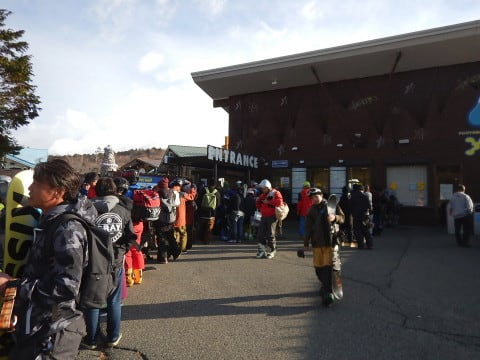

うむ．

今日は混みそうだわ．

で．

8時のゲートオープンと同時にゲレンデに

なだれ込みますが．

シーズン券の人たちがすでに30分前から入場していた

ゲレンデは，すでに結構人が多く…

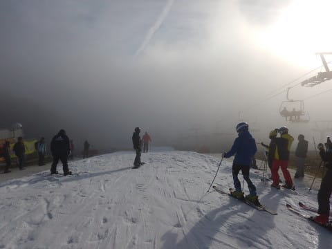

そして．

あさイチなのに，ゲレンデはもう荒れ始めてます（涙）

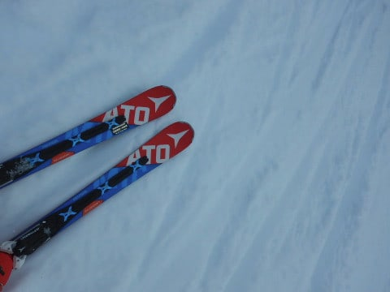

朝のうちのちょっとだけ，コース上に

うっすらとガスが出ていたけど．

気温も5℃程度と，この時期としてはまぁまぁの

平均的な冷え込み．

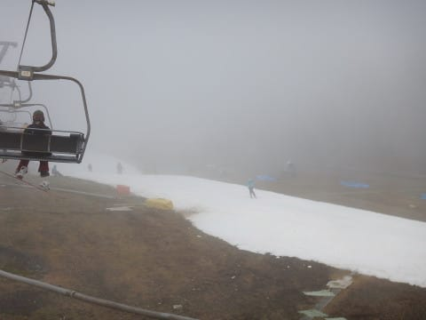

コース幅は…

うーん．

先週より，ちょっと広がった感じかな…

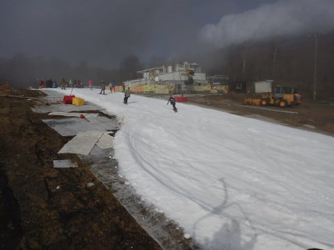

で．

オープンから1時間ちょっとの間は，

この程度の人口密度のゲレンデを快適に

飛ばせたんだけど…

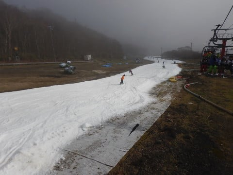

9時半を過ぎると．

リフト待ちができ始め…

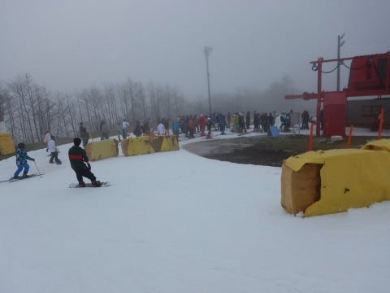

そして，コース上の人口密度も

上がりはじめ…

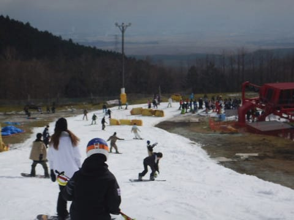

で．

10時過ぎにはすごいことになっちゃったん

ですが…！！！

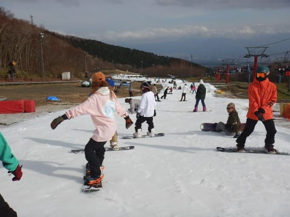

当然，リフト待ちもすごいことに…（涙）

7～8分待ち以上に伸びちゃったよ…（泣）

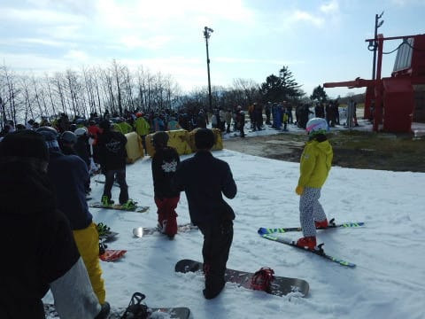

でも．

10時半過ぎに，並行するペアリフトが運転されてからは．

クワッドのリフト待ちはこの程度の，

3-4分待ちに減ったかな…

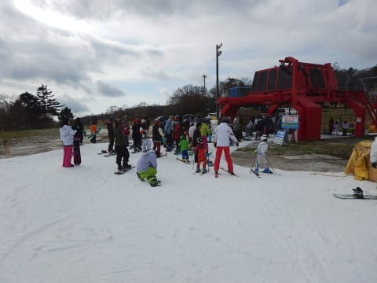

乗り降りに板を脱いで，ちょっと歩かなきゃいけない

ペアリフトは，待ちほぼ0でしたが．

…でも，リフト2本で，ゲレンデに全力で

人を送り込むということは．

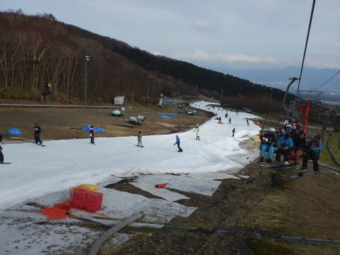

そうです．

ゲレンデの人口密度が，さらにすごいことに…（泣）

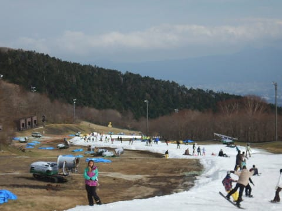

まぁ，これは．この時期のYetiの恒例ですね．（あきらめの境地）

そうです．

人がいないところをライン取りしていく訓練と

思えばいいんです！！←ポジティブに捉えようとしているのは分かるが…無理．無理がありすぎる…

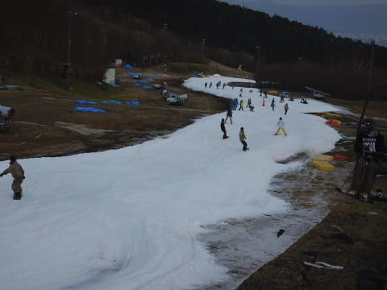

午後4時のコース整備前に，ちょっと人が

減ってきたかな…

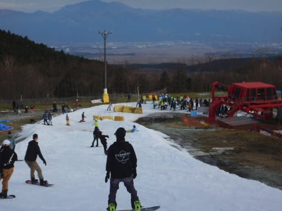

ただ．

今日は人が多かったけど．

コース整備直前になっても，コースに

穴が開くことは無く．

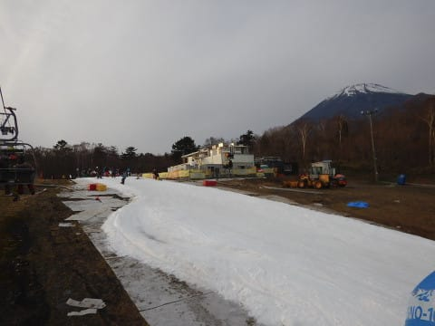

昼間，日が射すタイミングでちょっと滑りが

悪くなった時もあったけど．

気温は割と低めで，夕方までしっかり

板が滑ってくれる雪だったので．

その点は，良かったということにしておいて

あげよう…←だから，なんでいつもそんな上から目線なの？？

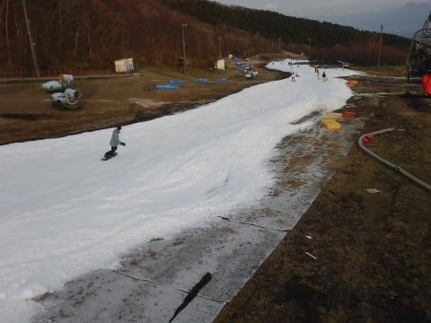

ということで．

午後4時から5時まで，圧雪作業が

入るわけですが…

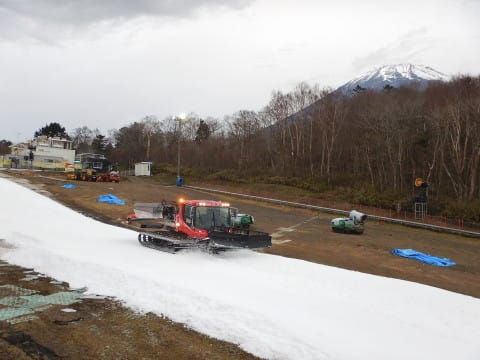

当然，圧雪終了後のシマシマバーンに飛び込むために．

コースオープン待ちのポールポジションをキープして…

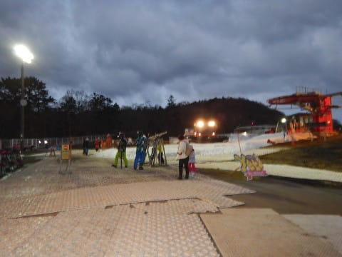

そして．

コースオープンと同時に．

ポールポジションでコースイン！！

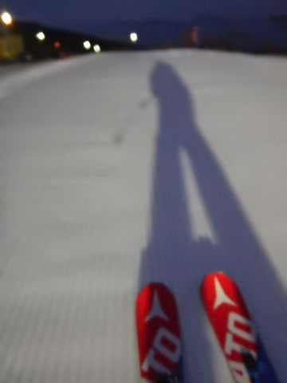

ふはははははは！！

前に誰もいないぞっ！！

このシマシマを，いただくのだっ！！

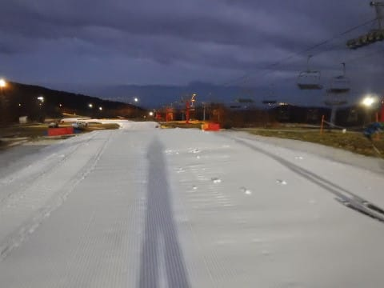

…と．

写真を撮っていたら．

抜かれた…

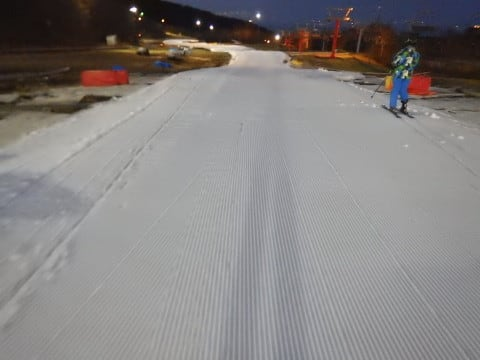

でも．

2番手でシマシマを滑りこむ気持ちよさ！！

いやーーー．

圧雪整備後の1本，最高っ！！

…でも．

2本目になると．

もうコース上の人が増えてきて…

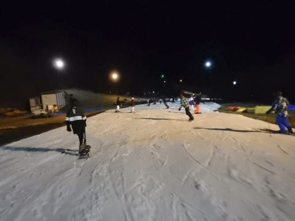

あぁ…残念…

気持ちいいのは，1本目だけだったか…（涙）

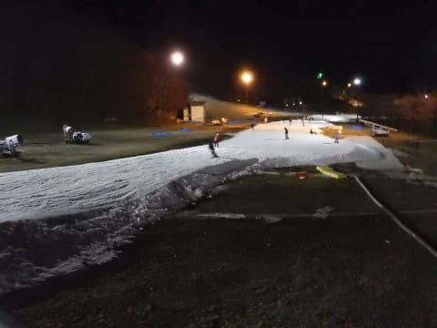

そして．

土曜ではなく，日曜夜のナイターというのに．

まさかの長さのリフト待ち…（泣）

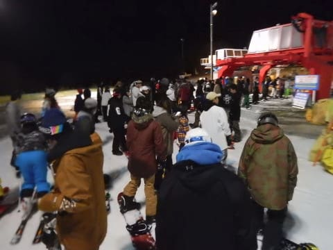

まさか，ナイターまで

ここまで混むとは思わなかったよ…（涙）

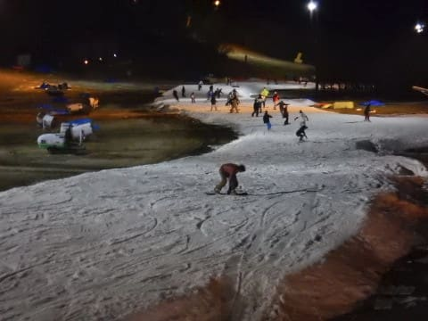

…ってな感じで．

ナイターを2時間ほど滑ったあと．

すでにゲレンデで過ごすこと，11時間．

昨日帰国したばかりで，時差ボケもまだ

解消していないので．

夜7時ごろにナイター途中で切り上げるという．

大人の私は，ここはちゃんと大人の対応で．

帰宅の途に就いたのでした…

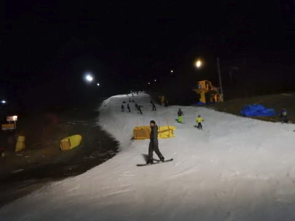

リフトが動いているのに帰るなんて…

なんて大人の対応なんだろう！！←いや，それが普通ですから

ってなことで．

この日で今シーズン4日目のYetiでしたが．

今週末からは，アサマ2000や熊の湯が

オープンするはずなので．

これでイエティは今シーズン最後のはずだなっ！！←多少の不安をもちながら

## 💬 コメント一覧

### 💬 コメント by (naoちゃんねる)
**タイトル**: 軽井沢も混みました～
**投稿日**: 2018-11-20 16:13:39

３週連続で軽井沢プリンスに行ったのですが、この日曜日は本当に混みました(疲)

イエティはリフト待ちは軽井沢より全然マシみたいですが、コースがエライことになってますね😅

娘もいいかげん狭いゲレンデでヒトを避けて滑るスキーが嫌になってきた様なので、何とか今週末は熊の湯orアサマ2000にオープンして頂きたいです。

### 💬 コメント by (musi)
**タイトル**: 漸く冬モード
**投稿日**: 2018-11-21 00:00:17

https://www.shinmai.co.jp/news/nagano/20181120/KT181120FSI090002000.php

志賀高原も、白くなり始めたようですが、熊の湯は、今週末の、オープンについて、今晩が勝負と、ブログにありますね。浅間2000も明日次第だそうで。

ここは、お約束の冷え冷え踊りと、降れ降れダンス？で、本格シーズンインを祈りましょう。

弱気に狭山デビューを検討するmusiより、今シーズンも宜しくお願いします。

### 💬 コメント by (はなげ親分)
**タイトル**: 高い人口密度
**投稿日**: 2018-11-21 00:12:14

地元民ですがこのデンジャラスなコースは、私の技術では楽しめません・・・

今週末もなにやら怪しげ模様なので

平日yetiナイターで紛らわそうか迷ってます（泣）

### 💬 コメント by (Skier_S)
**タイトル**: 23日は冷えそう…
**投稿日**: 2018-11-21 03:35:29

＞naoちゃんねるさま

いやーー．

この時期の軽井沢．

混みますよね…

3連休には，熊の湯もアサマもオープンしてほしいですよね…

でも．どちらのスキー場も混むと思いますが（涙）

＞misiさま

志賀高原も雪がうっすら積もりましたね～．

この3連休，22日に雪が積もるかにかかってます．

降れ降れ踊りを踊ったうえ，日ごろの行いを

良くして23日のオープンを祈りましょう…

＞はなげ親分さま

いや，これはこれで人を避ける修行だと思えば…←無理だから

今週末も，いろいろ微妙ですが．

24日，遅くとも25日には熊の湯はオープンすると

思っています．

…でも．ペアリフト下の第2緩斜面だけなら．

Yetiの方がいいかもしれませんね…

