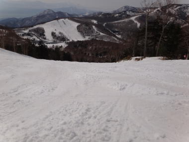

# 4月１5日，日曜の志賀高原は…快晴

📅 投稿日時: 2012-04-16 00:23:00

さて．

日曜ですが．

こっちは[天気予報](e3b2d1ec91c72d8faf5c81ae5ad257c79.md)，当たりましたね．

早朝は固いバーンに仕上がってるかも．

しかし．

午前中から日が射しはじめ．

雪が一気に緩み，どぼどぼバーンと化すのは

確実でしょう．

…という，予想通りの一日でした．

まず．

早朝は…

昨晩から10cm程度新雪が積もってたでしょうか．

6時半からの焼額の早朝スキーに出かけると…

朝からすかっと晴れで．

マイナス8度程度まで冷え込んでます．

で，ゲレンデは…

この最高のしましまを見よっ！

湿った新雪が冷え込みでしっかり固めに仕上がった，

スピードが出る，最高のしましまバーン．

いやー！

この時期．

これだけのためにここに来てもその価値はあるっ！

この週末は，この早朝が滑れただけで十分っ！

で．8時までの超最高の早朝スキーを終えて．

朝食後，ゴンドラで山頂へあがりますが．

快晴で景色は最高！

先週に続き，木々に雪が乗っており，4月中旬には見えない…

しかし．

太陽が高く上ると．

あっという間に雪が柔らかくなりだし．

9時過ぎにはコースのほとんどが柔らかく．

10時には結構ざぶざぶな感じになり，

ところどころ，スキーに張り付くストップスノーになっちゃいました…

昼からは一の瀬に移動してみましたが．

メインバーン上部は固めの下地の浅いコブ斜面になってましたね～．

普通はこの時期，もっと雪がドボドボになって，午後にはかなり深い

コブになるんですが…

この時期にしては低めの気温だったのか．下地は比較的しっかりしており，

それほど深いコブにはならず．

パーフェクターは一見よさそうな雪質に見えますが．

積もった新雪が解けた，板に張りつく雪が全面を覆っていて．

ちょいと滑りにくかった…

気温はこの時期と考えるとそれほど高くなかったんでしょうけど．

強い日差しで午後はところどころ，水を吸った透明な雪になってきて．

あー．

4月だなぁ…

って感じになりました．

あー．

でも．

追加情報として．

志賀高原の道路ですが，この週末は雪が積もったり，

マイナス10度近くまで冷えて凍ったりと，まだスタッドレスは

必須な感じです…

とりあえず．

雪は4月っぽくなっちゃったけど．

早朝スキーは最高だったし．

天気は最高で．

土曜と比べ，日曜はいい一日でしたね～！

PS.この4月の冷え込みで，現在の積雪は例年より多いですね～，

　一の瀬メインバーン，焼額第2ゴンドラ共に，GWまでは余裕で

　雪が持ちそうですよ～
