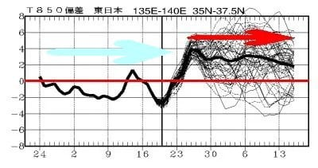

# 2024シーズンのスキー場の天気と積雪量を振り返ってみた，その3…ダメダメ2月と違い，雪が積もり続ける奇跡の3月！3月の方が2月よりトップシーズンらしかった

📅 投稿日時: 2024-06-20 02:31:13

🏷️ カテゴリ: [スキー雑談](c1f9d2cb7478308da16419928ea3945e9.md)

ってなことで．

前回の更新からかなり間が開いてしまい

ましたが．

今シーズンの積雪量を振り返ってみる企画，

第3回です！

[前回](e76ceb371c99e3f198607f8c603938f18.md)は，

本来ならトップシーズンのはずの2月末なのに，

雪不足でコースが次々クローズしていく

という恐怖の雪不足まで書きましたが…

いや．

でも．

2月26日に，

・白樺・ブナコース…2月27日で営業終了

・SGSコース・イーストコース・ミドルコース

　ミドル連絡コース…3月3日で営業終了

という恐怖のニュースが流れたときは．

2024シーズン，早くも終わったか…

と，そのときは本気で思いましたね…（涙）

（焼額山Facebookより）

でも．

ここから奇跡の巻き返し！！

そのあとの2月27日に50cmの積雪があり．

そのうえ，3月に入ったというのに，

営業期間を少しでも延長しようという思いで，

焼額はこの時期に人工降雪を打ってました！

すげーーー．

3月に人工雪を打ってるの，初めて見た…

（焼額山Facebookより）

さらに，そんな努力に応えてくれるように．

3月3，5，6，9，10日と立て続けに，

それぞれ20cmずつの積雪が！！

全くダメダメだった2月には全くなかった，

連続の積雪が3月頭になってやってきましたよ！

…これで，3月3日で終わとアナウンスされた

第3高速が，延長営業することになり．

さらに，雪不足で滑れなくなったオリンピック

コースも，3月9日から復活！！

（焼額山Facebookより）

そのほか，

SGSコース，

イーストコース，

ミドルコース，

ミドル連絡コースも再オープン

してくれて．

白樺・ブナを除いて，ほぼ全面オープンに

状態に戻ってくれました～！！！

でも，どうせすぐオリンピックコースは

クローズしちゃうだろう…

と，この時期は思ってましたが．

まさか4月上旬までオリンピックコースが

滑れるとは，この時は思わなかったですね…

その後，3月13日にも50cm，

（焼額山Facebookより）

3月20～21日にも積雪80cm！！！

結局，振り返ってみると，

2月27日に50cm級，

3月3，5，6，9，10日と20cm級，

3月15日に50cm級

3月20～21日と80cm級

と，かなり雪が積もった，

奇跡の3月

だったのでした…

それも，1月の軽くて風で飛んじゃう雪

じゃなく，しっかり重くてずっしり積もる

雪だったので，ゲレンデの積雪は

あっという間に復活し．

雪の状態は，4月並みのザブザブ雪が続いた

2月より，3月の方がよっぽどいい…

という，2月と3月が入れ替わったような

今シーズンでしたね…

しかし．

2月末から3月末にかけては，水色矢印で

示したような冷え冷えだったんだけど…

3月下旬の予想で．

4月は赤矢印のように激烈高温になる

という予想を見て．

今シーズンは，

3月に積雪はちょっとは復活してくれた

けど，例年よりまだ少なく．

絶対にGWまで雪がもつわけがない

と，恐怖の4月の来訪をおびえながら

待ったのでした…
