# 2021年7月，編笠山リベンジ＆権現岳へ！その6

📅 投稿日時: 2021-08-26 01:02:08

🏷️ カテゴリ: [登山・旅行](c1d637a11a25b457ac978d197adbdafc5.md)

えー．

Skier_Sは次々板をヘタらせているけど．

ヘタった板をどうしているのか…？

ということを，よく聞かれます．

ええ．

誰もが気になるところだと思います…

「まだ1-2年前の新しいモデルだから，

　オークションで売っぱらえば高く

　売れるんじゃないですか？」

…という，悪魔のささやきもありますが．

大体，ヘタって寿命が来た板は，

最後は石ころ踏み用にして

かぐらファイナルや最後の月山

など，雪があるかどうかのギリギリ

まで使われるので，

ガタガタになってしまいますし．

さらに最近は，新しい板を安く買うために

ビンディングを抜いて次の板に使いまわす

ことも多く．

ヘタってガタガタでビンディングがない板

では，誰も買ってくれないので．

オークションで売ることは無いです…

…皆さんは，使い終わった板って

どうしてますか？

ってなことで，本題へ．

今日はSkier_Sの板をヘタらせる電磁波を

浴び続けた板の話ではなく，

山登りレポートです…

では，どうぞ～！

ーー

という感じで．

景色の良いピークを過ぎて．

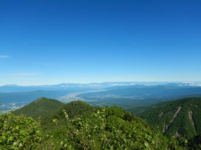

その先にしばらく進みますが…

さっきのピークを登り切った場所を，

振り返って見ると．

かなり高度感があるのがわかるかと…

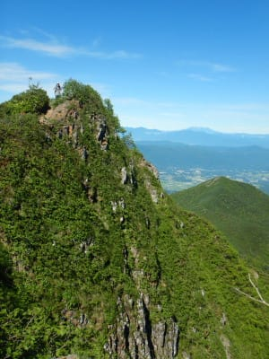

↑このてっぺんに人がいるのが分かるかな？

ってなことで．

また，目の前の岩場の急登に向かいますが．

こんなところを登り切るわけですから，

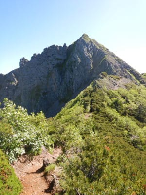

さらに鎖場が連続します…

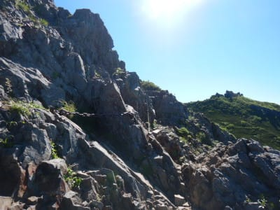

ただ，このあたりの鎖場は，安全確保の

ための鎖で．

足場もしっかりしているし，そこまで

急じゃないので，鎖を使わないと登れない，

というほどのことは無いです．

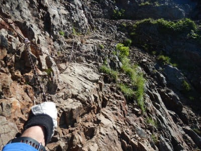

ただ，やっぱり落ちたら死ぬ系のところが

何ヶ所かありましたが…

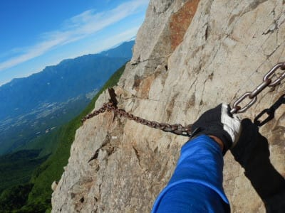

この鎖も，そんなに急登ってわけじゃなく．

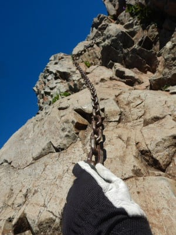

この写真の向こう側に立っている人を見ると

分かるように，鎖を使わなくても歩ける

場所にも，安全のため鎖が張ってある感じ．

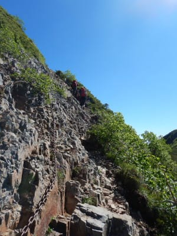

ってな感じで．

何ヶ所かの長い鎖場が続く道を

登っていくと…

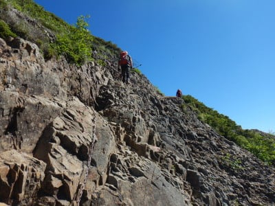

いきなり向こう側の視界が開け，

権現小屋と権現岳山頂がやっと

見える場所にやってきました！！

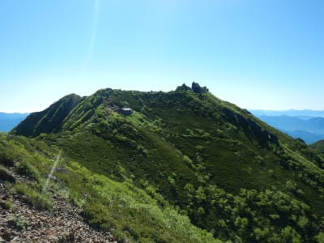

ここから振り返ると…

360度展望が開けそうなピークがすぐそこに

ありますね．

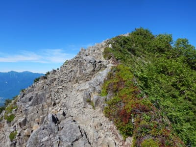

このピークが「ギボシ」．

登山ルートはここのピークを巻くように

なっているので．

このまま行っちゃうとこのピークを通り過ぎて

権現小屋～権現岳山頂へ行ってしまいます．

せっかくすぐ目の前に，こんな景色が良さそうな

ピークがあるんですから．

ちょっと寄り道してみましょうか…

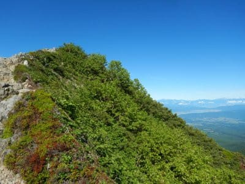

## 💬 コメント一覧

### 💬 コメント by (カンタロス)
**タイトル**: Unknown
**投稿日**: 2021-08-26 06:07:16

Sさま、こんにちは。

いろいろ苦労が伝わってきます(笑)

私は登山はやらないので、役目を終わった板について。

私はそこまで酷使しないので、シーズンイン前にブッ○オフにもっていきますね。

ワックス買えるくらいのおかねになります(笑)

### 💬 コメント by (Skier_S)
**タイトル**: ＞カンタロスさま
**投稿日**: 2021-08-27 01:23:00

ブックオフでSalomon 24hours LMを売ったら10円だった悲しい思い出があるので，

それ以降一度も持って行ってません…（涙）

今は高く買ってくれるんでしょうか？

### 💬 コメント by (カンタロス)
**タイトル**: Unknown
**投稿日**: 2021-08-27 06:01:15

Sさま、こんにちは。

１０円は悲しいですね…。うまい棒レベルですね…

(普通の人の)シーズン前の11月や１２月のクリスマス前は

高く買ってくれる傾向にあるかと思います。

完全に死亡した板を2400円で買ってくれました。

査定の基準が年式、見た目の破損度、定価で算出しているものと思われます。

売上げの機会ロスと在庫リスクからも(普通の人の)シーズン前の1ヶ月程度は査定のアップになっているかと。

ウィンター用品買い取りアップ、とその時期はお店に掲示してありますし(笑)

追伸、年間でウィンター用品コーナーのあるお店のほうが高額査定の傾向にある気がします。

### 💬 コメント by (Skier_S)
**タイトル**: ＞カンタロスさま
**投稿日**: 2021-08-28 01:52:52

まさか，SALOMONのトップモデルが10円とは．

10円を受け取ったあと，帰りの車で泣きました（誇張有り）．

2400円ならまだいいですよね…

一応，私としては結構待って，シーズンが始まっているつもりの

11月頭に売りに行ったのですが，まだ早かったのかな…

11月ごろに売りに行けばよかったのかも．

### 💬 コメント by (カンタロス)
**タイトル**: Unknown
**投稿日**: 2021-08-28 09:46:01

Sさま、こんにちは。

やはり普通の人(ここ、強調するところ)のシーズンインちょっと前が一番高額だと思います。

普通の人(くどく強調(笑))は１０月や１１月は滑りませんから(笑)

### 💬 コメント by (Skier_S)
**タイトル**: ＞カンタロスさま
**投稿日**: 2021-08-29 00:13:08

やっぱり12月ごろに売りに行くべきだったんですね…

私にとっては，11月はスキーシーズン真っ只中ですから(笑)．

これでもかなり我慢して11月まで待ったんですけどね…

