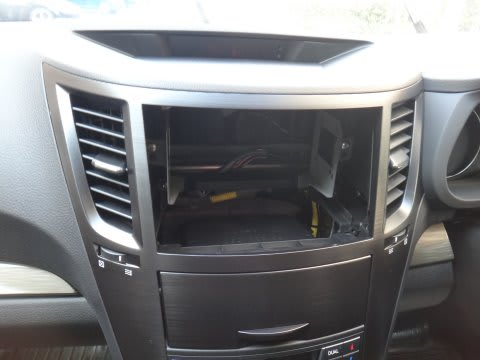

# プロジェクトX第2章…BRレガシィE型，早くも納車!

📅 投稿日時: 2013-06-10 01:42:44

えー．

ってことで．

レガシィvs.エスティマの異種格闘技戦となった，

プロジェクトXの結論が出て．

レガシィを購入することになったわけですが．

実は．

早くも．

本日，納車されたんですね～．

で．今回のE型レガシィ．

昨年のD型はフロントグリルが大きく変わったけど．

今回のE型．見た目は全く変わらないので，

E型かどうか，よく分かりませんね～．

とりあえず．

ぴかぴかの新車です．

娘も嬉しそうです．

…ナビは…まだついてません．

「ナビはまだか」

といわんばかりの空間がぽっこりと開いています…

通販で買ったので，これからつけなくては．

そして…この車の特長は．

当然こいつですね．

そう…アイサイトのカメラです！

内側から見ると，こんな感じで．

気になるほどではないけど，ちょっとゴツイかな…

アイサイトがつくと，サンバイザーと干渉するので，

結構横幅が狭いサンバイザーになっちゃいます…

アイサイトは，まだまともに使ってないので．

また今後，じっくり使ってからインプレッションを報告します…

どうでも良いですが．

この車．

サイドブレーキがこんなところについているので，

なんだか，体がまだこの位置のサイドブレーキになれてません…

…

まぁ，あれですね．

ドライビングインプレッションやアイサイトの使用感覚などなど．

また追って報告します…

ということなので．

これから，プロジェクトXの第2章が始まります．

以上，

本日スバリストになったという，報告でした．

## 💬 コメント一覧

### 💬 コメント by (ゆうこ)
**タイトル**: 納車早いですね。
**投稿日**: 2013-06-10 10:36:00

こんなにすぐに納車されるもんなんですね。

びっくりです。

そして、羨ましい。

アイサイトのレポート待ってます。

それから、お友達承認ありがとうございました。

お友達になるとどんな機能があるのかは、私もわかっていませんが。

### 💬 コメント by (miya)
**タイトル**: もう！？
**投稿日**: 2013-06-10 15:01:29

納車早いですねー。

A型とはいろいろスイッチの配置が違うんですね。

私も次はアイサイトっ！（かつ、A型以外っ！）

でも上部のサングラス入れがなくなるのが残念です。

16インチはスタッドレスが安くていいですよー。

### 💬 コメント by (Skier_S)
**タイトル**: 納車が早いのは…
**投稿日**: 2013-06-11 00:17:14

>ゆうこさま

いや…

実は，5月中に仮予約入れて，車を押さえていたから

なんです…

あと，一番の人気グレードかつオプションなしだったので，

納車が異常に早かった（見込み生産分を抑えられた）

ようです…

アイサイト，早速使ってみましたけど．

…結構面白いです．

>miyaさま

ということで，一番人気グレードかつオプションなし，

って感じだったので，見込み生産分を抑えられたということで，

納車が早かったんです…

A型とは，サイドブレーキ位置が大きく違いますよね！

SI-Driveのセレクタはステアリングのボタンになりました．

…どうせなら，この場所，小物入れにしてほしかったなぁ…

で．

そーなんですよ．

スタッドレスを考えると，絶対16インチが良いんですよね～．

16インチでも高いな～，

って思うくらいなので．

15インチでも良いんだけど…

って思ってます（笑）．

### 💬 コメント by (megalith)
**タイトル**: アイサイト装着車のタイヤについて
**投稿日**: 2013-07-16 23:19:36

アイサイト装着車のタイヤですが、インチアップ&ダウンについてですが、下手に行うとアイサイトのセンサーが誤作動を起こす可能性があるそうです。

そのため、指定サイズのタイヤが推奨されていますので、ご注意下さい。

Bスポ　アイサイトの場合のインチダウンはディーラーに確認してから15インチにしたほうが良いと思います。

逆に17インチへのアップは、ドアの所にサイズ指定があるので問題なくできると思います。

ちなみにGパケの場合は17→16インチでしたら大丈夫だそうです。

### 💬 コメント by (Skier_S)
**タイトル**: megalithさま
**投稿日**: 2013-07-17 21:51:01

いやー．

私もマニュアル読んで気になっていたんですが…

直径が変わると，アイサイトの動作に影響

与えるんでしょうね～．

どちらにしろ，ブレーキが16インチサイズなので，

15インチのホイールはかなり厳しいかと．

あきらめて16インチ履こうと思ってますが…

意外と，205/60R16ってサイズが中途半端なのか，

選べるタイヤが少ないんですよね～．

215/60か，205/65ならいっぱいあるんですが…

### 💬 コメント by (megalith)
**タイトル**: そうでしたね。(^_^;)
**投稿日**: 2013-07-18 10:59:07

やはり素直に16インチが良いかと・・・・(^_^;)

ところでスタッドレスタイヤは地元の店で買われますか？

またメーカーのこだわり等はありますか？

### 💬 コメント by (Skier_S)
**タイトル**: スタッドレスは…
**投稿日**: 2013-07-19 00:58:39

スタッドレスは，これまでダンロップ(古いDS-2の時代)x2，ヨコハマ，ブリヂストンx２と履いてきましたが…

ダンロップDS-2の時代は，なかなか寿命は長かったけど

効き目もそれなりだった思い出が…

最近のDSX-2は良くなったんでしょうか．

ちなみに，私はスキーシーズンに2万5千km走るので，

スタッドレスはもって2シーズンです(笑）．

### 💬 コメント by (megalith)
**タイトル**: ダンロップの
**投稿日**: 2013-07-19 22:09:56

DSX-2は発売開始してすでに結構経っているため、後継のWINTER MAXXが去年から発売されています。

そのため後数年で廃盤になると思います。

自分は前のDSXが値段の割に寿命が良く十分に使えましたので、次もダンロップにしようかと思っています。

スバルのインプやレガシィは横滑り防止装置がなくてもかなり安定度の高い車ですので、それの影響があるのかもしれませんが。(自分の乗っていたBPの2.0NAには横滑り防止装置はありませんでした。)

もちろん、値段次第ではヨコハマも良いのですけどね。(^_^;)

ですがさすがにブリジストンは高すぎで買えません。（泣）

ちなみに今年はグッドイヤーとブリジストンから新製品が出ました。

特にブリジストンは新製品としてBLIZZAK VRXが出るそうで、9月1日全国発売開始だそうです。

それにしてもスキーシーズンで2万オーバーとは・・・スゴイ(^_^;)

2シーズンしか持たないのなら、前年度製造の物でも十分使えますね。

また一層のことBLIZZAK REVO GZあたりいかがでしょう。

VRXが出る前のトップモデルのタイヤですし、少なくともVRXよりは買いやすくなると思います。

### 💬 コメント by (Skier_S)
**タイトル**: スキーシーズンは毎週700km以上走るので
**投稿日**: 2013-07-19 23:45:17

私にとって，11月中旬～GWまでスタッドレス履きっぱなし

だし，この期間は志賀高原までの往復650kmを確実に

毎週走るので…

＃なので，前のオデッセイは7年経たずに20万kmオーバー(涙)

昨年度まで，ブリヂストンでも，REVO GZは高くて変えなかったので，

REVO2を履いてました．

REVO2で，私にとっては十分です．

ケース剛性も高く，アスファルト路面でもヨレ感が少ないし，

つるつる凍結路でのグリップも十分だし．

次も，GZでなくてもREVO2が安かったらそれでいいかな～，と思ってます…

ちなみに，私はこれまでVSCやらTRCなどがついた車に

乗ったことが無いんですね～．

雪道は，滑らせて走るものだと思ってます(笑）．

BRでもVSCを切って走るかも…

### 💬 コメント by (megalith)
**タイトル**: 完敗です。(^_^;)
**投稿日**: 2013-07-20 22:20:31

自分も峠道の関係で、11月中旬までにはスタッドレスに変えますが、とても1シ-ズンでそこまではは走りませんね。(^_^;)

DSX-2ですが検索をかけると、REVO 02より良いという人もいますし、ダメと言う人もいますし人により評価がわかれるようです。

ただ、当時のヨコハマの人が自社新商品の宣伝のため試乗会を開いた時に、BS、DPのスタッドレスを用意して比較したら、予想以上にDSX-2が良くてヨコハマの人たちが驚いたと言う話もあるようです。

雪道を滑らせて走るって・・・(^_^;)

自分は冬の圧雪の峠道を60kmくらいで走ったことはありますが、登坂車線があり対向車がないときだけですね。

逆に下り坂は神経を使います。

自分もVSC付きは初めてですが、色々試してみたいと思っています。

### 💬 コメント by (Skier_S)
**タイトル**: megalithさま
**投稿日**: 2013-07-20 23:11:19

DSX-2，良さそうですね…

私の場合は，冬の間も関東の積雪の無い

アスファルト路面をかなり走るので，ドライでのヨレ感，

腰砕け感がないってのもかなり重要なファクターだったりします．

http://blog.goo.ne.jp/tsakamot2001/e/218d4d7f32b91b92cf833a1651ff3c2c

での記事に書いたように，私は雪道(スキー場への

上り道など，交通量が少ないところ)では，

あまりグリップ走行をしません…

オデッセイでは，えいやー！ってインに切り込んでおいて，

そこからアクセルを踏んでフロントをアウトに滑らせて，

ラインをトレースする…

という，超プッシュアンダーが出るオデッセイの4WDに

特化した走りかたをしてました．

＃トラクションコントロールがある車では絶対できない

＃走り方

BRはどんな走り方が一番速いのか…

いまから雪が積もるのを楽しみにしています(＾＾）．

PS.私も凍結した下り坂は恐くて大嫌いです(笑)．

### 💬 コメント by (megalith)
**タイトル**: スタッドレスでの
**投稿日**: 2013-07-21 13:53:31

ドライ性能でしたらミシュランでしょうか。

巷の評価ではドライ性能はMI>BS>YH&DPだそうですが、アイスバーンではBS>DP&YH>MIだそうで。

ヨコハマの評価も試乗会の会場のアイスバーンでの評価ですし。

自分の走り方は基本グリップ走行でしょうか。

速さより安全なんですが、雪道の直線で除雪がしてあるり、周りに誰もいないと気がつくと80km近く出している時もあります。(^_^;;)

ちなみにNAのBRはFFベースで比率は60:40です。

この辺は以前のBP等と同じですね。

それよりも、Skier_Sさんは今はダイビングですね。

海の事故気をつけてくださいね。(^^)

### 💬 コメント by (Skier_S)
**タイトル**: ミシュランは…
**投稿日**: 2013-07-22 10:21:28

ドライ性能がいいとは聞きますが、

アイスバ一ンの性能を考えるとちょっと…

って感じです。

BRのターボはVTDで、プラネタリーギア式の

センターデフが入っているのは

わかるのですが、NA車のトランスファー構造が

よく分からないんですよね

デフなしで、クラッチだけでトルク伝達してるのかな？

だとすると、ものすごいクラッチに負荷が…

あるいはべベルギヤ式センターデフで、クラッチで

差動制限なのかなあ…それだと、トルク配分のべースは50:50

だし…

このあたり、ご存じですか？

### 💬 コメント by (megalith)
**タイトル**: となると・・・・
**投稿日**: 2013-07-22 11:14:15

バランスがとれているBSでしょうか・・・・

自分はアイスバーン重視なのでMIは問題外で、BSは高すぎで問題外。

となるとYHかDPになると思います。

AWDのシステムは自分もあまり詳しくないので・・・・(^_^;)

検索したら以下の物がありました。(^_^;)

アクティブトルクスプリットとVTD－AWDの違い 

http://minkara.carview.co.jp/en/car/subaru/legacy_touringwagon/qa/unit86171/

アクティブトルクスプリットAWD

くhttp://minkara.carview.co.jp/en/userid/347713/blog/7738705/

ご参考になれば幸いです。

### 💬 コメント by (Skier_S)
**タイトル**: やはりBSでしょうか…
**投稿日**: 2013-07-23 01:18:15

私も，タイヤはBS（の旧モデル）が一番かなぁ…

と思っています．

4WDシステムの情報，ありがとうございます．

うーむ．

これを見ると，NA車のトランスファーは単なる

クラッチによるトルク伝達みたいですね…

電子制御クラッチによるトルク伝達の欠点は，

差動吸収をしようとした場合，後輪へ伝達できる

トルクが減るんですよね…

差動吸収とトルク伝達が両立しないという欠点が

あるのですが…

しかし，そこは4WDのスバルですから，きっと雪道で

楽しませてくれる車になっていると信じています(笑）．

ありがとうございました．

### 💬 コメント by (megalith)
**タイトル**: そうですね。
**投稿日**: 2013-07-23 20:11:03

バランスを考えるとBSですね。

AWDのシステムについてはやはりディーラーの整備士の人がよくご存知だと思います。

正確なところは確認されたほうが良いかと思いますよ。

さていよいよ自分も来週(おそらく8月頭位)納車予定になりました。(^_^)

いやー長かったです。BPが死亡して2ヶ月、ようやく代車生活から卒業です。

### 💬 コメント by (Skier_S)
**タイトル**: よいBMライフを！
**投稿日**: 2013-07-24 00:32:48

納車待ち遠しいですよね．

また，納車されたら報告してください～！

### 💬 コメント by (megalith)
**タイトル**: キタ━━━━(゜∀゜)━━━━!!
**投稿日**: 2013-08-02 22:36:01

ということで、本日夕方会社帰りに店へ行き、ついに納車されました。(・∀・)>BR E型

早速いつものセルフに給油に行きましたが、途中の国道がノロノロ渋滞でしたが、早速オートクルーズを見よう見まねで設定してみたら・・・・

「こ・・・これはスゴイ・・・・マジてスゴイ(・∀・)」

アイサイトがしっかり前車について車間距離を取ってきちんと停車。

もっとも本日納車されたばかりですから、詳しい設定やスイッチの機能なんてこれからですが、「技術の進歩はとてつもなく早いなぁ～」なんて思ってしまいました。

明日は仕事が早出なので、国道に出たらオートクルーズで楽をして出勤したいですね。(^_^;)

でも、これは一度高速で遠乗りしたいなぁ。

今度の盆休あたり1日だけ適当に遊びに行こうかなぁ・・・(^_^;)

・・・・ってその前に会社の人達に高確率でオモチャにされるけど・・・・(´Д｀)ハァ…

### 💬 コメント by (Skier_S)
**タイトル**: おめでとうございます！
**投稿日**: 2013-08-03 01:28:03

待ちに待った納車，おめでとうございます．

BPとくらべていかがですか…？

アイサイトは，のろのろ渋滞と高速道路で無敵の威力を

発揮しますよ(笑)．

長距離運転の強力な味方です…

高速の渋滞がいやじゃなくなるかも（笑）．

これからもBR仲間として，よろしくお願いします～

### 💬 コメント by (megalith)
**タイトル**: ありがとうございます。
**投稿日**: 2013-08-04 19:53:29

BPよりボディの大きいのはやはり気を使います。

特に全長が10センチ長いのは慣れる必要がありますね。

特に細い道では要注意です。

ただバックカメラも着けたのでバックする時はかなり楽になりましたが。

ちなみにバックカメラはナビメーカー純正ではなく、CAROZEのM-07という物にしました。

http://item.rakuten.co.jp/caroze/bcm07/

これはナンバープレートの穴を利用するので加工要らずですし、カメラもあまり目立たず性能も満足できるものです。

レガシィですと他の方のブログですが、こうなります。

のぶの散財日誌

http://blogs.yahoo.co.jp/nobuaki_com/53639209.html

バックカメラはこちらのブログで知りました。

エンジンはやはりBPより静かですね。

排気量に余裕があるのかiモードでも結構登り坂を登っていきます。

SモードやS#モードにしたらどうなるのかちょっと怖い気もします。(^_^;)

アイサイトによるオートクルーズも超便利で、特に自動車専用道路等ではまさしく現時点では最強です。

ただし、前車がある時少しRのキツイカーブに前車が消えると急に加速する傾向があるので、絶対に過信は禁物です。(国道の急カーブでほとんどこの傾向がありました。)

しかし、Skier_Sさんと同じく、「あとハンドル操作が自動だったら・・・(^_^;)」と思ってしまいます。

ナビも新しくしたら高機能すぎて面食らっています。(^_^;)

まだまだ修行が足らなそうです。(苦笑)

(取り付けたナビのスマートループ機能は、専用の通信機器がなくても、スマホ等で代用できるようです。)

それでは、こちらこそ今後共よろしくお願いします。m(_ _)m

### 💬 コメント by (Skier_S)
**タイトル**: 自動ハンドル切望
**投稿日**: 2013-08-05 02:40:13

やはり排気量が大きい分，BPよりパワーありますか…

上り坂結構登りますよね．

アイサイトで，コーナーで前車を見失ったときに

急加速を避けるために，私は前車を見失いそうな

シチュエーションでは，設定速度スイッチを

結構頻繁に調整し，設定速度が現在の走行速度に

近くなるように調整しています…

これで急加速を回避できます．

バックカメラも，安くて加工がすくなくて良さそうですね．

うちのBRは納車2ヵ月半で走行距離6000kmを超えそうです．

このお盆の帰省も，アイサイトが大活躍すると思います…

またBRのレポートすると思うので，よろしくです～！

