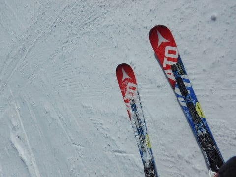

# 2020シーズンモデルのスキー板，試乗レポート スタート！…SALOMON編その1 ＆ 今回の試乗コンデションの説明

📅 投稿日時: 2019-04-05 01:29:44

ということで．

本日も，引き続き．

志賀高原は最高だったようですね…

あぁ…

月曜からの奇跡の4日間．

滑りに行きたかった…

しかし．

奇跡の冷え冷え祭りも，今日で終わり．

5日の金曜は…

気温が上がって，雪はかなり緩みます（涙）

6日土曜の朝は，そこそこ冷えるので，

緩んだ雪がガチガチに固まりそうですが．

でも，明け方に雪がぱらつきそうだから，

硬い下地の上にうっすらでも積もってくれれば，

滑りいいんだけどなぁ…

ってなわけで．

本題へ．

えー．

もう，先々週の週末になりますが．

アサマ2000の試乗会に参加してきたので．

皆さんお待ちかねの，

来シーズンモデルのスキー板の試乗レポート，

ちょいと遅くなりましたけど，本日から

スタートです！

…みなさん，ホントにお待ちかねだったのか

どうか，微妙ですが…

ってか，こんなシロートの試乗レポート，

何の役に立つんだか…

とりあえず．

今回の試乗は．

天気にも恵まれ…

そして，雪もこの時期としては

これ以上は望めないほどのGood

コンディションで．

いつもだと，春雪のザブザブな

感じでの試乗になりますが．

今回は，イイ感じでしっかり締まった，

硬めながらエッジがしっかり効くという，

最高ハイスピードバーンでの試乗でした～！

だもんで．

おそらく．

いつもよりちょいと強め，張りの強い

板の評価が高くなり．

フレックスが優し目，返りの弱い

板の評価は低めになっちゃって

いるかと思います…

あくまで，かなりスピードが出る固めの

バーンでの試乗インプレッションという

ことでよろしくお願いします．

んで．

私の試乗レポートでは，いつも言っている

ことですが…

このレポートを書いているのは．

テク・クラも指導員資格も何も持っていない

ど素人レジャースキーヤーです！！

素人スキーヤーが，わずか数本滑った

試乗のあと，自分が感じたことを

単に書きなぐっているだけなので．

他の人から見ると，

「なぜ，その板を誉める？？」

とか．

「なんでそんな評価になるの？？」

ということが多々あると思います．

だもんで．

あくまで素人スキーヤーが，

それぞれの板を好きか嫌いか，

独り言を言っているくらいに

読んでもらえればいいかと（笑）．

ってなわけで．

2020シーズンモデルのスキー板試乗レポート，

まずはサロモン編から！

○SALOMON S/RACE RUSH SL X12TL 165cm

SL競技＆基礎小回り用．

今年モデルと同じラインナップなら．

この上にガチの本格SLモデルの，

S/RACE PROがあって．

それに続く，SL用セカンドモデルとなる

このモデル．

今年モデルは，

・P80プレート＆しっかりしたXビンディング付き

・プレート無し＆優しいTLビンディング付き

の2バージョンがありましたが．

来シーズンもこの2モデル出るのなら．

今回試乗したのは，TLビンディング付きの，

優し目バージョンになります．

滑り出してみると…

足元にちょっと重さを感じます．

そして，ゆっくりとしたスピードで，

板なりのサイドカーブで曲がってみても．

反応が比較的ゆっくり返ってきて．

あまり小回り板っぽくない，反応が

ゆったりした感じを受けます．

でも，硬い斜面でスピードを出して，

エッジが食いついてくると，

「え？」って感じでググっと曲がって，

見事なカービング小回りになっていきます．

かなりスピードの高い領域で，板に

強い圧をかけて行ける，硬めの斜面では，

すごい気持ちよく板が斜面を捉え，

たわみで板が回り込んでいき．

切り替えですっと板が抜ける，

抜けの良さを感じます．

板が抜けたあと，板と一緒に落ちていけば．

マキシマム付近で板がガッツリグリップして

回っていき．

大きな谷回りの落差を取った，縦長の

ハイスピード小回りができます．

かなりのスピードを出しても安定感が

すごいあるので，全然怖くないです．

小回り板として，かなり高いスピード耐性

を持っています．

硬い斜面で，板がぐっと回り込んでくる

スピード域までもっていければ．

スピードを出してもかなりの安定感もあるし，

サイドカーブの割に，大きめの中回りくらいまで

問題なくこなすし．

小回りもカービングでグイグイ曲がっていけ，

すごい気持ちいいんですが…

ただ，スピードが低い領域では．

板が回ってこず．

結構重量も感じるので，軽快に

振り回せる感じでもなく，

重くて反応が鈍い板に感じ，

あんまり楽しくない感じ…

とりあえず，かなりの体力があり，

滑走スピードが結構高めの人が，

しっかり硬い斜面で，

カービング中回りから小回りを

ガッツリ攻める…

というにはいい感じですが．

体力が無い人や，

ゲレンデをお気楽に滑ろうという人には

お勧めできない，

かなりハイレベルな板でした…

## 💬 コメント一覧

### 💬 コメント by (若杉勲71)
**タイトル**: Unknown
**投稿日**: 2019-04-05 14:15:43

サロモンその2が楽しみです。

本日も快晴、良質な雪、前日よりもさらにがら空きと、絶好調。11時20分エキスパート発のバスでファミリーへ。

ここも快調。蕎麦屋で食事とビール。あんまりおまけの品が多いので時間がかかったのが誤算。照りつける太陽にじりじりとブレーキマンの魔手が。

ファミリーで少し足を引っ張られたのでヤケビへ。

山の神はさらにひどく、サウスに至っては殺人バーン！

皆様、午前中に気の済むまで滑っておかれますように。ブレーキマンとのバトルが好きなかたならいいですが。

### 💬 コメント by (kato)
**タイトル**: Unknown
**投稿日**: 2019-04-05 15:08:01

水曜日までヤケビにいました。水曜日は膝下パウダーでびっくりしました。まさに奇跡、Sさんがおっしゃった通りでした。これで私たちはシーズン終了、これからはSさんのブログで楽しみます。ゲレンデで時々ご一緒させていただきありがとうございました。来シーズンもよろしくお願いします。

### 💬 コメント by (かず)
**タイトル**: Unknown
**投稿日**: 2019-04-05 15:30:14

3,4行きました　3日オリンピックファーストトラック　4日熊ファーストトラックですが前日のトラック有り　悲　どちらもワックス失敗でブレーキでした　3日は休憩無しサイコー　4日は朝から日差しでウェットでしたよ　膝が痛いので週末はお休みです

### 💬 コメント by (ほっぽ)
**タイトル**: ４／５　志賀高原
**投稿日**: 2019-04-05 23:10:53

今日は平日スキー満喫出来ました。

でも、Ｓさんの予想通り、１１時過ぎにはストップ雪に変身。

夕方は冷えてガサガサでした。

滑走レポートを上げておきました。

今回は日曜日はＦＳＷのため、明日で帰宅します。

お会いできたらよろしくお願いします。

http://www2.tokai.or.jp/nana_hoppo/

### 💬 コメント by (Skier_S)
**タイトル**: 今週末も志賀高原！
**投稿日**: 2019-04-06 00:24:27

＞若杉さま

金曜も午前中は予想通り良かったんですね…

午後はストップ雪になっちゃいましたか．

予想通りではあるのですが，木曜までの雪が

週末までもってほしかった…

明日，お世話になります！

＞katoさま

水曜までヤケビですか…

一番いいパターンの滞在ですね（笑）．

うらやましすぎます．

とても4月と思えないコンディションを満喫され，

いい感じでシーズンを終えられたのかと…

今シーズンはもう終わりなのですね．

GWまでまだ雪はありますが（笑）．

また来シーズン，よろしくお願いします～！

＞かずさま

あら．

3，4行かれましたか！

3日は良かったようd背うが，ワックス合わなかったの

惜しいですね．

週末はコンディション悪いので，休みで正解です．

＞ほっぽさま

今晩降りそうなので，数cmでも積もれば明日は

コンディションがちょっと良くなるかと思います．

でも，明日も焼額はストップ雪になりそう…

明日，また焼額でお会いしましょう！

