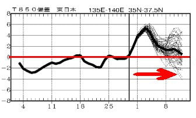
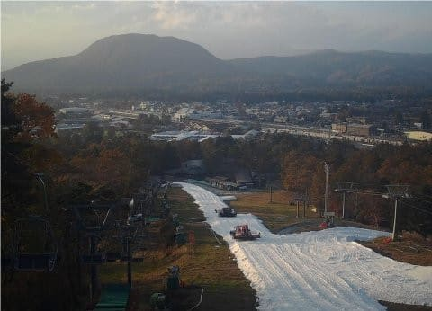
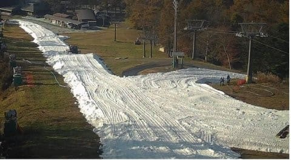
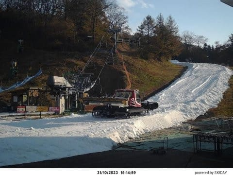
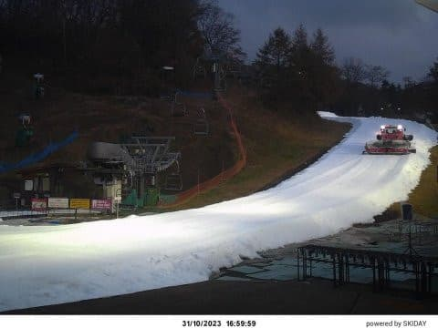
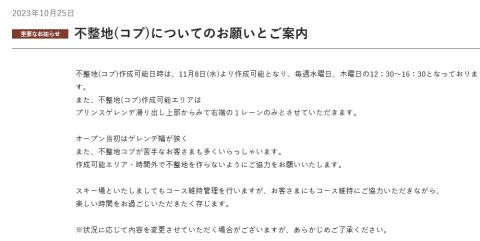
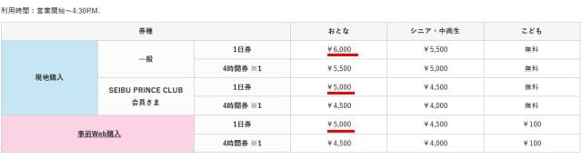
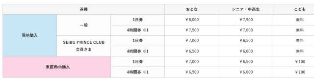
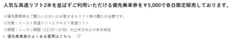
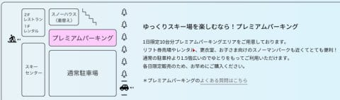

# 本日11月1日に軽井沢スキー場がオープンしますが…リフト1日券はWeb割引だけじゃくプリンス会員も1000円引き！そして今年も＋5000円で優先搭乗券

📅 投稿日時: 2023-11-01 02:18:15

🏷️ カテゴリ: [日記](cc4b5682fb7b8b144980957a978653fb0.md)

なぬ？？

11月？？？

え？

もう11月？

ウソでしょ…

まさか，あと2か月で2023年が終わっちゃうって

ことはないよね…

2023年って，15月くらいまであるんだっけ？？

…と．

私が知らないうちに11月の世界に突入して，

約2時間経ったらしい今．

今年中に終わらせなくてはならない仕事の

リストを見て，愕然としている

Skier_Sです．

ってなことで．

まだ認めたくないけど，いろんなスキー場が

オープンを控える11月に突入したようなので．

[QXVV24](https://www.sunny-spot.net/chart/QXVV24.pdf)で，これから2週間の850hpa気温

傾向を見てみたのですが

…ダメですね（涙）

これから

11月10日くらいまで，赤矢印で示したように

高温期間が続き…

最高では平年比+5度くらいに上がりそう（涙）

…ということで．

残念なお知らせです．

これから少なくとも1週間は，間違いなく

横手山の人工降雪機は動かせません（泣）

まぁ，今の天気図を見ると，11月7日あたりから，

ぎりぎり人工降雪機が動かせるかもしれない

けど…

11月7，8日は湿度も高そうだし，あまり

大量に人工降雪できない感じ．

やはり，横手山のオープンは11月中旬に

なりそうですね…（残念）

と，残念なニュースもありながらも．

11月1日といえば…

軽井沢スキー場がオープンしますよ！！

例年なら11月3日オープンのとk路．

今年は11月1日と2日早いオープン！！

ライブカメラを見ると…

プリンスゲレンデも，圧雪準備が進んでいる

ようで．

（[軽井沢スキー場ライブカメラページ](https://skiday.app/v5XpDAiHz0PL2Cp8ADxt/869223040349613/embed)より．以下同じ）

ちょっとコースは狭そうだけど，

雪の厚みは十分っぽく見えますね…

そして，栗の木ゲレンデも，コース整備が

進んでいますね～！

ただ，こっちはコース幅はイエティより

狭い感じ…

まぁ，いつものオープン時期の平均的な

コース幅かな．

コース幅が狭いので，例年ならすぐコブコブになる

この時期の軽井沢．

一応，意図的なコブライン作りは水・木曜の12時半～

16時半以外は禁止されてるようですね…

まぁ，意図的に作らなくても昼には一面の

コブコブになりますが…

（[軽井沢スキー場ホームページ，案内ページ](https://www.princehotels.co.jp/ski/karuizawa/informations/huseitikobu/)より）

で．

今シーズンの軽井沢スキー場．

11月1日のオープンからこの値段なのですが…

一日券は6000円とかなり値上がりして．

ただ，プリンス会員か事前購入なら

1000円安い，5000円で買えます！

（[軽井沢スキー場ホームページ，料金ページ](https://www.princehotels.co.jp/ski/karuizawa/winter/lift/#lift-fee)より）

…しかし，小学生の子供無料の軽井沢．

なぜか事前Web購入だと100円取られるという

不思議なシステムなので，ご注意を．

ちなみに，12月23日から3月20日までは

トップシーズン料金で，

一日券8000円っ！！！！！

プリンス割引，あるいは事前Web購入でも

7000円です…

（[軽井沢スキー場ホームページ，料金ページ](https://www.princehotels.co.jp/ski/karuizawa/winter/lift/#lift-fee)より）

あとは，軽井沢スキー場に確か2014シーズンから

導入された，優先搭乗チケット．

イースト高速リフトとウエスト高速リフトの

2本の高速リフトの優先レーンが使えるという

確か100枚限定だったかのチケットですが，

今年も土日祝＆年末年始に販売されるようです…

こちらは早い者勝ちなので，欲しい人は

Web事前購入で日付指定して買うのがいいかも．

（[軽井沢スキー場ホームページ，料金ページ](https://www.princehotels.co.jp/ski/karuizawa/winter/lift/#lift-fee)より）

しかし．

一日券7000円＋優先乗車券5000円で，12000円か…

買う人いるのかな…？

こういうのがためらいなく買えるお金持ちに

なって，

「ふはは．下々の民よ，長い列に並んで

　待たされるがよい」

と，お金持ち気分を味わってみたい気もする…

そもそも買おうとも思わないし，トップ

シーズンに軽井沢に行こうとも思わないけど

で．お金持ち気分といえば．

3000円を払うとゲレンデのそばの駐車場に

止められる，プレミアムパーキング．

今年もやるようです…

（[軽井沢スキー場ホームページ，料金ページ](https://www.princehotels.co.jp/ski/karuizawa/winter/lift/#lift-fee)より）

そもそも，軽井沢の駐車場．

土日は駐車料金1500円

というすごい価格ですが（涙）

昨年までのイエティの駐車料金1200円がタダに

なった今シーズン，他を激しくぶっちぎった，

突出した駐車場料金になりましたね…

ってなことで．

もう11月になり，本日から軽井沢もオープン！！

だんだん本格シーズンが近づいてきますよ～！！

## 💬 コメント一覧

### 💬 コメント by (ぽーちゃん)
**タイトル**: Unknown
**投稿日**: 2023-11-01 19:36:49

いつもリアル＆最新情報ありがとうございます。

志賀高原の天気は、ホントーに正確で助かります。

んでもって本日軽プリオープンですが、、リフト券はシーズンイン価格で1日券6,000です。ハイシーズンは8,000円となります。

プリンス会員価格やWeb割引はありますが。。。

すっかり高級リゾートになってしまいました(^^)/~~~

### 💬 コメント by (Skier_S)
**タイトル**: ＞ぽーちゃんさま
**投稿日**: 2023-11-03 02:43:12

情報ありがとうございます！記事を修正させてもらいました．

確かにハイシーズン8000円…っ！！！！

高い．高すぎます…（涙）

いや…超金持ちリゾートになった感じですね（泣）

