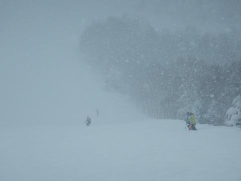
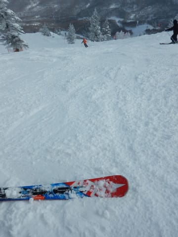
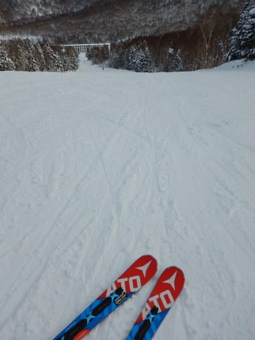

# 1月2日の志賀高原，焼額山スキー場は…朝イチすねパフ！午前は荒れ気味天気だけど，午後は回復傾向

📅 投稿日時: 2018-01-02 23:53:46

🏷️ カテゴリ: [2018スキー滑走日記](c11b88dc181f34079ab41db74a3587646.md)

ということで．

まだまだ志賀高原に滞在中のSkier_Sです．

だもんで．

まだまだ志賀高原レポートは続きますよ～！

今日，1月2日の朝も．

雪が降る中，お約束の焼額第1ゴンドラの

営業開始待ちからスタートするわけですが…

昨日よりちょっと人は多いかな．

で．

山頂の気温は…

マイナス12℃！

冷え冷えですっ！

そして．

山頂の天気は…

…

かなりの勢いで雪が降ってます…

かなりの降雪なので．

圧雪斜面にも5cmほどの雪が積もってますよ～！

当然，今日も太板出動だっ！！

そして，向かうは当然，

オリンピックコース．

オリンピックコースの積雪は30～40cmほど．

脛パフだぁ！！

せいぜい20㎝程度の積雪かと思っていたけど，

意外と積もってるよ！

ってことで．

行け～！

パフパフパウダーへ突撃っ！

脛パフ！

ちょいと重めだけど…膝パフ！

って感じで．

朝1時間ほど，膝パフを楽しませてもらいました…

今日は，こんな感じで，

激しい雪降りが続くのかな…

と，思っていたところ．

意外と日が差すタイミングもあったり．

また激しく降りだしたり…

を繰り返したけど．

午後はほぼ雪は降らず，

それほど荒れた天気ではなかったですね～．

ゲレンデ混雑は，午前10時を過ぎるとさすがに

混んできたものの．

第1ゴンドラのゴンドラ待ちは，午前10時過ぎに

最大このくらいで．

ゲートの外にちょっとはみ出るくらい．

午前11時を過ぎると，ゲートの外に

人がはみ出ることもなく．

コース上の人も，そこそこ多かったとはいえ，

31日ほどの激混みにはならず．

白樺コースとかはこの程度の人口密度だったし．

まぁ，31日に比べれば，ずっと滑りよかったかな！

でも．

新雪が結構積もった，柔らかい雪だったので．

午後になるとコース上は結構凸凹になってきて．

うーん．

ちとつらいなぁ…

でも．

第1ゴンドラ側のGSコース．

午後は人が減って，結構ガラガラに

なって来たよ！

うむ．

これなら凸凹でも滑りよいぞ！

許す！←だからなぜ上から目線？？

…と，思っていたところ．

午後3時過ぎに…

なぬ？

第1ゴンドラ故障！？？？

運休だと？？？（涙）

なんということだ～！！

ってことで．

1ゴンから流れた人で，

第3高速はこの後15分，激混み（泣）．

そして，1ゴンが滑れないので．

第2ゴンドラ側のサウスコース．

なんだかすさまじい混雑になっちゃったんですが…（悲）．

なぜ，1ゴン壊れるかな～！！

でも．3時半を過ぎると．

完全に2ゴン側に人が流れてしまったからか．

1ゴン横の第3高速はガラガラに！

そして．

1ゴンが止まったお詫び（？）のため．

16時頃にいきなり第2高速の15分営業延長が決まり．

16:30まで営業してくれたので．

日が暮れて，ナイター照明がつく時間まで，

今日もたっぷりすべったのでした…

…ってことで．

今朝も脛パフを楽しめましたが．

来ますよ．

きますよ～！

明日はパフパフデーです！！

朝の営業開始が遅れるのでは？？？

というくらい積もりそうです．

太ももパフ，

うまく行けば腰パフかも？？

…そして，エンドレスパウダー供給状態の

降雪がありそうです…

…ただ．

終日激冷えの雪降りで風が強そうなので…

そう．

日本語では，吹雪という天気です．

覚悟してください．

奥志賀ゴンドラは営業ヤバそうな風が吹くかも…

とりあえず，明日はゴンドラじゃないと辛そうな

天気だけど．

パフパフに大期待！！

## 💬 コメント一覧

### 💬 コメント by (olaf2125)
**タイトル**: あらためて…
**投稿日**: 2018-01-03 01:03:42

明けましておめでとうございます。

昨年、念願のシルバーステッカーをいただいて（何を勘違いしたか）自分の滑りがレベルアップしたと思い込んでいる今日この頃です。

近日中に苦手のパフを攻略しに戻ります。

本年もどうぞよろしくお願い致します。

### 💬 コメント by (Skier_S)
**タイトル**: 1月3日、1ゴン営業開始遅れる予定
**投稿日**: 2018-01-03 07:48:46

焼額1ゴン朝一組のみなさま、

昨日午後壊れた1ゴンはまだ直ってないようです。

営業開始遅れるとのこと。

3高も除雪作業で開始は8:45くらいか…

という話でした。

2ゴンか2高スタートがよさそうかも

### 💬 コメント by (Skier_S)
**タイトル**: まさかの
**投稿日**: 2018-01-03 09:42:47

2ゴン強風営業見合わせ(;_;)　

1ゴンは9時に動き出しました

### 💬 コメント by (ほっぽ)
**タイトル**: ご苦労様です
**投稿日**: 2018-01-03 10:34:56

Ｓさん

まさかの１ゴン故障で運転開始遅れに２ゴン運休とはイタイですね。

奥志賀もほぼ全滅のようですし、よりによって今日、この冬一番の大雪にならなくても、と思います。

こんな悪天候でも滑っているスキー〇カの皆さんには脱帽です。(^^;

私も天気良かったら日帰り志賀と思っていましたが、予報見て断念しました。

これで３連休は体調万全でスキーが出来そうです。

### 💬 コメント by (Skier_S)
**タイトル**: olaf2125さま
**投稿日**: 2018-01-03 18:47:03

銀のお札は貼ると悪雪だろうが吹雪だろうが

ひたすら滑れるようになる霊験があるようです(笑)

次は3連休あたりにはいらっしゃらないのですか？

今度はシマシマぴかぴかバーンの朝一番を狙ってください！

### 💬 コメント by (Skier_S)
**タイトル**: ほっぽさま
**投稿日**: 2018-01-03 19:22:04

今日は、午後は吹雪で1ゴンもかなり減速し、

修行のような一日でした…

今日は、一ノ瀬や高天のクワッドも動かなかった

ようです。

でも終日パフパフを楽しめました…

私はどんな天気でも楽しめるようです(笑)

### 💬 コメント by (ノムノム)
**タイトル**: 昨日午後から焼額参戦中です。
**投稿日**: 2018-01-03 19:56:03

明けましておめでとうございます。

今年も宜しくお願いします。

本日は悪天候の中でしたが、自分なりに楽しめました。

Sさんは如何でしたか？

午前中、第1ゴンドラ前でSさんと思わしきSXの板を

持った男性に勇気を振り絞って声を掛けたのですが、

別人でした…(苦笑)

お会いできなくて残念です〜！！

ちなみに第1ゴンドラ内のガラスに

「Sさんがだいすきだー」って書いてありましたけど…(笑)

### 💬 コメント by (yumi)
**タイトル**: わたし、埋まるの好きみたいです☃️
**投稿日**: 2018-01-03 20:43:40

私は今日も、お約束のホイホイへ。

なにやら後ろから 歓喜の雄叫びを上ゲながら、ピューっと去って行くＳさんを何度も見送りました。

やはり今日も🎵🎵🎵だらけでした。

### 💬 コメント by (はなげ親分)
**タイトル**: 今日は降参
**投稿日**: 2018-01-04 00:15:13

麓からなんとか１ゴンまでたどり着いたのですが、途中で地吹雪の洗礼を受け1ゴンが動いているのは確認したのですけど心折れて下山しました・・・

こんな性根では銀のお札、返納しないといけませんか？

### 💬 コメント by (Skier_S)
**タイトル**: 一旦帰宅しました
**投稿日**: 2018-01-04 03:18:57

＞ノムノムさま

あら．

今日は終日太板を履いていたので，

SXは履いてませんでした…

私のSXを見分けるためには，

金のお札を確認するのが確実ですので，

次回からはゴールドステッカーの有無を

チェックしてみてください．

でも，今日のパフパフは最高でした~！

朝イチは昇天するかと思いました．

…しかし．1ゴンのガラスにそんなことが

書いてあったんですか…！？？

＞yumiさま

いや．

あの深い難しい雪を滑ってらっしゃるなぁ…

と思いながら，横を通っていきましたが．

やはり，太板はいいです←技術の無さを道具でカバーするSkier_S

太板なら，あのオリンピックコースでも「♪♪♪」ですよ~！！

＞はなげ親分さま

1ゴン駐車場まで来て滑らすに帰られたのですね（笑）．

そこまで地吹雪の中運転してきた苦労を考えれれば，

私なら間違いなく滑ってから帰りますが…

でも．

あの天気だったら，滑らなくても普通ですから．

銀色のお札は返納不要です．

むしろ，あの天気でも滑る人に，

銀色ではない色のシールをあげたいくらいの

気分です…

