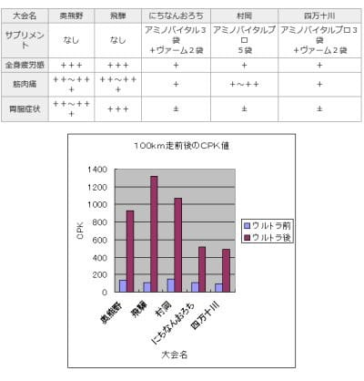

# なぜ登山でVAAMを試してみようと思ったのか？その１…客観的なデータがあったんだもん

📅 投稿日時: 2022-08-29 01:23:59

🏷️ カテゴリ: [日記](cc4b5682fb7b8b144980957a978653fb0.md)

えー．

塔の岳の登山日記で．

「VAAMがいいらしい」ということで，

試してみた…

と書きましたが．

今日は，なぜそのような考えに至ったかの

ディープな経緯を書いてみようかと（笑）

まず．

私の山歩き．

トレーニング目的で，結構なハイペースで

長時間坂道を歩く

わけなんですが…

普段からスキーシーズンや登山時，

運動しているのに，

筋肉がつかないどころか，

むしろ体重（筋肉）が落ちてしまう

という状況…（涙）

うーん．

筋肉，つけたいんだけどな…

スキーのための大切な筋肉なのに，

過剰な運動で，筋肉が分解されちゃってるかな？

…と思い．

これを避けるため，昨シーズンから

スキー後や登山の後．

プロテインを摂取するようになったんですが．

プロテインをとるようになってから，

運動後の筋肉痛がほぼなくなった

という効果も感じて．

…うん．サプリも悪くないな…

と，思い始めたところ．

前回の丹沢山登山のとき．

下りのラスト40分．

スタミナが切れて，乳酸も溜まってきて．

バテ気味でペースが落ちちゃったという

悔しい経験をしたので…

途中でバテないよう，

ランやバイクをやってる人のバテ防止の

サプリを参考にしてみようかな…？

と思い．

まぁ，ランやバイクの定番サプリと言えば，

アミノ酸．

アミノ酸サプリをいろいろ調べ始めた

わけですが…

ただ，普通にネットで調べると，

効くとか効かないとか，身体に悪いとか．

口コミや，「●×らしい」という

伝聞形の情報がほとんどなわけですね．

…ここで，科学的エビデンスとなる原典に

当たらないと気が済まない私．

いろいろ調べまくると．

まず，面白かったのが，

[このサイト](http://tokushima-nishi.com/tyousa/index.html)．

徳島西医師会の，佐藤先生が調べた調査結果に

行きつきました…

（[徳島県医師会，「調査と研究」ページ](http://tokushima-nishi.com/tyousa/index.html)より）

これ．面白いんですよ．

どうやらこの先生，自らフルマラソンや

ウルトラマラソンを走るようなんですが．

サプリ有り無しで，走った前後の

血液検査結果を比較する

という，私が欲しかった科学的データを

公開してくださっていて．

「これだ，これが欲しかったんだよ！！」

と，ついつい読みふけったわけですが…

まず，[このページ](http://tokushima-nishi.com/tyousa/22.html)を見ると．

三つのウルトラマラソン後のデータを比較

しているんですが．

サプリを摂らなかった奥熊野，飛騨のレースに比べ，

サプリを摂ったにちなんおろちのレースでは，

レース後のCPK，GOT，LDH，CKMB値

（筋肉由来，長時間運動での骨格筋ダメージを表す）

の悪化が抑えられていてます…！！

（[徳島県医師会，「調査と研究」ページ「ウルトラマラソン後の血液検査No2」](http://tokushima-nishi.com/tyousa/22.html)より引用）

ちなみに，にちなんおろちのレースでは，

「アミノバイタル」３袋と「VAAM」２袋を

摂取したようです…

そのあと．

さらにサプリを摂取していくつかのレースに

出場したようなんですが…

下のデータにある，上側の表ように，

サプリを摂らなかった2レースと，

サプリを摂った3レースを比較すると，

まずは，

疲労感や胃腸症状等の主観状態はサプリを摂った3レースで効果が認められた

のですが．

サプリを摂取した3レースを比較すると．

下側のグラフを見て分かるように，

アミノバイタルだけを摂取した村岡に比べ，

レース後の筋肉損傷を示すCPK値という客観データでは，

ヴァームを摂ったにちなんおろちと四万十川が有意に低い

という結果が出ています…！

（[徳島県医師会，「調査と研究」ページ「100km走前後の血液データ （サプリメント効果）No.1」](http://tokushima-nishi.com/tyousa/23.html)より引用）

アミノバイタルはそれほどじゃないけど，

ヴァームには筋肉のダメージを抑える効果が

あるということか…！

この徳島県医師会の調査と研究ページは，まだまだ詳細な

分析結果があって．（ハーフマラソンやフルマラソンでの

サプリ効果や，その他ヘモグロビンや赤血球，

腎機能や脂質などの詳細データもあるよ）

かなり面白いのですが…

やはり，長時間にわたる持久力が求められる

レースでは，アミノ酸サプリ（特にVAAM）が

効くという客観的データが揃ってます．

こうなると．

なんでVAAMが効くのかの原理を知りたい

という欲求が抑えきれず，歯止めが効かなくなり．

片っ端からアミノ酸代謝の文献を読みまくる

という．

暇じゃないのに，睡眠時間を削って何やってるんだ

状態に陥った，Skier_Sだったのでした…

（[まだまだ続く](e57f7e152440954d9758a907381a39e42.md)．ここから先はマニアックになっていくよ…）

## 💬 コメント一覧

### 💬 コメント by (真美子)
**タイトル**: Unknown
**投稿日**: 2022-08-29 10:44:14

すごく面白いというか、早く続きを読みたい!

### 💬 コメント by (おおすぎ)
**タイトル**: Unknown
**投稿日**: 2022-08-29 11:25:33

いや～、また面白い論文をお探しですね！

私事で恐縮ですが、学生時代、（陸上部・短距離）から、「アミノバイタル」一択です♪

寝起き、走る前、練習中、走った後、寝る前も常に身体に入れていましたね。

（タダで配られていたというのもありましたが・・・）

プロテイン系も試してはみましたが、あんまり身体に合わなくて・・・

だもので、未だにヒョロっとした体系です（残念↷）

### 💬 コメント by (副院長)
**タイトル**: Unknown
**投稿日**: 2022-08-29 11:37:34

アミノバイタル、前日の夜、当日朝、運動中、運動後、これで昨日の乗鞍ヒルクライム終えました。いつもはこれに脱水用OS1を追加してましたが、今後VAAM追加しなくっちゃ。メモメモ。

### 💬 コメント by (スシネコ)
**タイトル**: Unknown
**投稿日**: 2022-08-29 12:59:06

お久しぶりです。（覚えていますかねぇ？w）

８月は筑波山バリルートを週末に３往復／日して冬に備えていました。

私はVAAM派ですが、効果があるのかどうか分からなかったので、今回のエビデンスはとても勉強になりました。

冬に向けて体幹トレーニング頑張ろっと。

### 💬 コメント by (northfox)
**タイトル**: Unknown
**投稿日**: 2022-08-29 13:03:15

この頃はサプリも積極的に活用しようと思っているのでとても興味があります！

物欲系とは違ってとても有益な情報ですので、続きを楽しみにしています😙

### 💬 コメント by (Skier_S)
**タイトル**: 意外と興味持ってもらえる記事だったんだな…
**投稿日**: 2022-08-29 23:03:20

＞真美子さま

続き書いてますが…

これ以降の記事は，あまりにもマニアックすぎて，読者を振り落としていきそうな勢いです（笑）

＞おおすぎさま

いや．

この佐藤先生の調査結果，ホントに素晴らしいです！

私もアミノバイタルとかBCAA系は効くのかな？と文献を探していたら，

全く予想外に「VAAMが効く」という証拠に突き当たってしまったという経緯です…

＞副院長さま

アミノバイタル派なんですね！

やはりヒルクライムやる人は，アミノバイタルとかのアミノ酸をとる人が多いみたいですね…

OS-1もいいけど，VAAMウォーターもいいです．

500mlでナトリウムの食塩相当0.5g摂れるので，

今回の登山では塩タブレット全く不要でした．

私はVAAMは顆粒じゃなく，水に溶かすタイプにしています．

＞スシネコさま

お久しぶりです！

覚えてますかねって…忘れたくても忘れられませんから（笑）．

筑波山3往復ですか！？？それはすごい…

4-5時間かなりの負荷をかけ続ける山歩きでは，VAAMの効果は確かにありそうです．

＞northfoxさま

物欲選手権よりは役に立つ情報ですよね…確かに（笑）．

しかし，このあとの記事は読者を振り落としていきそうなので，ちょっと心配…

