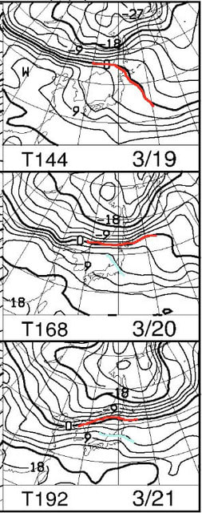
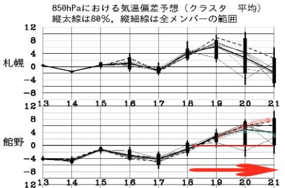
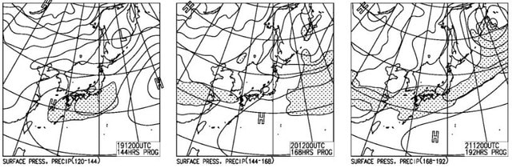
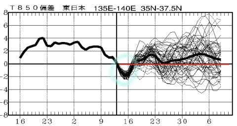
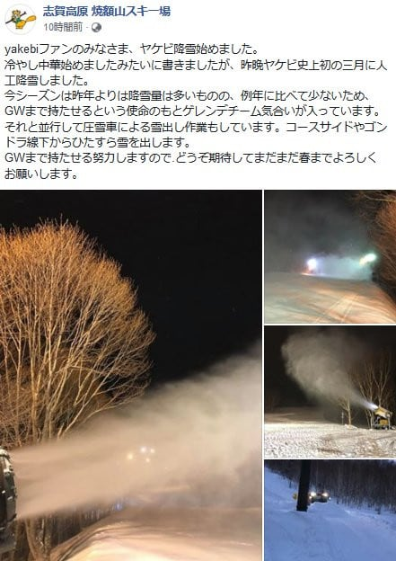

# 今週末の志賀高原スキー場は冷え冷えだけど，19日以降はしばらく気温が上がりそう（涙）．でも，焼額山はGWまで滑れるように人工降雪実施中！素晴らしいっ！！！！

📅 投稿日時: 2019-03-15 02:40:29

本日．

焼額特派員からのレポートによると．

本日の志賀高原は．

最高

だったようですね…

朝は焼額オリンピックコースが

冷え冷えの30cmパウダー．

昼にはすっきり晴れて，

GSコースなんかは，トップ

シーズン並みの最高雪質

だったようで…

…

…明日も晴れるので，最高でしょうね…

いや，土曜も冷え冷えなんですよ．

2月のトップシーズン並みの激烈寒気が

入るんですよ．

そのせいで，3月中旬なのに，

雪はトップシーズン並みなんですよ．

朝にはブーツパフの軽い新雪が

滑れそうなんですよ．

…でも．

北風が強くて，冷えて終日雪が降り続けるので．

要するに．この土曜．

雪はいいけど．

吹雪気味で寒い

ということなんです…

そして．

日曜も，冷え冷えなのはいいとして．

昼には晴れてくるかな～，

と思ったところが．

昼過ぎまで雪がぱらつきそうな感じ…

遅くとも夕方には晴れそう

なんですけどね～．

この日も終日冷え冷えで，

雪がいいのは確定なので．

なるべくなら昼前から晴れて

ほしいところ…

うーん．月曜は冷え冷え晴天の，

最高の一日になりそうなんだけど…

まぁ，また明日直前予想しますが．

今週末，1，2月並みに冷えるので．

トップシーズン並みの防寒を

しっかりしていってくださいね～！

あと，この週末．

志賀高原の登り道路は完全積雪

だと思いますし．

土曜朝は高速もチェーン規制がかかるかも．

この週末は，真冬の準備を忘れずに…

とりあえず．

こんな感じで．

月曜までは冷えるんです．

…月曜までは．

しかし．

火曜，19日以降は…

うぎゃーーーー！！

なんだ，これはっ！！！

赤い0℃線が，19，20，21日の3日間．

ずっと北海道くらいの北に上がって

しまっていて．

志賀高原には，水色の+6℃線が

近づいてます…

これは，降れば絶対液体です．

固体が降る気温ではありません…（涙）

あぁ…

冷え冷えの週末は．

今週で終わりそう…（涙）

さらに．

850hpa気温偏差予想を見てみると．

こんな感じで，赤矢印で示した

19日から21日まで，かなりの高温

になりそうです…（泣）

でも．

20，21日のところを見ると．

まだ予想ばらつきが大きく．

赤目印を付けたコントロールランは，

平年比＋6℃～+8℃に上がる予想ですが．

青目印を付けたアンサンブル平均は，

+4℃線後にとどまっていて．

21日では，アンサンブル平均の方が，

コントロールランより4度近く

低くなっています．

こういう場合は．

コントロールランよりも，

アンサンブル平均に近い推移をしていく

パターンが多いです．

この，850hpa予想気温は，気温が

高めに予想されている，GSMの

コントロールランによる図面なので…

20，21日は，実際にはここまでは

気温が上がらず．

あと2～4度ほど低い気温で

推移してくれるんじゃないかな～．

…とはいえ．

どっちにしろ，平年より高い

気温なので．

降れば液体となる高温であることには

変わらなさそうなんですけど（涙）

で．

この3日間の地上天気図は…

うーむ．

微妙．

19，20日は，網掛けの降水域が，

志賀高原に近づいているように

みえますが…

この天気図のままなら，ギリギリ

降らずに済みそう…

いや．

ここもまた，私の．

必殺・高温になるけど雪が解けないよう

雨よ降るな降るな踊り

によって．

聖地志賀高原は，液体が降る危機を

回避するはずなのだ！

大丈夫！

21日も，液体は空から落ちてこないはず！！

私の踊りを信じるのだ！！←毎度のツッコミだけど，あなたが志賀高原の天気を決めているんじゃないからっ！！！

そして．

21日以降，これから4月にかけて．

また，気温が高いままになっちゃうのか？？？

毎週木曜発表の，一か月予想図を見てみましたが…

うーむ．

水色で囲った，13日から17日まで．

今週の冷え冷えを反映して，平年より

低い温度まで下がっているのが

読み取れますが．

…それ以降は，

平年より+1度ほど高い感じで

推移しそうですね…

残念ながら，平年より気温が低い，

冷え冷え状態にはならなさそう

ですけど．

[2月末に予想されていた](e4e4ef25a84d203091d03b78cd71deb96.md)．

　3月はひたすら平年より2～3℃高い

　気温が続く，異常高温になりそう

という，スキーヤー殺しの予想は．

スキーヤーの熱い思いがこもった，

激しく情熱的な冷え冷え踊りにより，

いい方に外れてくれたようです…！！

とりあえず．

この3月が予想より冷えてくれたおかげで．

志賀の積雪量は，昨年よりはマシな状況に

なってきましたが．

…残念ながら，まだ例年に比べれば

雪が少ない状況です（涙）．

このままだと，GWの営業は安泰と

言えない状況ですが…

…ここで，素晴らしいニュースがっ！！

なんと．

焼額山．

GWまでの営業を確実にすべく．

3月というのに，ゲレンデに人工雪を

打っています！

ガンガン打ってます！

なんと素晴らしいっ！！

（[焼額山FB](https://www.facebook.com/yakebitaiyama/posts/2082458085182860)より）

いやーーー．

普通，3月に人工雪，打つか！？？？

常識的に，1月には人工雪を打ち終わる

モノですが…

まさか，3月に人工雪を打つとはっ！！

すごいぞ，焼額っ！！！

この，焼額山の情熱に負けないよう．

我々も引き続き，休まず止まらず．

地球の気温が上がるほどの熱い情熱を込めた，

冷え冷え踊りを踊り続けるのですっ！！←矛盾してるから…！気温上がったらダメだから…っ！！

## 💬 コメント一覧

### 💬 コメント by (ozxyz.xyz)
**タイトル**: Unknown
**投稿日**: 2019-03-15 10:13:03

リンクさせてもらいました。

URLがかけないので、ozxys.xyzで検索していただければ１発です。

今週末行けないのが残念！

来シーズンはお会いできること期待してます！

いつもありがとうございます。

### 💬 コメント by (若杉勲71)
**タイトル**: Unknown
**投稿日**: 2019-03-15 11:36:23

志賀高原情報

本日は晴天なり。本日は快晴なり。雪質も最高なり。チウホテルのビーフシチューも美味しいなり。butしかし、本日もオリンピックとGSのPPは、か○う、ほ○だ、二夫妻のものとなりました。雪質は、奥志賀＞ヤケビ＞一ノ瀬の順。

以上、速報でした。

### 💬 コメント by (パパは初心者)
**タイトル**: Unknown
**投稿日**: 2019-03-15 15:32:34

本日　ネットで娘のダイビングCカード取得について色々しらべていたらこちらのブログに辿り着き　？？

これ　S様のブログではないですか！！

もう私にとっては神のような存在です。

モアルボアル、タオ島　懐かしすぎる。早く年長さんの娘が潜れる年齢にならないかなー、

本日夜　焼額に向け出発です。今後ともご教授よろしくお願いします。

### 💬 コメント by (ホンダ)
**タイトル**: Unknown
**投稿日**: 2019-03-15 17:00:09

焼額山特派員報告です。焼額は本日-10度のシーズン真っ盛りの素晴らしいバーンです。かたすぎもせず柔らかすずもせず

まさしくウヒョヒョな状況です。奥志賀高原も一ノ瀬もgood まさしく極上な一日でした。夕方から素敵な雪が舞ってきました。明日の早朝でお待ちしていますよー

### 💬 コメント by (Skier_S)
**タイトル**: 明日は真冬並み！
**投稿日**: 2019-03-15 22:51:55

＞ozxyz.xyzさま

やっぱり，次は来シーズンなんですね…

まだまだGWまで滑れるんですが．

また来シーズンお会いしましょう～！

＞若杉さま

…うらやましすぎます…

今日は一の瀬よりヤケビの方が雪が良かったんですね！

明日はちょっと天気が悪くて視界も良くなさそうだけど…

この週末も冷え冷えが続きそうです．

では，また志賀でお会いしましょう！

＞パパは初心者さま

あら．

ダイビングもされるんですね…

我が家は，昨年の夏に娘がジュニアオープンウォーター

とりました～！

娘は，スキーも海も大好きです．

明日，明後日と焼額スタートで志賀を滑ってます～！

たぶん，また大勢で滑っていると思います．

＞ホンダさま

うらやましい…

うらやましすぎます．

ってか，また今週も金曜から滑ってらっしゃるんですね（笑）．

明日はちょっと天気は崩れそうですが，でも冷え冷えなので

いい感じかと．

帰宅がついさっきなので，明日はさすがに早朝に行けません…

通常営業から参加ですので，よろしくお願いします～！

