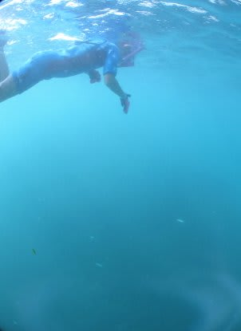

# 2015年8月　子連れでモアルボアルでダイビングその29…ダイビングが終わったあとは，セレブ（？）な夕方

📅 投稿日時: 2016-08-03 03:39:05

🏷️ カテゴリ: [ダイビング日記](ce3a7a8d424d112fce83ee85c81a0e344.md)

ブログの記事の面白さは，

人間の精神的余裕に比例すると思う今日この頃．

いかがお過ごしでしょうか．

＃最近の記事，自分で読んでも面白くないなぁ…（涙）．

ということで．

今日も深夜更新，ダイビング日記へGo!

----

という感じで．

こういうショップ目の前の海で…

超ゼイタクなイワシシュノーケリングを

満喫したあと．

ホテルへ戻りましたが…．

ふむ．

時間はまだ，夕方4時前ですね．

私「夕食までまだ時間があるし…何して過ごす？」

娘「プール，プールっ！！！！」

…

…お前…

あれだけ海で泳いできたというのに．

まだ泳ぐのか…っ！！？？

ということで．

超泳ぎ好きな娘を連れて，

ホテルのプールに向かい．

プチセレブ気分で，のんびりプールで泳ぐ娘．

お前，ホントに泳ぐの好きだなぁ…

って感じで．

1時間ほど泳いだら．

…ショップでのログづけタイムなので．

プールから上がり．

いつもの道を歩いて，ショップへ向かいます…

そして，ショップでログづけのあとは…

そう．

今日は最終日なので．

清算をせねばなりません…（涙）．

ダイビング旅行が終わりに近づき，現実に引き戻されるのは．

…ダイビングフィーを支払っているとき

じゃないでしょうか（笑）

しかし．

今回利用したエメラルドグリーンダイビングセンター．

フィリピンでは珍しく，ダイビングポイントによって

追加料金がない，明朗会計！

1日1本しか潜らなくても，3本潜っても．

ぺスカドール島まで遠征して潜っても，

1ダイブ1750ペソの分かりやすい均一料金です．

ちなみに，ドルでも日本円でも支払い可能ですが…

カード払いできないのでご注意！

そして，ログづけ＆清算の後．

ショップ前の海に，夕日を見に行きました．

夕日が沈もうとしているころ，地元の人たちが

海で遊んでます…

あぁ．

今晩が，モアルボアルラストか…

明日帰るなんて…

いやだな～

＃かといって，スキーに行けないところで暮らすと死んじゃう

＃自分が，ずっとここに残るのは無理だけど

そして，夕日は沈んでいき…

空は徐々に，オレンジから紺色に

その色を変えていきます…

あぁ．

楽しかった．

楽しかったよ．

モアルボアル，また来たいな～…

…と，黄昏を眺めつつ思った，Skier_Sなのだった…

＃その思いは2週間後に実現される…はず

## 💬 コメント一覧

### 💬 コメント by (Tomoko.Y)
**タイトル**: 動画のBGM
**投稿日**: 2016-08-03 07:02:11

Sさま、先日の動画のBGMがとてもすてきで、曲名を教えて頂けますか？

Shazamに聴かせましたが、間違えてばっかりなので…((T_T))

よろしくお願いします。

### 💬 コメント by (Skier_S)
**タイトル**: Tomoko.Yさま
**投稿日**: 2016-08-04 00:03:36

えーっと．

この音楽，Youtubeの編集画面で，

BGMを入れる際に「広告なしで使えるBGM」

ってことで自由に選べる音楽を適当に

突っ込んだものです．

タイトルは，調べてみると

Pas de deux

演者は，

bird creek

となっています．

Youtubeでフルの音楽が聴けますよ～

https://www.youtube.com/watch?v=Z8yo9sHgaLM

### 💬 コメント by (Tomoko.Y)
**タイトル**: 聴けました～＼(^o^)／
**投稿日**: 2016-08-04 07:09:30

YouTubeで聴けました。

Sさま、ありがとうございます～!!

### 💬 コメント by (Skier_S)
**タイトル**: Tomoko.Yさま
**投稿日**: 2016-08-05 01:17:12

聴けましたか～！

良かったです（＾＾

