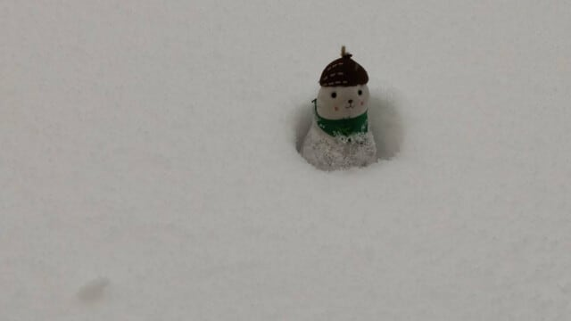
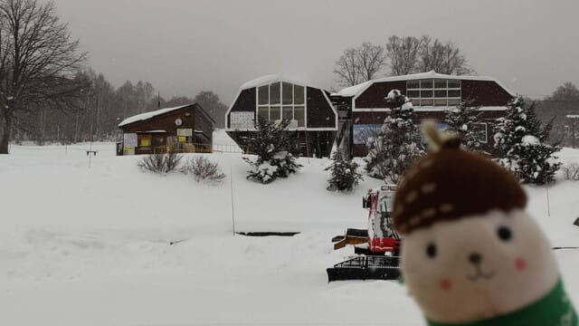

# ダメだ…月曜の夜はダメだ

📅 投稿日時: 2024-12-17 11:40:10

🏷️ カテゴリ: [日記](cc4b5682fb7b8b144980957a978653fb0.md)

ってなことで．

スキーから帰ってきた翌日月曜に，

朝から夜まで仕事して，帰宅が0時を

過ぎ，さらにちょっと仕事すると…

土日の運動と睡眠不足のおかげで，

もう死ぬほど眠くなり．

いつも通り，気づいたら電気も消さずに

床で倒れてるわけですね(涙)

ダメです．

月曜の夜はダメです…

ということで．今日は昼間に簡単更新！

月曜の志賀高原ですが．

いつものおこみん特派員によると．

日曜の夜から月曜朝にかけても，志賀高原では

雪が降ったらしいのですが…

でも，積雪はせいぜい5cmあるかないかの

うっすら積雪だったようです．

西風じゃなければ，もっと積もったのに…(泣)

でも，奥志賀高原は圧雪の上にうっすら新雪の

いい感じのバーンだったみたいで．

特にゴンドラは動いてないけど圧雪されていた

ダウンヒルコースが最高だったようです…！

まぁ，ゴンドラが動いてないので，ダウンヒル

コースを下に降りたらバスで移動するしかない

のですが…

ちなみに志賀高原，今は雪が降ってないようですね．

西風じゃなければガンガン雪が降る天気図

なんですが…

18日の水曜夜からちょっと降るかな？

あとは，今のままの天気図だと，22日の

日曜はかなり積もりそうな予感…

とりあえず，これからも冷え続けるし，

今週末は焼額も第2高速と第1ゴンドラが

動くはずだし．

今週末はトップシーズンの雪で広いゲレンデが

滑れそうですよ~！

## 💬 コメント一覧

### 💬 コメント by (けんけん)
**タイトル**: Unknown
**投稿日**: 2024-12-17 14:50:32

クリスマス寒波の他にも年末にも来そうですよー！

Windyアプリでみる感じ山雪型っぽいし降りそう！

### 💬 コメント by (Skier_S)
**タイトル**: ＞けんけんさま
**投稿日**: 2024-12-18 01:57:14

いやー．

今シーズンはこのあと何度か繰り返し寒波が来て雪が積もりそうですね…

確かに，クリスマス寒波と正月寒波，ダブルでやって来まそうです！

今シーズンはいい感じに始まりましたね…！！

### 💬 コメント by (かず)
**タイトル**: Unknown
**投稿日**: 2024-12-18 01:59:48

年末より前にスタートなんて記憶にないですが今週末スタート予定です  日曜楽しみです  

Sさん夕食は宿だと思いますがどこか宿意外に夕食食べれるとこ知ってますか？高額除く笑

### 💬 コメント by (Skier_S)
**タイトル**: ＞かずさま
**投稿日**: 2024-12-19 00:28:55

あれ？12月に滑ったことないんですか…！それは意外でした．

今週末，日曜はそこそこ新雪が積もりますよ~！！

