# 11月19日(日)の横手山スキー場特派員レポート！…板を履いてリフト乗車OKに．そして24日(金)から冷える！雪が積もる！25日の週末に期待！

📅 投稿日時: 2023-11-20 00:16:31

🏷️ カテゴリ: [日記](cc4b5682fb7b8b144980957a978653fb0.md)

ということで．

かなり残念な感じの土曜のイエティでしたが…

本日の日曜，イエティは朝から普通に

営業したようで…

やっぱり土曜じゃなく，日曜に滑りに行けば

よかった…（涙）

で．本日の日曜．

志賀高原に忠誠心が高い特派員が，

横手山に行ってきたようですが…

…横手山，昨晩からも積雪があり，

土曜は板を脱いでリフトに乗車しなくては

ならなかったのに，日曜は板を履いて

乗り降りできるようになったようです！

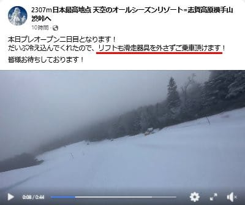

（[横手山Facebook](https://www.facebook.com/yokoteyama2307/videos/%E6%9C%AC%E6%97%A5%E3%83%97%E3%83%AC%E3%82%AA%E3%83%BC%E3%83%97%E3%83%B3%E4%BA%8C%E6%97%A5%E7%9B%AE%E3%81%A8%E3%81%AA%E3%82%8A%E3%81%BE%E3%81%99%E3%81%A0%E3%81%84%E3%81%B6%E5%86%B7%E3%81%88%E8%BE%BC%E3%82%93%E3%81%A7%E3%81%8F%E3%82%8C%E3%81%9F%E3%81%AE%E3%81%A7%E3%83%AA%E3%83%95%E3%83%88%E3%82%82%E6%BB%91%E8%B5%B0%E5%99%A8%E5%85%B7%E3%82%92%E5%A4%96%E3%81%95%E3%81%9A%E3%81%94%E4%B9%97%E8%BB%8A%E9%A0%82%E3%81%91%E3%81%BE%E3%81%99%E7%9A%86%E6%A7%98%E3%81%8A%E5%BE%85%E3%81%A1%E3%81%97%E3%81%A6%E3%81%8A%E3%82%8A%E3%81%BE%E3%81%99/300005619522914/)より）

特派員からの写真によると．

日曜朝の志賀高原，そこそこの積雪が

あったのか，かなり真っ白ですね…！

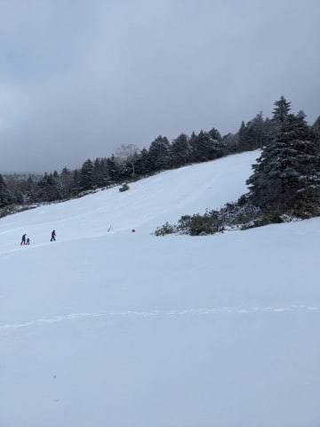

そして，雪が積もったおかげで，

リフト降り場にも雪がついていて…

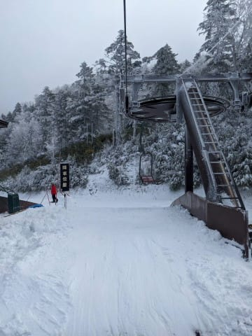

これなら問題なく板を履いて乗り降り

できそうな感じ…！

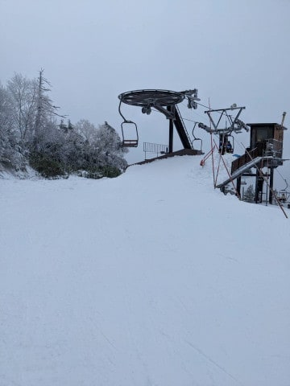

で．

昼に向かって天気は晴れていったようで…

午前中のゲレンデ状況は結構よさそうに見えます！

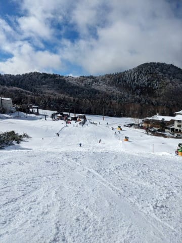

そして，リフト混雑は…

リフト代金が高いからか，積雪＆

凍結路面でアクセスが難しかったからか，

横手山はそれほど混まず，11時ごろまで

リフト5-6分待ち．

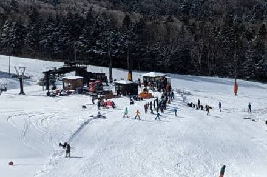

11時以降はほぼ待ち

無しだったようで．

例年ほどの激込みにはなってませんね…！

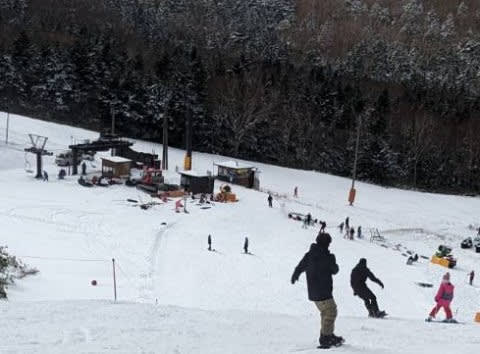

ってなことで．

天然雪が積もったこともあり，

午前中は意外とコンディションが

良かったようですが…

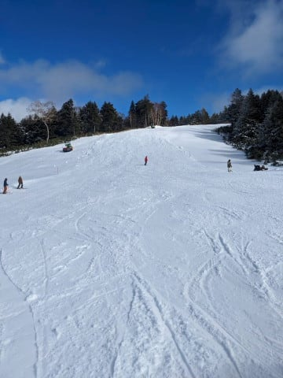

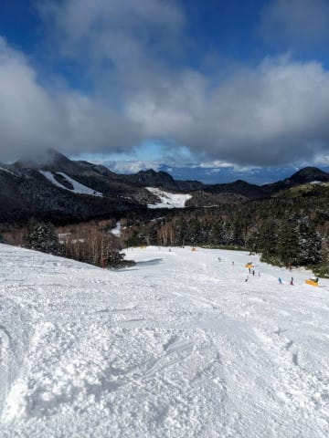

さすがにまだ雪が薄いので．

午後になってくると，穴が開くほどでは

ないにしろ，雪が薄いところはちょっと

危険な香りがする感じになってきてた

みたいです…

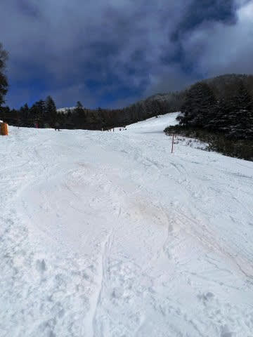

とはいえ，ゲレンデに完全に穴が開いた

わけじゃなく，このくらいならまだ許せる

レベルですね．

意外とこの週末，横手山はちゃんと

滑れたんですね…

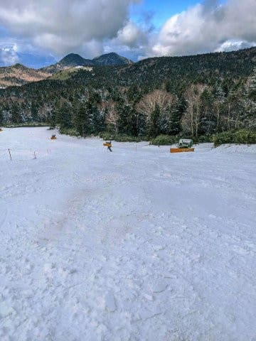

金曜の雨がそれほどではなく，土曜の

雪が予想より積もったのが救いか．

ってな感じで．

何とか金曜の雨を乗り越えた志賀高原．

これからの日曜夜～月曜朝にかけて，

また雪が積もります！

その後，21日火曜から23日木曜祭日まで

気温が上がって，積雪もなければ人工降雪も

打てませんが…

24日の金曜から25日の土曜にかけては…

激烈に冷えます！！

25日，平年比-6℃くらいまで冷えそう…！！！

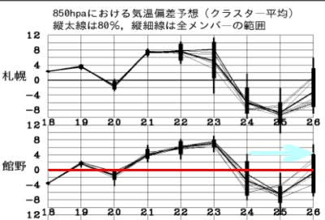

24日，25日とも．

志賀高原には水色の-6℃線が近づく

レベルで…これは真冬並み！

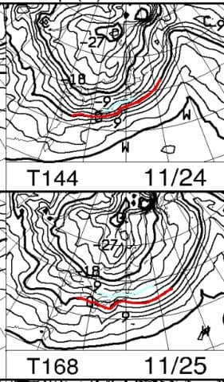

で．

24日の地上天気図は見事な縦じまの

真冬の冬型気圧配置…！！

これは志賀高原でも降る．積もる！！

このままなら，24日の天然雪で，

25日にオープンできるスキー場がそこそこ

出てきそうな予感…！！！

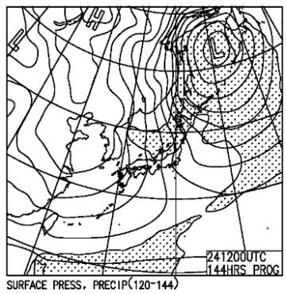

ってなことで．

23日の祭日には間に合わなさそうだけど．

25日の週末は，オープンするスキー場が

増えることに大期待！！！

…って，ここまで書いて．

もう記事がかなり長くなったので，

イエティの詳細レポートは，また明日…

明日詳細書く元気，残ってるかな
