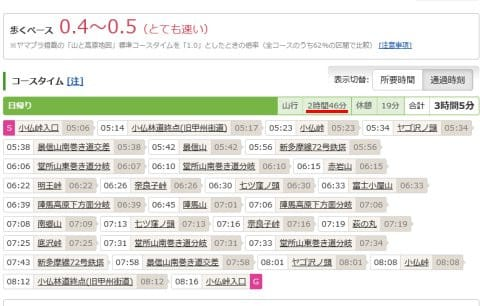
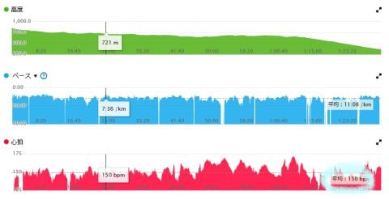
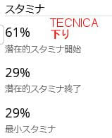
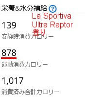
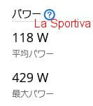
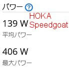

# トレランシューズ対決…今度はHOKA Speedgoat5で小仏P⇔陣馬山往復！HOKA・La Sportiva・TECNICAの対決結果やいかに！？その2

📅 投稿日時: 2023-07-28 03:14:22

ってなことで．

小仏P⇔陣馬山往復による，3種類のトレランシューズの

タイム比較．

昨年測ったHOKAのSpeedgoat MID GTX：3時間27分

今年測ったLa SportivaのUltra Raptor2 MID GTX：3時間15分

今年測ったTECNICAのSupreme MAX3.0：2時間58分

と，お気に入りのHOKA のシューズのタイムが

TECNICAのシューズより30分も遅かった

ということに納得いかず，

昨年のタイムより，今年のタイムが上がっているから，

今年HOKAのタイムを測ったらもっと

早くなるのでは？？

という好奇心から，

ぶっこわれたHOKAのSpeedgoat MID GTXの

代わりにSpeedgoat5を買って，タイム測定に

臨んだわけですが…

今回．

果たして．

HOKAのタイムは早かったのか？

遅かったのか？？

という点と．

そのタイム差は何から生じたのか？

というところを，

Garminさんの測定データをもとに，

分析（という名の勝手な推測）をしてみます！！

[前回](e767da1bb346264fd947e31b00636e60b.md)は，三つのシューズの比較と，

ひさしぶりのHOKAのシューズを履いた

インプレッションを報告しましたが…

小仏P⇔陣馬山を往復してみて．

HOKAのSpeedgoat5．

ふんわりクッションで膝に優しいし，

ツルツルする濡れた粘土のような土の

上でも滑らずに鬼グリップするし…

やっぱり，この靴が一番好き！！

うん．

HOKAのシューズ，やっぱりいいよね…

と思ったわけですが．

果たして，HOKAはクッションがいいだけで

遅い靴なのか？

あるいは昨年の自分が遅かっただけなのか？

タイムを見てみましょう…っ！！

果たして，タイムは…

…

…

…

…

どどーん！！

2時間46分でした～！！！！

なんと．

TECHNICAの最速タイムをさらに大きく更新し，

HOKAのSpeedgoat MID GTX：　　　 3時間27分

La SportivaのUltra Raptor2 MID GTX：3時間15分

TECNICAのSupreme MAX3.0：　　　 2時間58分

HOKAのSpeedgoat5：　　　　　　　　2時間46分

となりました！！

速い…やっぱりHOKAのSpeedgoatは速かった！！

La Sportivaより30分早いよ！！！

HOKA，速いだろうなぁ…と思ってたけど．

TECNICAとここまで差がつくとは思わなかった…！

そして，昨年より40分くらい短縮してるし…

やはり，昨年から今年にかけて，タイムがかなり

上がったんだなぁ…

いや．今回のコンディションがよかったんじゃないの？

とか，無理してタイム出したんじゃないの？

とお思いでしょうが．

気温を比べても．

左からLa Sportiva，TECNICA，今回のHOKAの時の

気温．

1℃以上ずれてない，ほぼ同一コンディション．

　

　

そして．平均心拍数ですが…下りを見ると．

La Sportiva　150

TECNICA　148

今回HOKA　149

と，大体150を狙ったので，

心拍数の違いはわずか．

登りの時の平均心拍数も，

La Sportivaが151，

TECNICAが147，

HOKAが148で．

むしろ，登りはLa Sportivaの時がTECNICAや

HOKAより3-4高くて，La Sportivaの時のほうが

追い込んでる感じですね…

とりあえず，心拍数を見ても，

特にHOKAの時に特別に追い込んだというわけでは

ないことがわかるかと…

ってな感じなので．

この結果は同じ気温の同じコースで，

私が心拍数150になるようなスピードで

歩く（走る）とどうなるかを，純粋に

シューズの違いで比較したものです！！

ちなみに，下りのスタミナを

比較すると…

圧倒的にLa Sportivaではスタミナを消耗して，

終了時は1％しか残ってませんが…

TECNICAとHOKAのスタミナ消耗は

どっちも同じくらい．

下り初めのスタミナがほぼ60％でスタートして，

下り終わりで29％のスタミナが残ってます！

　

　

このGaminさんが測定するスタミナ．

体感とかなり近くて…

La Sportivaで歩いた時の疲労感はかなり

高くて，「もうスタミナ残ってない…」

って感じだったけど．

TECNICAとHOKAの時は，往復が終わっても

「まだもう少し運動できるな…」

という感じで，

往復走り終わった後の疲労感は，

TECNICAとHOKAでほぼ同じレベルでした．

…でも，HOKAのほうがかなり早いペースで

走ったのに，疲労感が同じってのは…

心拍が同じペースじゃなく，同じスピードで比べれば

HOKAのほうが，疲労感が少ないといえるのかな．

ちなみに，登りの消費カロリーを見ると…

La Sportivaは878kcal，

TECNICAは800kcal，

HOKAは785kcalと．

同じ距離を，HOKAが最も少ないカロリーで

移動しているので…

やはりHOKAが一番エネルギー消費が少なく，

疲労が少ないといえるのかも．

しかし，La Sportivaが圧倒的にカロリー消費が

多く，スタミナ消費しているという結果と

整合していますね…

　

　

さらに，平均パワーを見てみると．

La Sportivaの平均パワーは118W，

TECNICAのパワーは131Wに対し…

HOKAは…139W！

　

　

TECNICAとHOKAがほぼ同等ですが．

HOKAが一番パワーが出てますね…！

まぁ，パワー≒スピードなので，一番速い

HOKAがパワーが一番高いのは間違いない

ですね．

疲労が少ないのにパワーが出ているってのは，

HOKAが効率よくパワーが出てるってことですね．

ってなことで．

[私が一番最初にかなり気に入った](e8ed26550fe8244ab29595105f7fa0ea8.md)，

HOKAのシューズが最も効率よく

タイムが出る靴だ

というの結果が出て，ちょっと安心した

わけですが．

次回は，なぜHOKAのタイムが良かったのか，

疲労が少なくて済んだのかを，

またGarminさんの詳細データをもとに

もっと細かく解析してみます！！

PS.

3週連続で山を歩いて（走って）体力が上がったから，

一番最後のHOKAがタイムが良くなったのでは？？？

という懸念があり．

これを確認するために，今度はもう一度

La Sportivaを履いて小仏P⇔陣馬山往復

しようか？？

と思った危険な自分がいたけど．

さすがに4週連続小仏P⇔陣馬山往復は止めた…
