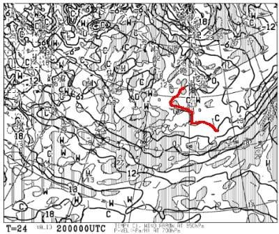

# 2023/3/19(日)の志賀高原スキー場特派員情報！そしてこれから1週間の天気は21日は晴れるけど，その後梅雨かと思う天気に(涙)

📅 投稿日時: 2023-03-20 03:28:27

🏷️ カテゴリ: [日記](cc4b5682fb7b8b144980957a978653fb0.md)

えー．

本日も一日PCの前に座りっぱなしで

丸一日全く自室から出ることなく．

食事も3食PCの前で済ませ，

泣きながら原稿を仕上げていた今日この頃，

皆様いかがお過ごしでしょうか(時候の挨拶)

…ってか．

今日中に仕上げないとヤバい原稿がまだ

仕上がってないんですが…(涙)

ホントこのくそ忙しい年度末に，記事執筆

突っ込んだヤツに殺意すら覚える…

ってなことで．

日曜日だった本日も，家で過ごさざるを得ず．

幽体離脱して志賀高原に行くこともかなわな

かったわけですが…（涙）

本日は天気が良かった週末ということもあり．

かなり大勢の特派員から写真が送られて

来ました～！！！

…それも，天気もコンディションもいい，

楽しそうな写真が…（涙）

おかしい…

私の怨念が呼ぶはずだった台風1号は

どこへ行ったのか…

というわけで．

どうやら私の怨念が届かず，すっきり晴天で

始まった日曜ですが…

木々が白くなっていて，久々の冬っぽい

景色！！

あさイチは-8℃と，ここ数日で言えば

結構な冷え込み！！！

そして．

久々の晴天の冷え冷えシマシマバーン

だったようです！！

いや…どうでもいいけどこれ，

うらやましすぎるんですけど…？？

もしかしたら，こんな冷え冷え雪で滑れるのは，

今シーズンラストなんじゃないかな？？？

ただ，雪もよく，晴天だったので…

どうやら朝のうちはリフトもゴンドラも，

ちょいと混み気味で．

ゴンドラは5分待ち，リフトもそこそこ待った

みたいですが…

でも，11時半ごろにはガラガラになり．

ほぼ待ちなしでゴンドラに乗れたようです！

昼ごろには焼額のGSコースはちょっと

凸凹が出始めたみたいですが…

奥志賀や寺小屋は昼過ぎまで雪も良かった

みたいですね～！

寺小屋はかなり混んだとの報告もありました…

しかし．

天気は一日中すっきり晴れて，

景色も良くて．

いい感じのスキー日和だったみたいですね…

でも，さすがに午後になると

ちょっとバーンも荒れ始めたようですが．

焼額も上の方はそこまで雪も緩まず，

割といい雪質をキープ！

ただ，麓に近い部分だけは，ちょいと

緩んだみたいで．

麓付近の日当たりの良い部分は，

ちょい荒れ気味になってたみたいです…

ただ，ラストに近い時間になると，

荒れ気味バーンがそのまま固まり始め，

ちょいと滑りにくい感じになるところも

あったようですが…

でも．

ここ数日のコンディションを考えると．

今日は天気・混雑・雪質とも，比較的

恵まれた一日だったみたいですね～！！！

あぁ…

なぜ，こんな日に私は一日家で原稿を

書いてなきゃいけないのか…

そして，21日もスキーに行けそうにありません（泣）

とはいえ．

一応21日にスキーに行く人もいると思うので．

軽く明日，明後日の天気を予想しておくと．

20日(月)の850hpa気温は，0℃線が

志賀高原より北にあるし．

地上天気図を見ても高気圧に覆われて

晴れそうなので…

朝は雪は締まっていても，昼間は

緩んだ春の重い雪になりますね…

21日(火・祝)の850hpa気温は…

赤い0℃線ははるか北海道の北．

激烈高温になりそう…（涙）

そして，地上天気図は…

この日も低気圧に覆われて，

日差しが降り注ぎそうなので…

朝から雪は緩めのザブザブ春雪覚悟．

まとめると…

20日(月)：終日晴れ．

　朝は放射冷却で冷えてバーンはかなり

　硬めのシマシマ．

　じき緩んで，日が当たるところはユルユル

　雪に．

　西斜面は昼前までは硬いままもって

　くれるかな．

　午後は全面的にユルユルの荒れ荒れ斜面．

21日(火・祝)：終日晴れ．午後は雲が

　多くなるか？

　朝からプラス気温．

　あさイチは表面が適度に緩んだ滑りやすい

　バーンだけど，すぐに緩んでザブザブ雪に．

　4月下旬並みのザブザブ凸凹荒れ荒れ

　バーンになっていく．

…って感じでしょうか…

残念な感じの天気です…

そして．

その後の，22，23日の地上天気図を

見ると…

なぬ？？

網掛けの降水域が本州を覆ってます…

何かが降りますね…

ちなみに，24，25日の地上天気図も

降水域が本州を覆っているので…

22日から25日までの4日間．

何かが降り続けます．

何かが…

果たして，22日から25日まで．

降るのは液体か，固体か？？

22，23日の850hpa気温を見ると…

うがーーーーー！！！

なんだこりゃーーーー！！

赤い0℃線は北海道より北…（涙）

これは，降るのは液体ですね…

そして，24，25日の850hpa気温は…

24日は赤い0℃線は東北地方で，

志賀高原にかかっているのは+3℃線．

これだと液体になりそう…（涙）

そして，25日になると，やっと赤い0℃線は，

志賀より南に下がってくれるので，

なんとか雪になるかな？

ということで．

22日から24日まで，ひたすら空から

液体が降り続ける3日間

になり．

25日に何とか雪になる感じっぽい…（泣）

うーん．

また，21日から24日まで，かなり高温の

期間が続き．

その間降り続けるので，この3日で

雪がかなり解けてしまいそう（激涙）

しかし．

普通は春先のこの時期．

何かが降っても一日くらいで止んで，

晴れたり降ったりを繰り返すのが春の

天気なんですが…

なんでこんなことが？

と，FZCX50の，普段は見ない850hpa温位を

見てみると…

23日から25日にかけて．

赤く括った線が密集した部分が，

ちょうど本州にかかってます…

…この，850hpa温位の線がギュッと

集まる部分は，停滞前線が発生するとき

独特の形．

停滞前線って…梅雨前線ですよ？？

この時期に停滞前線ですか？？？

そして．

この停滞前線と同じ形で．

見事に網掛けの降水予想域が

重なっているのが分かるかと…

停滞前線は，その名の通り停滞するので…

数日間，雨が降り続けます（涙）

普通，春に停滞前線って発生しないんですが？？

停滞前線って，梅雨ですよ？？

季節が3か月早いんですが！？？？

まさか．

まさかのこの時期の停滞前線のせいで．

3日間ぶっ続けで，志賀高原でも高温の

雨が降り続けそうです…

ゲレンデ，大丈夫かなぁ…（泣）

おかしい．

今シーズン，ちょっと天気がおかしすぎる…

もしかしたら．

今週末，怨念で季節外れの台風を呼ぶつもりが．

数日遅れで，季節外れの梅雨を呼んで

しまったのか？？←ありえないから

ってなことで．

21日祭日は高温の春のザブザブ雪．

22日から24日は雨

となってしまいそうな志賀高原．

25日はちゃんと雪になって，ゲレンデが

回復することを祈るばかり…

…そして．

原稿がまだ書きあがってないのに．

時間がないというのに．

今日も長い記事を書いてしまった…

## 💬 コメント一覧

### 💬 コメント by (レインボー75)
**タイトル**: Unknown
**投稿日**: 2023-03-20 15:55:03

月曜日の志賀高原情報

今日もニゴンスタート。白樺はやや硬めだけどまずまず。唐松も同じ。GSのポールが楽でクローチングで行くと快感。GSはちょっと過密。

三高が明日までなので、最後はここ回し。未就学３歳の女の子と、年長のお姉ちゃんの滑りが圧巻で、聞くと「パパの真似をしてるの」

所用で11時終了。その後、唐松下やサウス下ではストップ雪になったとか。

私は今日で50日連続で滑ったのですが、明日は野球観戦のため休場します。できれば明後日も休場できると嬉しいのですが。

それと、エス様の怨念が梅雨を呼ぶんですね。覚りをひらいてください。

### 💬 コメント by (ダウンヒル)
**タイトル**: Unknown
**投稿日**: 2023-03-20 20:43:05

今日の午後からコースイン。

前回出動した際に施したワックスがジャストフィット!

ホームゲレンデの西館山のシャビシャビ雪でも滑る滑る!

レインボーさんの普段の情報通り、寺小屋が上々でした。

嬉しいことに、20,000な皆様と出会うことができたりで、とても楽しく過ごせましたぁ!ありがとう御座いました!

追伸...キッズのパパさん、いい教育され、お手本を示されていて...素晴らしいですね～。

### 💬 コメント by (Skier_S)
**タイトル**: 明日も滑りに行けず
**投稿日**: 2023-03-21 02:33:06

＞レインボー75さま

50日連続ですか！！！！

いいなぁ…私も毎日滑りたい…

しかし明日はお休み？？野球観戦って，TVですか？

＞ダウンヒルさま

春になると，やっぱり寺小屋が一番いいコンディションになることが

多いですよね…

そして，焼額のキッズ達．幼稚園児2名がすごすぎる…

