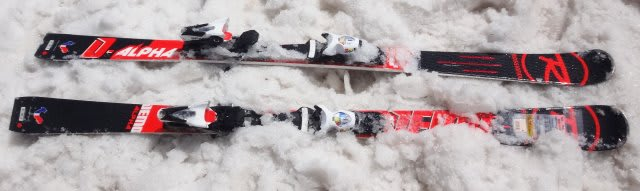
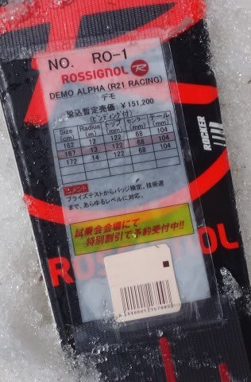
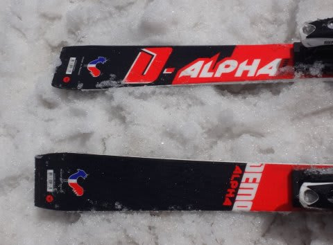

# 2017シーズンモデル，スキー試乗レポート第4回…ROSSIGNOL編

📅 投稿日時: 2016-05-18 03:42:46

今日もご無体職場からの帰宅が遅かった，Skier_Sです…

だのに．

ちゃんとBlog記事を書く自分．

偉いっ！！←自分で誉めるか？？

ってことで．

今日はちょっとヘロヘロなので．

2017シーズンモデルのスキー試乗レポート，1機種だけで…

ロシニョール編です．

では，どうぞ～！

○ROSSIGNOL DEMO ALPHA R21 167cm

基礎小回り用．

ロシニョールのデモシリーズの最上位モデル．

…基本的に，今シーズンモデルからの継続モデルになるのかな？

板もプレートも，大きく変わってないように見えます…

で，

荷重ポイントは土踏まず，わずかにかかとより．

かなり張りがしっかりした，がっちり固く感じる，

しっかりした重い板です．

しっかり強い板なので，スピードを出していくか，

乗り手がしっかり仕掛けないとたわみません．

でも，たわまないまでも，板を傾ければエッジがガッツリ

グリップして，サイドカーブに乗って

レールターン状に回り始めます．

スピードが出るとここからさらにたわんで，

鋭く回っていくんでしょうけど…

この日試乗したようなザブ雪だと，サイドカーブに乗って

回るのが精いっぱい．板をたわませられませんでした…（涙）．

どっしりとした安定感と強いエッジグリップのため，

ずらしでコントロールしようと思わない板です．

私にとっては，コブとかはちょっと手ごわそう．

どんなシチュエーションでも気楽にこれ1セットで…

というわけにはいかないですが．

ハイレベルな滑走速度域や体力を持っている人が

高速で整地をガンガン飛ばして攻撃的な小回りを…

という，特定のシチュエーションを狙って最高の性能を

発揮する，整地スペシャルな小回り板だなぁ，

と思いました．
