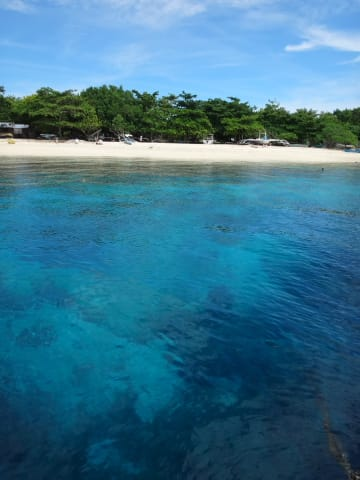
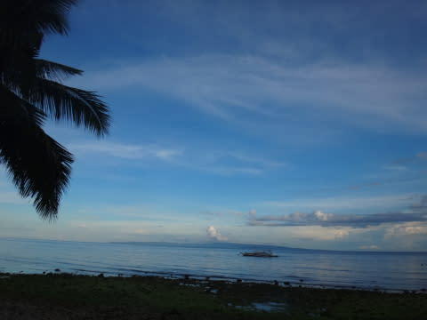
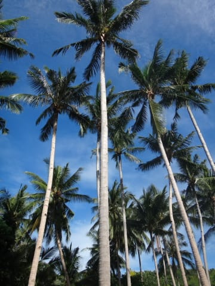
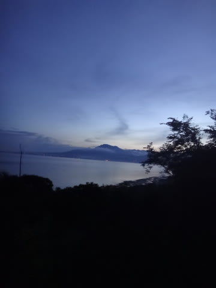
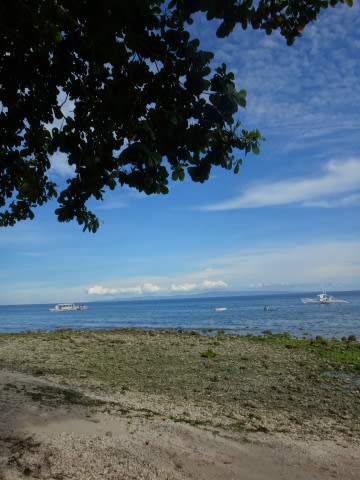

# 2014年8月　オスロブagain…再び，子連れでジンベエザメと泳ぐぞ！　プロローグ2

📅 投稿日時: 2014-08-29 03:36:45

🏷️ カテゴリ: [ダイビング日記](ce3a7a8d424d112fce83ee85c81a0e344.md)

って感じで．

今回も，ダイビングショップは，

子供をダイビングボートに乗船させてくれる

[エメラルドグリーン・ダイビングセンター　サンタンダー](http://www.emeraldgreen-santander.com/index.html)を利用して．

ホテルは[ルビ・リゾート](http://www.lubi-resort.com/)に宿泊という，

前回と全く同じパターンで予約した，

フィリピン旅行．

だけど今回は，前回より一日延ばして，

4泊5日，中3日のダイビングの旅程です．

＃ご無体職場で3日間の夏休みを取るのに，いろいろ上司に言われたような気もするが…幻聴だったと思おう

んで．

前回，ジンベエのみが目的だったけど．

今回．

やっぱり，フィリピンと言えば，

アポ島やバリカサグ方面でも潜って

おきたいでしょ！

…ってことで．

ホテルからボートで1時間半以上と，ちょっと遠くて，

追加料金がかかるけど．

せっかくだから，ジンベエシュノーケリングの日を

除いた2日間は，これらの方面に足を延ばして

ダイビングを楽しみましょうかね～

…って計画．

うーむ．アポやバリカサグって．

ダイビングを始めた直後に行った思い出があるけど．

もう，かれこれ10年以上昔になるなぁ…（遠い目）

＃その時に，忌まわしき[出国でパスポートNo取り違え](e3f297dded27f560b2aa0917a23a321a0.md)のトラブルが…

で．

今年から小学生に上がった，わが娘．

もう，一日中ダイビングボートの上で過ごすのにも

慣れまくってしまってて，

途中何回か，船の上からシュノーケリングさせて

あげれば，一日中上陸することなく

ずっと船の上に乗り続けていても，

ご機嫌で過ごしてくれるので．

ボートで片道1時間半かかる，バリカサグやアポ島への

遠征に連れて行くのに関しても，もう，何の心配もいらないし．

＃というよりも，むしろ喜んで船に乗りたがってくれる

さらに，宿もダイビングショップも9か月前に行ったばかりで，

勝手がわかってるし．

前回の[超待ち時間が長い帰りの乗り継ぎ](e29a4c421213a8900180d4f0a10ae4b1b.md)もなく，

往復ともセブ直行便を取れたし．

って感じなので．

今回の旅行に関しては，何の心配ごともなく．

無事出発日を迎えたのでした…

