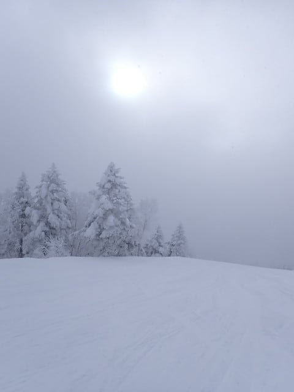
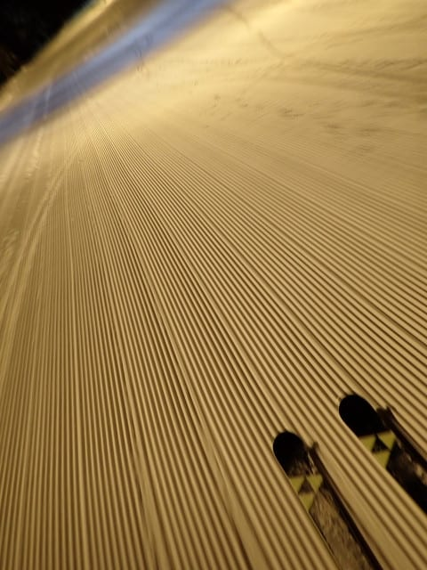

# 2025/1/18(土)の志賀高原スキー場は…朝1時間雪降り，その後晴天の冷え冷え最高雪！シーズンベストの1日！

📅 投稿日時: 2025-01-19 00:10:33

🏷️ カテゴリ: [2025スキー滑走日記](cacd3fbf84d4a679ee61a5894c3f95e14.md)

ということで．

今日も志賀高原で滑っていたわけですが…

いやーーーーーー．よかった．

ムチャクチャ良かった！！

朝はガン降りの雪で，天気予想外した

かと思ったけど，そのあと晴れて最高の

一日でした～！！

ってなわけで．

今日もいつも通りの志賀の上り坂を

走っていくわけですが…

昨日1日雪降りだったから本格雪道

なのは良いとして．

…今も雪が結構降ってるんですが？

今日は朝は雲が残るかも…と予想してたけど，

前日からの積雪は無しってだれか

言ってなかったっけ？？←自分でしょ

そして．

いつも通り通常営業開始の8:30を

狙って焼額に到着しますが…

今回，まさか信州中野から先でチェーン

規制をするような天気だと思わず，自宅

出発時間にマージンを取ってなくて，

チェーンチェック渋滞を回避するため

一つ手前の小布施で高速を降りたぶん

遅れてしまい，ブーツを履いている間に

営業が始まってしまうという痛恨のミス…（泣）

だもんで，朝イチの列がはけた後の

ガラガラゴンドラで山頂に登りますが．

…営業開始直後とはいえ，ここまで人が

少ないので今日はそこまで混まなさそう…

ってなことで山頂に行くと．

…雪だよ…

誰だ？？今日は晴れるといったいい加減な

やつは…？？←だから，自分でしょ

とりあえず．

朝からすっきり晴れない可能性が高く，

朝は雲が多いかも…とは書いていたけど．

まさかここまで視界が悪い雪降りで

スタートとは思ってなかった（泣）

気温も-12℃と，予想の-7℃から5℃も外す

大失態…（激涙）

でも，雪は冷え冷えでいいですね！！！

昨日終日雪だったから柔らかいかと思ったら，

圧雪は適度に締まった雪質で，その上に

1－2cmの新雪が乗ってます！

朝の1－2本は暗くて雪面の凸凹が見にく

かったけど，雪質は最高！！！

…って思って滑っている間に，だんだん

空が明るくなってきましたよ…？？

9時過ぎには，ゲレンデも明るくなって

見やすくなってきましたよ…！！！

そして，10時前には雲も切れて青空も

見え始めてきたと思ったら…

いや…見事に晴れてきましたよ…！！

10時半過ぎには，見事にすっきり晴れ

ました～！

ふはははは．私の予想は完全に外れた

わけではないのだ．

晴れるのが予想より2時間ぐらいずれた

だけなのだ…っ！！←ちょっと厳しい言い訳

が．

今日は焼額もそんなに混んでおらず．

焼額の呪いは解けてないのに…

志賀高原常連メンバーに身柄を確保され，

一ノ瀬方面に連行されてしまい．

まずは一ノ瀬ファミリーへ…

正面バーン上部は昨晩からの積雪で

ちょっとモサモサ雪が乗ってたけど．

でも，雪質は冷えてて最高！！

なんにしろ晴れてて最高！！

一ノ瀬正面バーンが荒れていたので，

しばらくタンネを滑ってましたが…

いや…ホントに今日は雪質がいいよ！！

これで晴れてるんだから…

最高としか言葉が出ない！！

そして，その後は寺小屋にも向かいますが…

いや．

寺小屋も最高！！

この，雪が良さそうな感じを見よ！！！

天気も景色も雪もいいし．

これで土日のわりにはリフトも混んでないし…

朝の雪降りが嘘だったんじゃないかと

思えるほどの快晴になり…

素晴らしい！！

これだよ！！

やっぱり6月の月山とか10月のイエティとか

じゃなく．

ホントはこういうところで滑りたかったん

だよ…っ！！！

ってな感じで，昼前まで寺小屋を堪能

しましたが．

やはり焼額以外はかなりのアウェイ感を

感じたため，一ノ瀬ファミリー経由で

戻ります…

ちなみに，帰りにパーフェクターコースも

滑ってみましたが．

…これ，今シーズン全く圧雪が入ってない？？

パーフェクターコスは，完全なボコボコ

非圧雪バーンでした…

ってなことで．

1時間半ほどほかのスキー場へ浮気してましたが．

12時には焼額へ復帰！！

…第2高速リフト，土日と思えないガラガラさ

ですね…

こんな晴天で雪質が最高の日に，こんな

すいてて，経営的に大丈夫なのか？？

（すいてるのはうれしいけど…）

そして．

今日はゲレンデも，サウスコースが一部

人口密度が多かった以外は，

GSコースもガラガラだし…

オリンピックコースも無人だし…

こんな晴天の最高雪質の日に，

こんなガラガラで好き放題の

ラインを思いっきり大回りで

滑りまくれて，いいんですか！？？

ゴンドラも午後はピークでもゲートの

外に列が着くほどは混まなかったし…

こんな最高ゲレンデを思う存分

満喫できていいんですか！？？

いや…

今日は間違いなく，今シーズンイチの

最高デーじゃないですか…っ！！！

まぁ，昼間の気温は-2℃と，1月にしては

ちょいと高めの気温まで上がったけど，

雪質はずっと良いままだったし．

午後3時過ぎには，GSコースやオリンピック

コースはさすがにちょっとボコボコに

なってきたけど…

でも，それ以外のコースは終日

大回り板で気持ちよく滑れるフラット

バーンだったし．

…今日も日が傾く，16時15分の営業終了まで

しっかり滑り倒してきたのでした…

いやーーーー．

満足．

今シーズンは恵まれてるよ…

今日は晴天・最高雪質・ガラガラの3拍子が

完全にそろった，間違いなくシーズン

最高の1日だったよ…

…

…

はい．

で．

よく訓練されているこのBlog読者はもう

気づいている．

これで終わらないことに気づいている．

そうです．

今日もナイター参戦です…っ！！

もう，多くは語らない．

写真を見て，ナイター開始の1本の

シアワセさを感じてください…

最高雪質の，ぴかぴかシマシマを

好きなように切り刻める快楽．

あさイチだけじゃなく，夜にもまた，

この世にこれ以上の快楽は存在しないと

思わざるを得ない，この快楽を味わえる，

このシアワセ…

今日の昼間だけじゃなく，夜まで今日の最高の

バーンを味わい続けたい！！

というゼイタクを実現する，この快楽の

ナイターバーンの甘美なことよ…

今日のナイターはガラガラではなく，常に

搬器1－2台待ちがあったのがちと惜しかった

けど．

でも，今日も18時のナイタースタートから20時の

ナイター終了まで，ひたすら休まず止まらず

リフトぐるぐるし続けたのでした…

いやーー．

最高…

最高な一日だったよ…

また明日も最高な一日になりそうなので．

この週末はシアワセな2日間を過ごせそうです！！

## 💬 コメント一覧

### 💬 コメント by (富山県民)
**タイトル**: Unknown
**投稿日**: 2025-01-19 05:45:08

こんにちは。

私も1月18日と19日に志賀高原に来ています。

今シーズン初の志賀高原です。

1月18日は熊の湯と横手山を滑走しました。　朝は雪でガスかまかかってましたが11頃から晴れてきました。

横手山スキー場には何度か来てますが今回は樹氷がとても素晴らしくてまるで蔵王の樹氷みたいな出来でした。

朝11時までは熊の湯で滑走して11時頃から横手山に移動しました。

横手山からの絶景は素晴らしいです。

特に樹氷がとても綺麗でした。

今日1月19日は志賀高原中央部と焼額山と奥志賀を滑走する予定です。

今週末は2日とも晴れという大当たりな週末です。

### 💬 コメント by (ジミ～高橋)
**タイトル**: お会いできて光栄です
**投稿日**: 2025-01-19 19:25:34

今日1/19(日)スキーヤーSさんに初めてお会いしました。もしかしてと思い、失礼とは思いましたが、お声がけさせていただきました。

ブログは毎日拝読していますが、ご本にお会いしたのは初めてで、とても嬉しく思いました。

ステッカー有難うございました。

平日に滑ることが多いので、土日の焼額山スキー場はあまり行っておりませんでしたが、今シーズンはまたお会いできることを期待して、週末も出陣しようと思います。

取り急ぎ、御礼まで。

From志賀高原焼額山スキー場特派員の一人？

ジミー高橋

### 💬 コメント by (レインボー77)
**タイトル**: Unknown
**投稿日**: 2025-01-19 20:32:02

日曜日の志賀高原情報

夜の降雪はゼロ。朝の蓮池-4℃、暖かい快晴の一日。

パノラマから唐松のキッズパークで甥の家族と待ち合わせ。今日は全山キッズ無料なので、あちこち案内しました。寺子屋からの北アルプスの絶景には、自然と声が出てしまいます。東舘林道から広々としたブナ平に出ると、なんか幸せ。

西舘経由でヤケビに戻ると、11時を過ぎていました。老人はこれくらいにしないと身が持たない。一番良かったのは、タンネと西舘。たまには遠征もいいものですね。

### 💬 コメント by (Skier_S)
**タイトル**: 今日も最高！
**投稿日**: 2025-01-20 02:03:08

＞富山県民さま

あら…志賀高原に来てらしたんですか！！

焼額滑ってましたか？？

どこかでお見かけしているのかも…？？？

＞ジミ~高橋さま

今日はお会いできてよかったです～！！

普段は平日メインなんですね…もし休日に滑ることがあれば，また声かけてください！

今回は一緒に滑りませんでしたが，また今度は一緒に滑れれば…

＞レインボー77さま

焼額でお見かけしないと思っていたら，遠足に出かけていたのですか．

今日は子供を連れていろいろ巡るには最高の一日でしたね…！

こんな日が毎日続いてくれるといいのですが…

