# 2022/4/23(土)の志賀高原スキー場は…晴れ時々曇り，早朝は締まってたけどすぐゆるゆる雪．午後は滑らない雪になったけど，ガラガラ！

📅 投稿日時: 2022-04-24 00:17:51

ということで．

今日も何とか無事志賀高原に到着しました～！

(というより，途中から車の中で爆睡し

荷物のように運ばれてきた）

なんと今日は朝2時に家を出て，6:30の

早朝スタートから参戦です！！

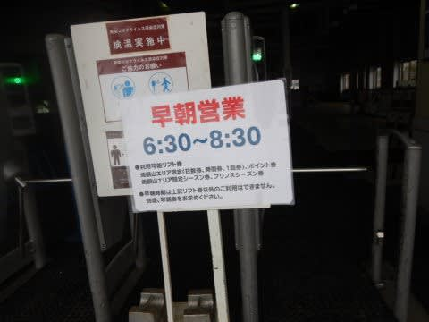

…いや．

絶対一人だけで来てたら無理だよな…

一緒に乗りあってきてくれる運転手がいて

良かった…

ちなみに今日から志賀草津道路がオープン

したので，今シーズン初の草津経由での志賀入り

でした～！

ってなことで．

6:30早朝営業開始直後のゴンドラで山頂へ上がると…

気温はすでに+5℃．

朝6:30でこれって…

温かすぎるよ…(涙)

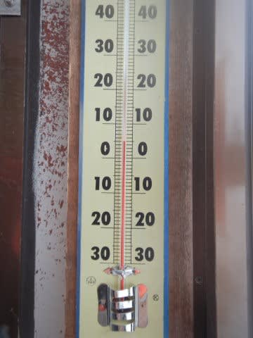

とはいえ．

あさイチは曇り空で日差しも弱かったので…

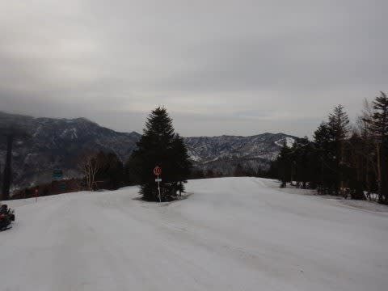

早朝スタート時はゲレンデもかなり硬めの

シマシマ！

気温5℃でこんなに硬いとは…

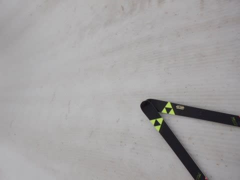

7時過ぎくらいまではかなり締まった

シマシマを滑れましたが．

7時過ぎには日も射し始め，

バーンは緩み始めて来ました…

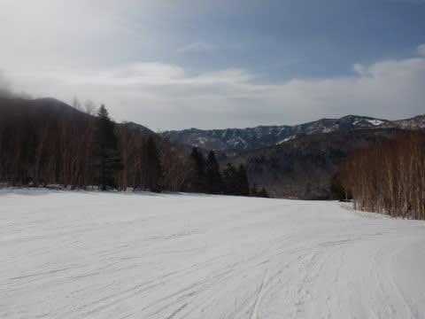

今日は雪が重すぎて圧雪しきれなかったのか，

焼額にしては珍しく，朝イチシマシマには

ところどころ深いかなり凸凹があり．

あさイチには硬い凸凹に飛ばされて

ちょっと怖かったところもあったものの．

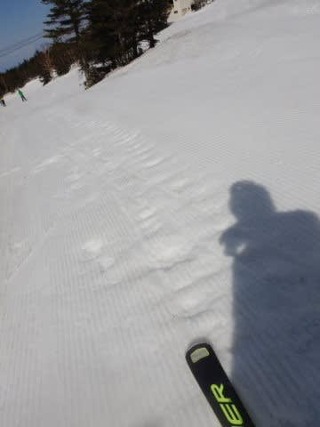

早朝営業終了のころにはいい感じで

雪も緩み，表面がちょうどいい具合に

緩んで，凸凹もそれほど気にならなく

なり…

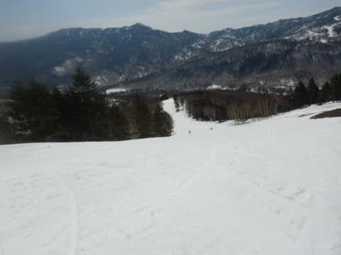

そして，8:30の通常営業開始時には，

パノラマコースオープン！

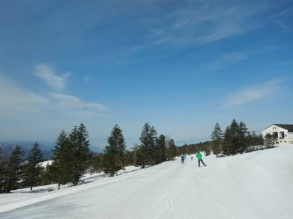

晴天の中，今日2度目のシマシマを堪能！

パノラマコースオープン時は，表面がちょうど

いい感じで緩んだ，かなりの快楽バーン！

いや…

4月でこれだけの快楽バーンが滑れたら，かなり

いい感じ…！！

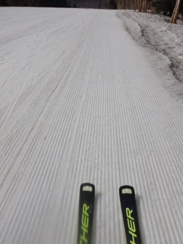

でも．

快楽だったのも，通常営業開始から1時間ほど．

10時ごろには晴天の強い日差しもあり，

雪も緩みきって，ザブザブした感じの

バーン状況になってきちゃって…

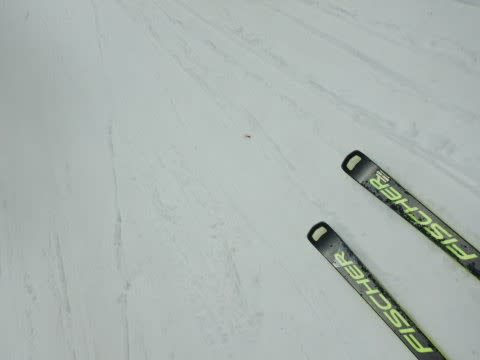

重い雪に板が埋もれる感じの，ちょいと

滑りにくい雪になってきました…（ちょい涙）

でも，今日は終日ゴンドラもガラガラ飛び乗り！！

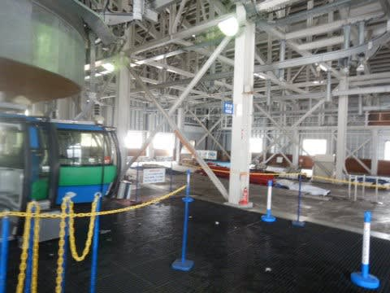

だもんで，雪がゆるゆるになっても，

人が滑らないのでバーンがそれほど

荒れません…！！

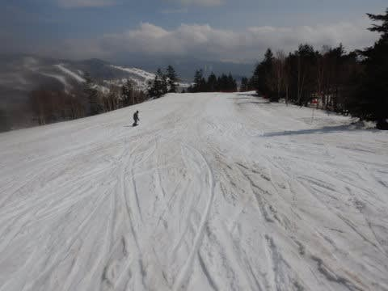

人が滑らないので，雪は黒ずんできたものの．

ゴーストタウン状態で人がいないので，

バーンが凸凹にならなくていいな！！

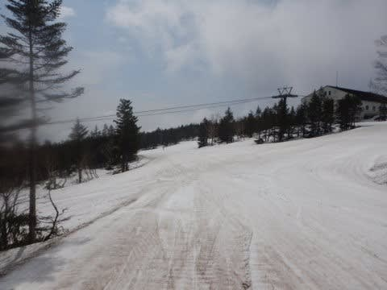

…と，思っていたものの．

午後1時ごろになると．

人が滑らないので，雪の汚れがひどくなってきて…

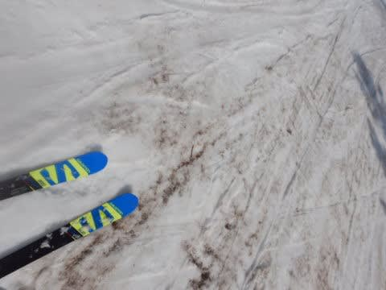

そのうえ気温も+10℃を越えてきて…

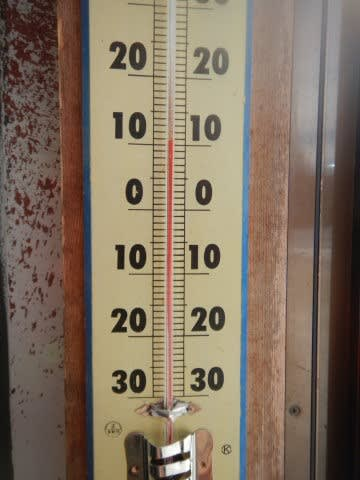

さらに日差しも強かったので，

残念なことに，雪の滑りが悪くなって

きました（涙）

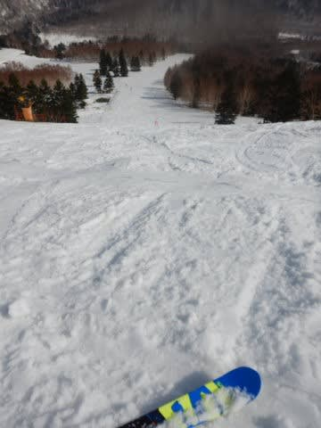

今シーズン．

気温が高くても意外と雪が滑ってくれて，

4月になっても妖怪板つかみに襲われずに

済んでいたのに．

今日は午後1時以降は，かなり板の

滑りが悪かったです（泣）

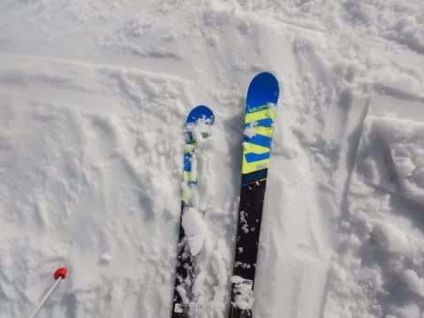

とはいえ．

1，2月の雪が多かったので，バーンはまだ

コースいっぱいに雪があって，オープンしている

コースは，コース上に穴が開いてるところもないし．

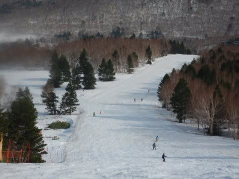

人も少なくて最後までそんなにコースは荒れず，

緩斜面での板の滑りは悪かったものの，

急斜面で張り付く雪というほどひどくも

なかったので．

今日も朝のうちは，

「今日は疲れてるし．

朝6:30から滑ってるのもあるし．

早めに上がろう」

と，朝のうちは思っていたのに．

気づいたら日が傾く夕方で…

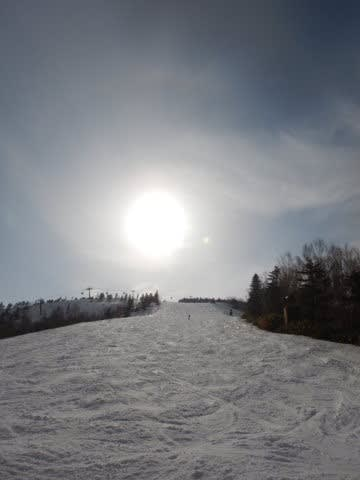

当然のごとく，朝6:30から営業終了まで

滑り続けてしまったのでした…

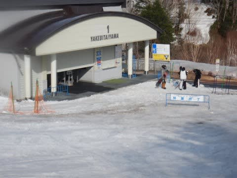

はい．

いつもの言葉を使うところですね…

「やっぱりな」

## 💬 コメント一覧

### 💬 コメント by (ikkun)
**タイトル**: Unknown
**投稿日**: 2022-04-23 21:29:25

やはりサイボーグ( *´艸｀) お疲れ様でした   新潟は昼辺りから雨予想でしたが 外れ 比較的温かくなくて❗朝イチ並んだゴンドラ～の数本は良かったですよ❤️(アカカン)  ちなみに昼前で止めたら霧が出たので良かったです❗

### 💬 コメント by (Skier_S)
**タイトル**: ＞ikkunさま
**投稿日**: 2022-04-24 23:55:44

焼額は終日ほぼ晴れでした…

雪の滑りがあまり良くなく残念でした(涙）

