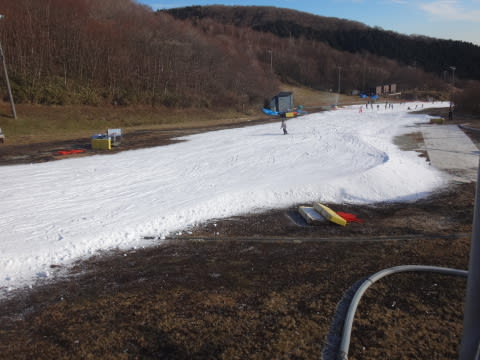
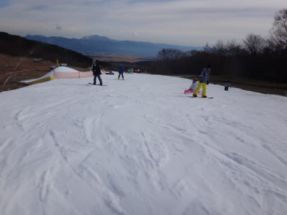
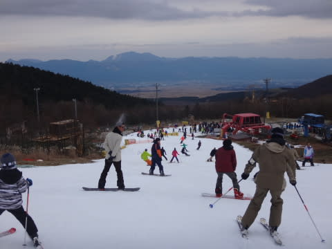
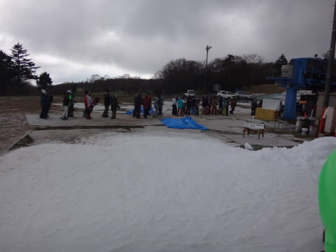

# 11月29日の日曜も結局イエティへ…速報モード

📅 投稿日時: 2015-11-30 02:25:51

えー．

本日．

いろいろスキー場もオープンしたし．

そろそろイエティ以外へ…

と，思っていたのに．

どのスキー場もコースは短く，雪も少な目のようだったので．

やはり今週もYetiへ行ってきました…

7週連続だよ（涙）．

…天気は晴れのち曇り．

気温は朝イチは-1度と，結構冷え込んだ本日．

Yetiも，アイスクラッシュじゃない普通の

人工降雪機が使えたようで，

ちょっとコースは広がったかな…

しかし．

他のスキー場がオープンして，人が分散するだろう…

と思った今日．

なぜかすごく混んでました…（泣）．

コース上の人口密度もすごかったし…

クワッドリフトも，9時過ぎから2-3分待ちを超え，

昼前には，クワッドリフトが5分前後，

並行してかかるペアリフトも，今シーズン初の

リフト待ちが…

とはいえ，ペアリフトは1分程度の待ちで済みましたが．

うーむ．

他のスキー場がオープンしてから，

まさかこんなに混むとは…

また，詳細は明日！

## 💬 コメント一覧

### 💬 コメント by (ヒロちゃん)
**タイトル**: 混みましたね～
**投稿日**: 2015-11-30 08:23:41

想定外に、混みましたね、皆、安全パイで、同じ結論だつた感じですね、ワンポイントアドバイスありがとうございました。さて、今週まつは、本番ですね笑笑

### 💬 コメント by (いか)
**タイトル**: Unknown
**投稿日**: 2015-11-30 12:08:02

あら、随分と混んでいたようですね。

私は早速日曜日だけ八方に行ってしまいました。シーズンインです。

パノラマだけですが、右左両方滑れたので広く、斜度もあってよかったです！

地雷はそれなりには見かけましたが、土曜日夜の降雪でほとんど気になりませんでした。

### 💬 コメント by (Goku)
**タイトル**: 熊の湯
**投稿日**: 2015-11-30 19:02:57

日曜日にオープンした熊の湯に行ってきました。

想像通りの厚みでしたが、ほぼ幅いっぱい滑れたのでまーまー満足でした。

来週からいよいよ焼額山ですね。

毎年オープンに合わせてしっかり雪を造ってくれるサウスコースですが、今年はどうでしょうかね？

### 💬 コメント by (Skier_S)
**タイトル**: もう，Yetiは十分でござる…
**投稿日**: 2015-12-01 00:21:13

＞ひろちゃんさま

混みましたね～（涙）．

さすがの私もナイターはやめました．

今週末から，ついに志賀高原通いスタートです！

＞いかさま

うーむ．

どうやら情報を集めると，八方パノラマがこの週末では

一番良かったような感じですね…

パノラマだけのために，5時間運転して

行くパワーがなかったです…

＞Gokuさま

熊の湯も，午前中は混んだみたいですね～．

来週からはヤケビオープンです．

ヤケビブログ

http://blog.princehotels.co.jp/yakebi/2015/11/30/

を見ると，やっぱり唐松コースに

人工雪を打ってますね～．

今年は西館でスキー場開き祭だから…

