# 12月20日の志賀高原は…朝のゲレンデは最高のコンディション．．だったけど

📅 投稿日時: 2014-12-20 23:05:41

えー．

土曜日，20日の志賀高原ですが．

本日の，朝．

かなりの積雪があった感じの山道を登り．

今日から第1ゴンドラが動くという期待と，

積雪によるGoodコンディションに胸を躍らせて，

はやる気持ちを抑えつつ，

朝イチに，いつもどおり焼額山にやってくるわけですが…

…

…

え？

何？

強風で，第1ゴンドラ，第2ゴンドラ共に，運休だと！！？？

え？楽しみにしていた第1ゴンドラどころか，第2ゴンドラも

動かない，だと…？？

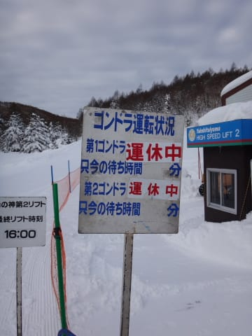

ががっががががーーーん．

ど，どうしたことだ．

一体，これは何の罰ゲームだっ！！？？

ゴンドラが動かないので，本日動いたのは第2高速，第3高速と第4ロマンス．

とりあえず，風はそこまで強そうに見えないので．

現実を受け止められないまま，

第2高速に乗って，ゲレンデに出ると…

ほう．

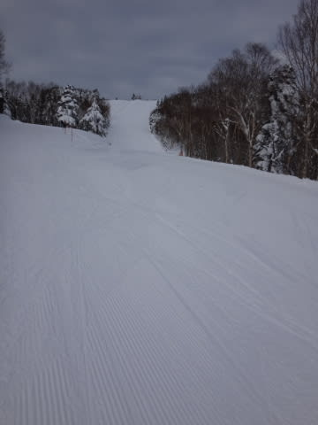

なるほど．

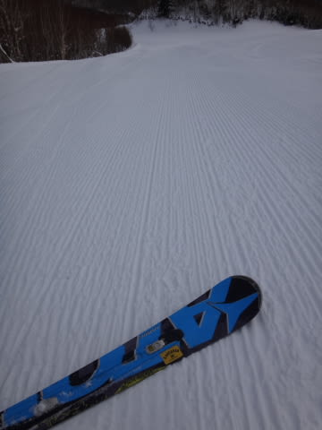

…これはっ！！

さ，最高の雪質ではないか！

冷えた雪がしっかり圧雪された，やわらかいけどエッジがしっかり食い込む，

もう何でもできそうなバーン！！

そして，コース幅いっぱいに大回りができる！

そうだ．

トップシーズンって，こんな雪だよ！

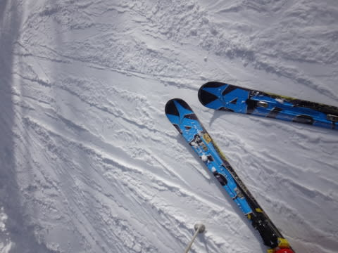

とりあえず．

最高のゲレンデコンディション！！

これまで，硬い雪か荒れ荒れ新雪ばっかり滑ってたので，

長らく忘れていた，この感覚！

うははははは！

ゴンドラは動かなかったけど，最高！

楽しいっ！

…そして，朝のうちは予想通り．

ええ，予想通り．

そのとおり．私の予想通り（しつこい）

時折晴れ間もさす，いいコンディションで．

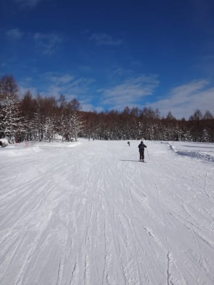

いやー．

これで，ゴンドラさえ動いてくれれば，文句なかったのに…

と，午前中は滑っていたわけですが．

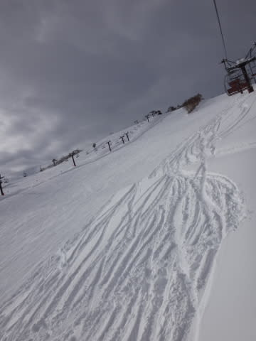

…なんだか．

午後から．

雲が多く，風が強くなりだして…

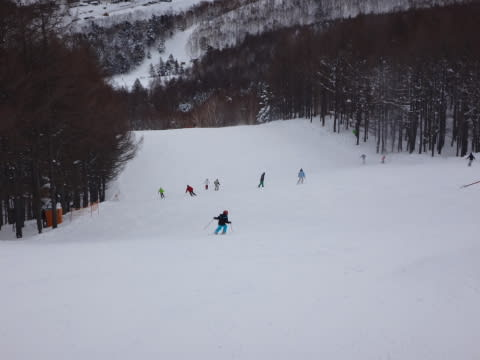

強い風がゲレンデに吹き付け，雪が舞い上がり始め…

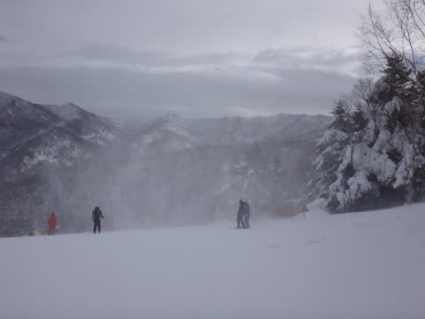

そして．

2時ごろに．

きました．降ってきました．

何かが…

…

…

とりあえず．

これは．

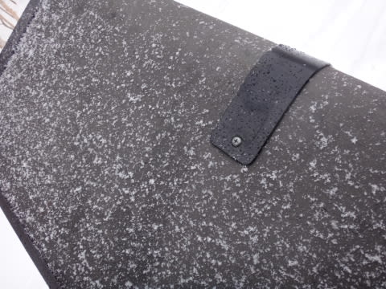

良かった…

雪だよ．

雪だ．

…

でも，ウェアやリフトにつくと溶けちゃう雪で，

リフトワイヤーからしずくが落ちてきたりするような

感じでしたが．

まぁ，雨に比べれば1億2300万倍くらいまし．

雪で，良かった…

と，思ったのもつかの間．

なんだか，すごい風で，湿った雪が強く吹きつけ…

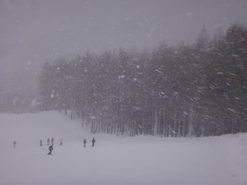

3時近くに，ダイヤモンドも山の神もリフトが

強風で止まっちゃいましたが！！？？

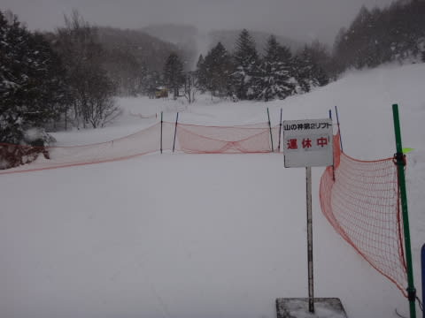

え？

焼額から，宿のある一の瀬方面に帰れなくなっちゃいましたが？？

…バスで帰るしか，ないのか？

…と，思った，さらにその直後．

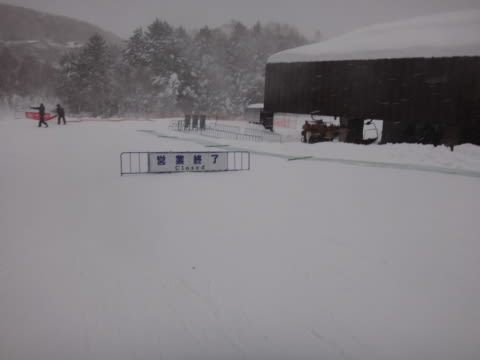

がががーーん．

3時半までには．焼額第2高速，第3高速もすべて強風で

止まってしまうという！！

なんだ．

なんなんだ，この仕打ちはっ！！！

…せめてもの救いは，

一の瀬ファミリーは，4時過ぎまで予定通り営業してくれたこと

でしたが…

でも．

ゲレンデは．

ものすごい湿雪が吹きつけ…

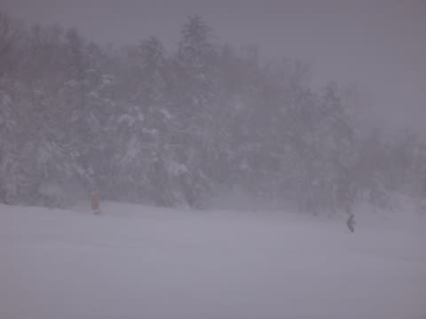

そして，足元のでこぼこがまったく見えない状態で．

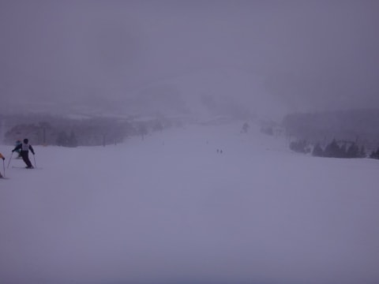

…午前中の最高コンディションと，あまりもの差に

愕然とする午後だったのでした…

ある意味．

　　　朝のうちは晴れ．前日の積雪は無く，朝イチはきれいな快適圧雪．

　　　昼近くから雲が増え始め，昼過ぎには何かが降り始める．

　　　降り始めはぽつぽつと降り，夕方に向かって降りが強まる．

という，私の天気予想はどんぴしゃあたったわけですが．

…この強風までは予想していなかった…

そして．

この強風のおかげで．

楽しみにしていた，本日から開始のナイターが，

見事に中止（激涙）．

なんてこったい…

って感じで．

雨ではなく，雪になったことに関しては．

私の日ごろの行いのよさが出たということですが．

強風で朝からゴンドラが動かず．

そして，午後3時過ぎには次々リフトが止まっていき．

ナイターも中止になってしまった…という，

ひどい仕打ちに関しては．

いったい誰が犯人なんだ！！？？

という，犯人探しをしたい気分のSkier_Sなのだった…

＃犯人はお前だろ，という突っ込みに関しては，当局では一切受け付けません

## 💬 コメント一覧

### 💬 コメント by (Goku)
**タイトル**: Unknown
**投稿日**: 2014-12-21 16:38:59

え～と、犯人は私ではありませんよ。

なんてったって、私は仕事してましたから。

むしろ、仕事でスキーが出来ない私に神様が味方してくれたのかも（失礼）

### 💬 コメント by (aqura)
**タイトル**: Unknown
**投稿日**: 2014-12-21 21:08:19

いやー、まいりましたね。今シーズンスタートなのに、このこの天気( ノД`)…

私は一ノ瀬からバスで、車のある焼額山に戻りました。

### 💬 コメント by (Skier_S)
**タイトル**: 帰宅しました…
**投稿日**: 2014-12-22 01:04:31

＞Gokuさま

志賀も，西舘やらブナくらいまで下がると，雨だったみたいで．

ヤケビは大丈夫でしたが，ブナや西舘はカリカリ

でした…

夜間瀬も，雨の影響が出てたみたいですね～．

しかし．

犯人は，一体…？？

＞aquraさま

ついにシーズンスタートですか！

でも，散々な天気でしたね…

私と逆のバスで帰ったんですね．

今日は朝イチ焼額の雪は最高でしたね～．

…もしかすると，飛び石4連休で

23日まで滞在とかですか？

### 💬 コメント by (aqura)
**タイトル**: Unknown
**投稿日**: 2014-12-22 11:42:46

はい、ごうい強引に休暇です。(^-^)

今日も焼額山滑ってます。でも、雪とかガス、良いコンディションではないですねぇ。

### 💬 コメント by (Skier_S)
**タイトル**: aquraさま
**投稿日**: 2014-12-22 22:41:07

えええ～！

いいですね～．

4連休…

我がご無体職場では，明日祭日に

休めるだけでも奇跡に近い…

＃強引に休んでますが

ってことで．

明日は日帰りソロ焼額です！

