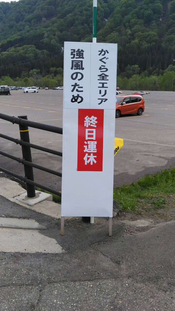
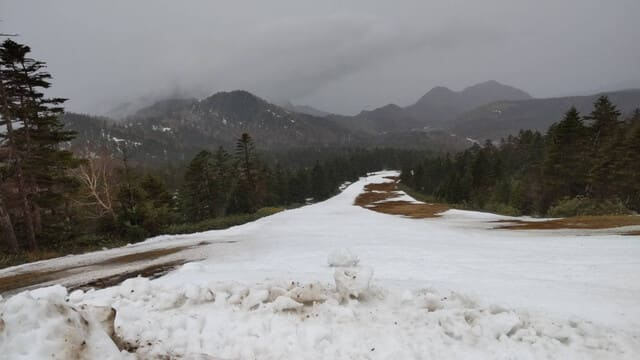
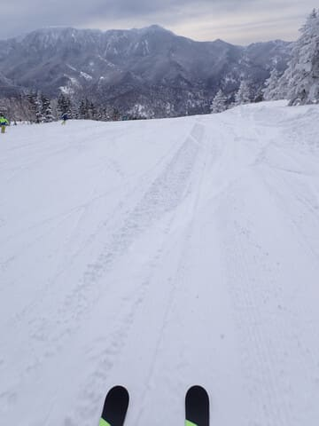
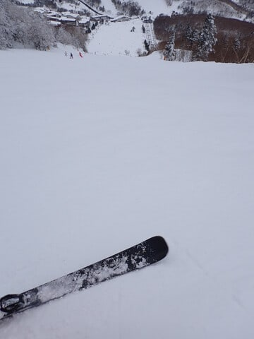
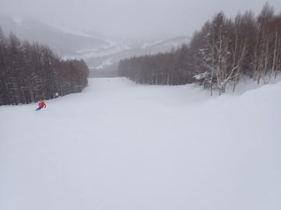
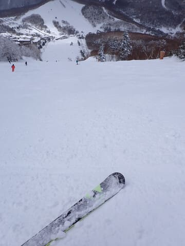

# そろそろ2026シーズンモデルのスキー板の詳細試乗レポート開始！…そして5/17はかぐら運休でも横手のリフトは動いたらしい

📅 投稿日時: 2025-05-18 02:35:30

🏷️ カテゴリ: [スキー板試乗](c0bd8048615710cee890e403a36cc9a2b.md)

えー．

残念ながら悪天候予想のため，早々に

かぐらが営業休止を決めた本日土曜．

意外とかぐらは昼前に雨がやんで天気が

落ち着いてきていたっぽいのですが…

やっぱり事前予告通り，終日運休だった

ようで．

その代わりと言っちゃなんですが，横手の

リフトは強風の中予定通り第4が動き，

しばらく経ってから第2も動き出し．

第2，第4の2本のリフトが動いたようです～！

…しかし．

第2ゲレンデ，もう末期的状態になってきて

ますね…（涙）

このコースも明日がラスト．

今日滑ったおこみん特派員によると，

リフトに乗ってるときはかなりの強風

だったけど，ゲレンデは雨で板が滑って

楽しかったようです…！

…でも雨なので，滑ってる人がほとんど

いない…

そして，明日の日曜はかぐらファイナル．

あぁ…ファイナルかぐら，滑りに行きたかった…

日曜は娘に勉強を教えなくてはならず，

滑りに行けない…（激泣）

果たして，精神的にリフレッシュされてない

スキーに行かない週末のあと，来週1週間，

無事仕事を乗り越えられるのか！？？

…大丈夫か？？？

（無理な予感）

ってなことで．

白い粉を断って禁断症状に苦しんでいる

この週末にもかかわらず，スキーネタの

Blogを書くわけですが…

記事を書きながら，さらに禁断症状が加速

しそう…（泣）

という禁断症状の中，本題へ移りますが．

今シーズンも，来る2026シーズンモデルの

スキー板をそこそこの台数試乗してきました～！

すでに大体の板で速報レポートは書きましたが，

これからいつも通り，詳細レポートを

連載していきます…！！

…しかしこんなシロートの試乗レポート，

参考になってるのかな…？

…と毎年心配になりますが．

…大丈夫．参考になってるはず！！

なってると信じて，今シーズンも書く！！

…ちなみに，過去の試乗レポートは

[こちらの記事](e019d16dddf9244b43f41d7afe00e2e4e.md)からたどれます．

ってなことで．

今シーズンも，エキップさんの試乗会と

アルペンさんの試乗会の二つの試乗会に

参加しましたが…

両方合わせて21機種．

…普段の年は30機種以上乗るんですが，

今年はエキップさんの試乗会とアルペン

さんの試乗会が同じ日で被ったので，

試乗台数が減りました…

試乗会が行われたのは，3月8，9日の

2日間．

初日の8日は，前日まで気温が上がって

下地が硬くなったうえに，冷え冷えトップ

シーズンの新雪が数cm積もった感じで．

表面はトップシーズンの柔らか雪

なのに，下地がしっかりしているので

雪は荒れてこず，エキップさん試乗会の

焼額は良かったけど．

アルペンさん試乗会の一の瀬は，

正面バーンでは下地のカリカリが所々

出てくる，ちょいと難しめのバーン．

2日目の9日も，朝までに冷え冷え雪が

数cm積もり，この日も焼額は良かったけど…

この日も一ノ瀬正面バーンは

カリカリに凍った下地の上にモサモサの

雪が乗った，難しめのバーンコンディション

でした…

そして．ブーツはHEAD Raptor WCR3の

フレックス150を履いて試乗してます．

ブーツが強めなので，結構しっかりした

強めの板の評価が高くなっている傾向が

あると思います…

そして，いつもの注意書きを改めて

書いておくと．

このレポートを書いているのは，

指導員もテククラも持ってなければ，

レースをやっていたわけでも無い，

どシロートのレジャースキーヤーです．←ここは繰り返し強く主張しておくところ

レジャースキーヤーが

自分の好き嫌いを言っているだけ

なので，

私がいいと思った板でも，

「なぜこれを誉める？」

と思う方もいっぱいいると思いますし．

逆に，私と合わなかった板でも，

「なぜこの良さが分からない…？」

という方もいっぱいいると思います．

あくまで，いちレジャースキーヤーが，

自分の好き嫌いを述べているだけです！！

全く持って客観的な評価じゃなく，

私の好き嫌いが多分に入った，めちゃくちゃ

すごい主観的評価なので，そのあたりを

ご承知おきのうえ読んでください…

そして，今回試乗した板も私の趣味で

選んでいるので，だいたい毎年試乗して

いる板を，また今シーズンも履いてみて

いる感じになっちゃってます…

いつもと変わんない，おんなじ板

ばっかり履いてます（笑）

それでも，去年履いたのと同じモデルの

板でも，昨年と今年で書いている内容が

変わったりしているので．

まぁ，雪面コンディションが違うからなぁ…

と言い訳をしつつも，同じ板で全く違う評価を

してしまっているところに，自分の試乗

インプレッションなんてあんまりあてに

ならないということがわかります…（ちょい涙）

そもそもいつも書いてますけど．

プライズも指導員資格も持っていない，

ド素人が好き嫌いを書いているだけなので．

「まぁ，この板をこんな評価する人も

いるんだなぁ…」

という程度に読んでいただければと思います．

ということで．

2026シーズンスキー板の試乗レポート，

次回から連載開始です！

## 💬 コメント一覧

### 💬 コメント by (harutomo)
**タイトル**: Unknown
**投稿日**: 2025-05-18 09:53:41

試乗レポート楽しみにしています。

私も、明日から試乗レポートしようと思っていました。

### 💬 コメント by (Skier_S)
**タイトル**: ＞harutomoさま
**投稿日**: 2025-05-19 02:34:46

楽しみにしていてくれてうれしいです…！

でも，今日から試乗レポート書こうかと思いましたが，今日は特派員レポートになっちゃいました(笑)

