# 2017年8月，小学生の子連れでパラオ再訪！その14…2日目のエキストラ，4本目のサンセットダイブ！

📅 投稿日時: 2018-10-02 00:56:02

🏷️ カテゴリ: [ダイビング日記](ce3a7a8d424d112fce83ee85c81a0e344.md)

気のせいでなければ．

なんだか，今朝しばらく．

まだ書きかけだったこの記事を晒して

しまっていたような気もするんですが．

…気のせいだったに違いない…

ってことで．

この記事を一度読んだ人などいない

と信じて投稿．

…の，本題の前に．

そう．

本日，とある郵便物が届いたのですが．

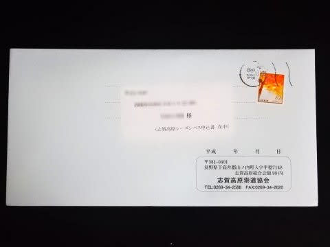

うむ？

志賀高原索道協会から？

ってことは…

あれだな！

そうです．

志賀高原のシーズン券申込書です！

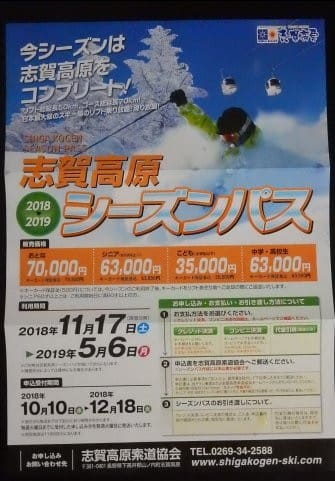

ちなみに，このシーズン券．

2014シーズンまで65,000円．

2015シーズンから67,000円．

そして，2018シーズンから70,000円に値上がりして．

今シーズン，またさらに値上がりするんじゃないか！？？

と，この手紙を受け取るまで心配していましたが．

何とか今シーズンは，値上がりせずに済んだよう

ですね…（一安心）．

しかし．

シーズン券やら10日券やら，常連を狙って値上げしてくる

志賀高原．

私の周りのシーズン券保持者は．リフト1本換算20円程度で

乗っている方々ばかりなので．

そういう人たちを狙って，

「シーズン券は積算滑走標高差50万mまで．

　それ以上は追加料金です～（笑顔）」

とかいう料金を設定してくるんじゃなかろうか…

ってな心配もしたくなりますが．

いや，キーカードを使えば，そういう料金設定も

不可能じゃないですから…

でも．

とりあえず，今のところ．

そういう20000mクラブメンバー狙い撃ちの

料金は設定されないようです（笑）．

ってなわけで．

スキーシーズンは近づいてますが．

本日もダイビング旅行記です．

では，どうぞ～！

---

ってな感じで．

3本目のダイビングを終えたボートは，

ジャーマンチャネルを抜けて，帰路につきます…

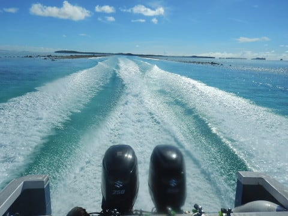

娘は，知らぬ間にボートキャプテンと

仲良くなったみたいで…

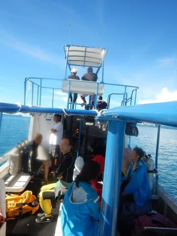

さりげなく，こんなところに座って

ますね…

特等席ですな…

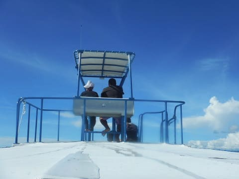

で．

ボートに乗って約1時間．

ショップ前に戻ってきました…

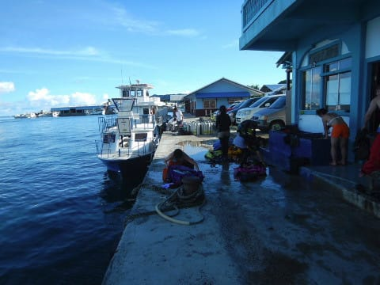

ここでほとんどのメンバーはボートを降りて．

4本目に行くゲストのみ，船に残って再度

出航っ！

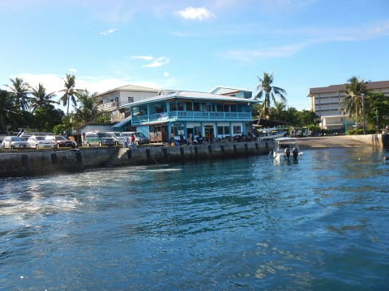

今回，4本目のエキストラダイブに行くゲストは，

私ともう一人のみ．

娘と妻も

「ショップでログづけしてお茶飲んで

　のんびり過ごしてるわ～」

と．

私を置いて船を降りちゃったので．

ゲスト2人＋ガイド1名だけの寂しいメンバーで，

日が低くなる中，ポイントへ向かいます…

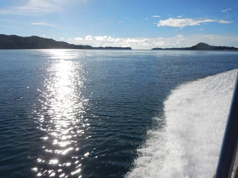

んで．

今日のエキストラダイブのポイントは

「ブルーミングダスキー」

シルトっぽい砂地で，ハゼ狙い．

マクロな1本です．

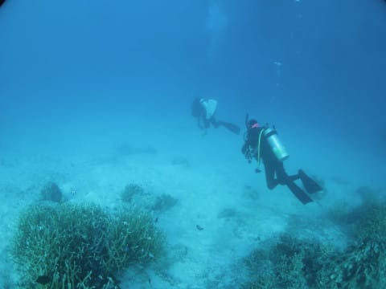

まずはこいつ．

沈めた瓶に住み着いている，

ナカモトイロワケハゼ．

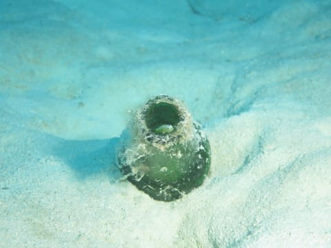

瓶が複数沈めてあって．

いくつかの瓶にこいつが住み着いているので．

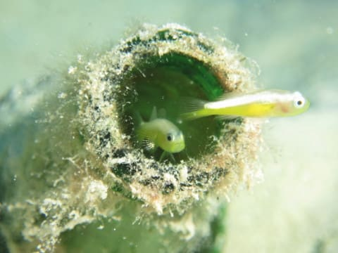

ダイバー2人，それぞれ別な瓶の前を

陣取って．

ひたすら粘ります…

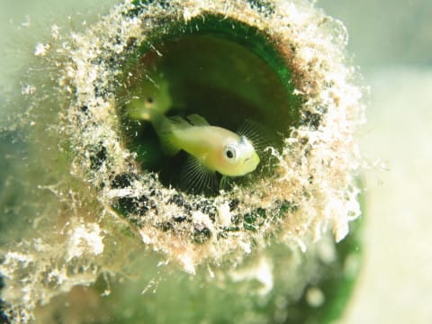

せっかく2匹いるから，きれいに

2匹揃って写真に撮りたいけど．

両者きれいにピントが合う位置に

揃わない…（涙）

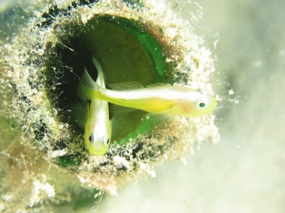

ってな感じで．

ナカモトイロワケハゼで粘ること15分．

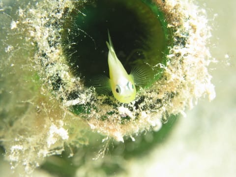

次は…

ガイドに，ホムラダマシと呼ばれるハゼを

見せてもらいますが…

ど，どこにいるか全く分からん…

しばらくじっと見てみると…

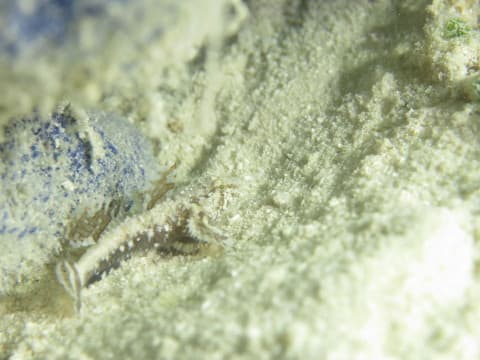

いた！！

もう，保護色な上に，小指の第1関節までくらいの

小さなハゼで，見つけにくいことと言ったら…

それも，かなりのスピードでちょこまかと

動き回るので．

写真に撮るのも一苦労…！

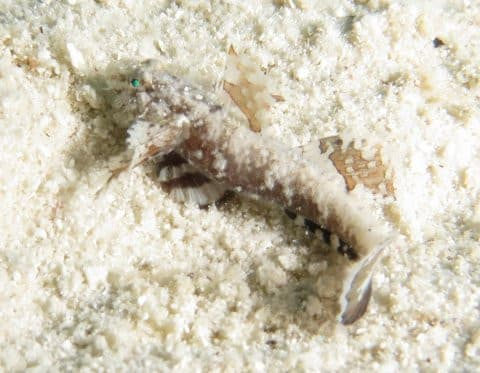

緑の目がきれいなハゼでしたが．

なんとか，写真に残せたな…

というレベルの写真が撮れたところで

切り上げ…

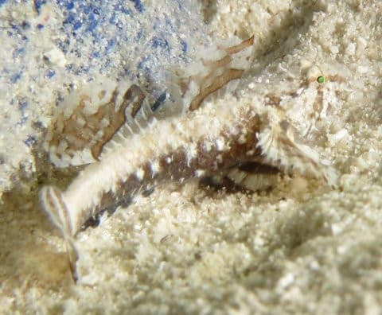

いやー．

かなり大量にピンボケやら，

逃げられた後の砂地を撮った写真を

撮りましたよ…

あとは．

こんな感じのところにいたのは…

ハダカハオコゼちゃんですね．

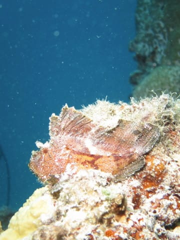

さっきのホムラダマシの目が

エメラルドのグリーンなら．

こいつの目はルビーの赤でしょうか…

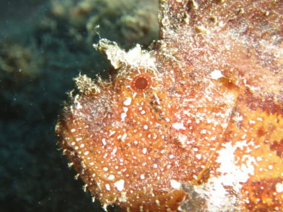

てな感じで．

いろいろ見て，エグジットすると．

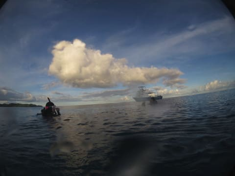

…もう日が暮れかける頃でした…
