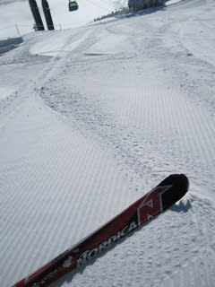
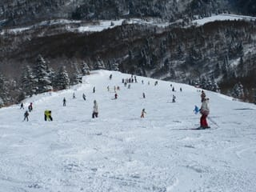

# 今日の志賀は…

📅 投稿日時: 2011-02-20 00:00:53

今日は絶好のスキー日和．

朝から快晴！！！！

うひょーーーー

生きててよかった！！

朝は，信州中野のチェーン規制やら事故やらで，

志賀に上ってくる人が少なかったのか，がらがら．

雪質も，雨が降った後にそこそこ雪が積もったらしく，

朝は最高！！

気温もマイナス10度くらいまで，しっかり冷え込んでました．

雲海を眺め，ダイヤモンドダストが舞う中スキーができました！

…しかし．

昼には，0度近くまで気温が上がります．

人も増えてきました

氷のごろごろがいっぱい出てきて，

ちょっと雪がぼそぼそしてきたかな…

と思ったら．

午後には，木曜深夜に降った雨のあととおぼしき

固い下地がかなり出てきました．

固い氷の上にぼそぼその雪がのったでこぼこバーンに．

危惧していたカリカリバーンになっちゃったよ～

午後はちょいとテンションダウン気味．

でも，まぁ1日天気のいい中滑れましたね～

明日も晴れるようです．

しかし，このまま明日気温が冷えたら，結構固い

バーンになっちゃうかも…
