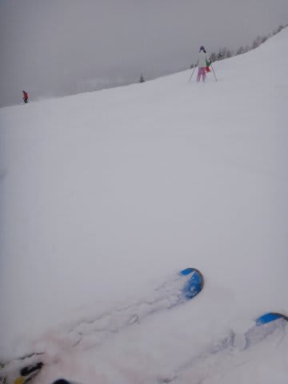
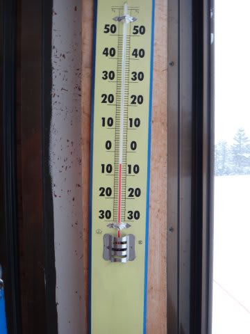
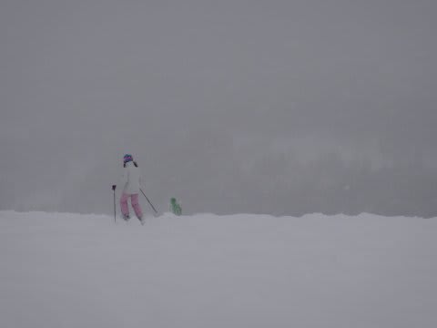
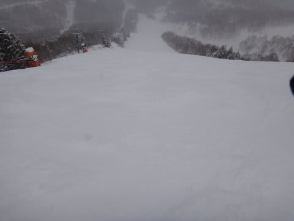
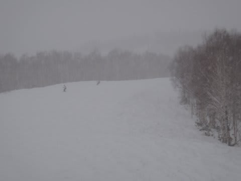
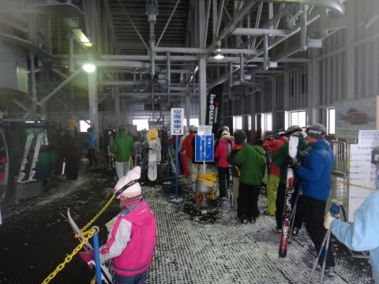
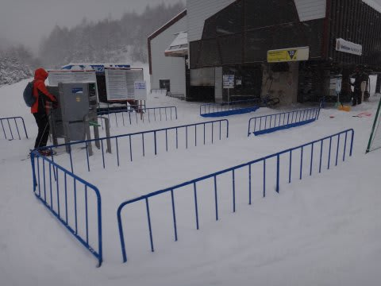
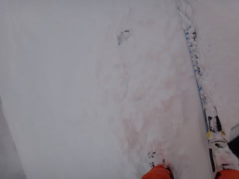
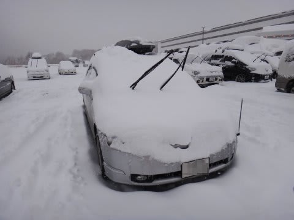

# 1月14日の志賀高原は…もさもさ雪

📅 投稿日時: 2013-01-16 00:29:31

🏷️ カテゴリ: [2013スキー滑走日記](c91dbe557f9a69230b1600e48622fdd61.md)

…ってことで．

悲惨な昨日の交通状況の影響で．

一日遅れましたが．

14日の志賀高原，焼額山の状況をば…

この日は．

朝から雪．

…って言うより，ちょうど朝から降り始め．

…降るなら，夜のうちに降って，朝から晴れてくれればいいものを…

朝の圧雪後に降り始めた雪なので，圧雪バーンにも10cm程度の積雪．

朝の気温が-5度とこの時期にしては気温が高めで，雪がちょいと重めだったので…

ちょっともさもさして，スピードが出せないし，滑りにくい…

かといって．

非圧雪コースも，朝から降り出したばっかりなので積雪があるわけでもなく．

オリンピックコースとかは，積もった10cmほどの新雪がすぐに削り取られてしまい．

アイスバーンともさもさ雪だまりが入り混じる，加速＆減速が繰り返される

デンジャラス・バーンに．

…さらに視界も悪く，足元の凹凸が見えなくて，なかなかエキサイティングな感じです(泣）．

うーむ．

楽しくない…

せめてもの救いは．

滑りにくいからか．

大雪での交通状態を危惧してか．

お客さんが非常に少なかったこと．

…午後になったら，ほとんど人がいない貸切スキー場みたいに

なってきました．

この日のゴンドラの最大待ち時間もこんな感じ．

朝11時を過ぎると，ゴンドラ待ち時間も完全0になってきました．

当然，リフトは待ち時間0です．

…これ，平日より人が少ないのでは？

しかし．

朝から降り始めた雪は．

午後になっても弱まることはなかったので．

昼間だけで，20cmほど積もったのじゃないかな～．

ってことで．

重めのもさもさ雪がどんどんたまっていき．

午後になってもこんな感じ…

朝よりもさもさ感200％アップです．

ゲレンデ全体が完全にもさもさ＆凸凹，ところによってはアイスバーン有り…

って感じに(悲）．

うーーん．

これは．

ちょっと，楽しくないなぁ…

ということで．

大雪の交通状況が心配というのもあり．

私にしては大変珍しいことに．

リフトがまだ動いている午後3時過ぎには，切り上げたのでした…

朝から夕方までで，このくらい雪が積もったようです…

で．

まさか．

この後に，あんな大変なことが待っていようとは…

(続く)

＃最近，「続く」パターンが多い気が…

## 💬 コメント一覧

### 💬 コメント by (komu)
**タイトル**: Unknown
**投稿日**: 2013-01-16 01:45:02

Skier_S様

お仕事お疲れ様でした。

12日土曜日に富士見パノラマへ日帰りでいってきました。志賀高原はなかなか敷居が高くて…

今日は早く寝て下さい。(( _ _ ))..zzzZZ

### 💬 コメント by (Skier_S)
**タイトル**: komuさま
**投稿日**: 2013-01-17 00:19:25

あいやー．

3連休なのに一日だけしか滑らなかったんですか！

私なら，禁断症状で死んじゃいます(笑）．

富士見パノラマ，いかがでしたか…？

混んでませんでした？

昨日は私にしては珍しく，1時前という

早い時間に寝ました…

