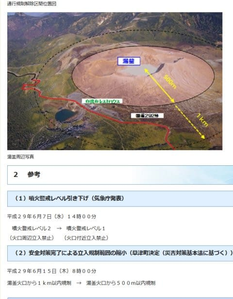
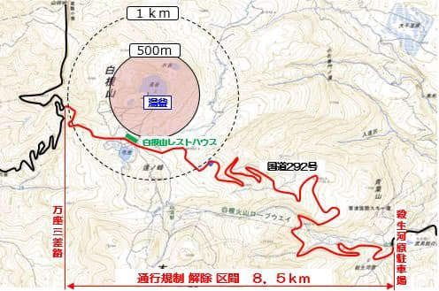
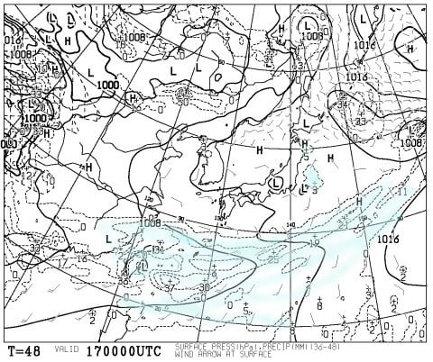
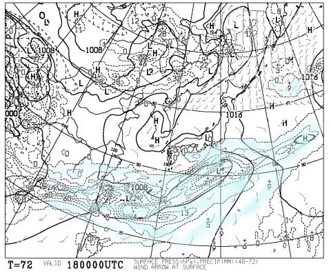

# 今週末の月山は…天気がよさそうですな．

📅 投稿日時: 2017-06-16 00:41:58

えー．

どうやら．

草津白根山の噴火警戒レベルが上がっていたため

しばらく続いていた，志賀草津道路の夜間通行止め．

本日，解除されたようですね…

（[群馬県ホームページ](http://www.pref.gunma.jp/06/h28g_00005.html)より）

噴火警戒レベルが2→1になったということで．

通行規制区間が火口から半径1km→500mになったらしく．

これまで午後5時～次の朝8時まで夜間通行止めだった

志賀草津道路．

通行規制区間から外れて，終夜通行可能に

なったようです！

ちなみに，草津レストハウスや駐車場も立ち入り禁止が

解除され，湯釜が見える高台部分まで登れるように

なってるようで…

ということで．

話題は変わって．

今週末の月山の天気ですが．

土曜の天気図を見てみると…

うむ．

降水域は山形にかかっていないし，

妙な寒気も入ってないので，

晴れそうですな．

そして，日曜の天気図を見ても…

…これも，水色に塗った梅雨前線による降水域，

関東南岸にかかっているものの．

東北地方からははるか遠いので…

この日も，晴れそうですね．

すっきりと…

ただ，火曜から今日まで定例のリフトの架け替え

（冬用の高い位置→夏用の低い位置へ)

を行っていたようなので．

この週末，板は脱いで乗り降りしなくては

ならなくなるのかな～．

で．

リフト架け替えの3日間，人が滑ってないので．

大斜面のコブは，ほぼ消えかけてるんじゃないかな～．

とはいうものの．

この週末．

久しぶりのスキー日和の月山になりそうですね…

あぁ…

参観日…

なぜ，このような週末に限って，

娘の参観日なのか…（遠い目）．

## 💬 コメント一覧

### 💬 コメント by (michi)
**タイトル**: Unknown
**投稿日**: 2017-06-16 21:45:36

自分も明日は息子の父親参観日です。

年に１回ですからね。

楽しいことはガマンですね（爆）

### 💬 コメント by (Skier_S)
**タイトル**: michiさま
**投稿日**: 2017-06-17 01:07:02

あ，みなさん今週土曜参観日…

って方，多いですね～．

なにか学校側で示し合わせて

一斉にやってるんですかね？？

まぁ，参観日がトップシーズンじゃなくて

良かった…

と，自分を慰めています(笑)．

