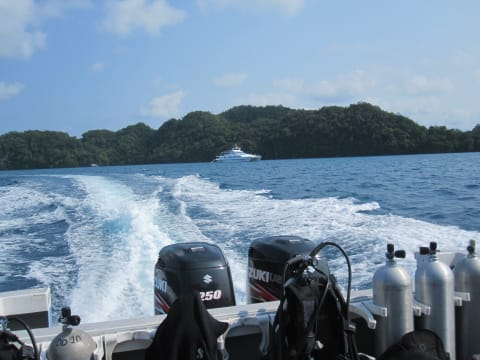

# 2014年10月，小学生の子連れでパラオへダイビングに行ってみた，その3…ダイビング1日目，スタート！

📅 投稿日時: 2015-07-20 02:53:50

…そして．

パラオでの初日の朝．

朝7時に，眠い目をこすって起き出して…

朝8時15分，ホテル前に迎えに来た，

ダイブショップのピックアップの車に

乗り込みますが…

うーーーーむ．

娘．

娘よ．

痛々しすぎる…

せっかくパラオまでやってきたというのに…

とりあえず．

車に乗って，10分弱．

到着したのは…

今回利用するダイブショップ．

デイドリームさんです．

ショップの中はそこそこ広く．

コーヒーなんかが飲み放題．

とりあえず，ここで初日の受付を終え，

ショップの前に停泊している船に乗り込みます．

ふむ．

最近は，パラオの船は大型化が進んでいるとは

聞いてましたが．

ここのショップの船も，平屋のスピードボートではなく，

クルーザースタイルの，30Ftを余裕で超えるクラスの船ですね…

ってことで．

9時過ぎに，出航！

うん？

…後ろに見える船は…

ああ．

最近話題のクルーズ船，龍馬ですね…

そして，船はコロールを離れ，ダイビングポイントへ向かいますが…

…昨日，ホテルへの到着が遅く，眠かったらしい娘は，

船に乗った途端，振動が気持ちよかったのか，熟睡

しちゃいました…

…顔のテープが痛々しい…（涙）．

…さて．

船には乗ったものの．

おそらく，泳げないだろうわが娘．

この船の上で，今日一日，

どう過ごしてもらおうか…

