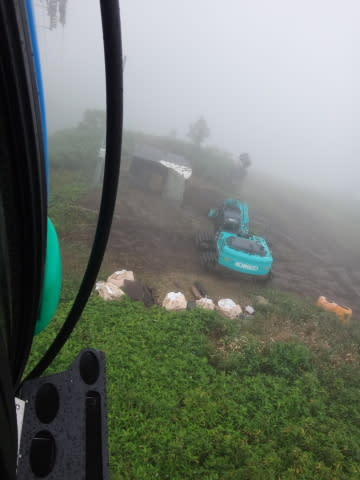
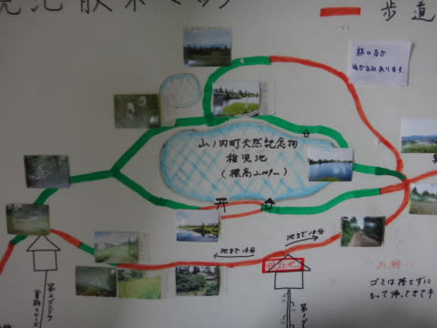
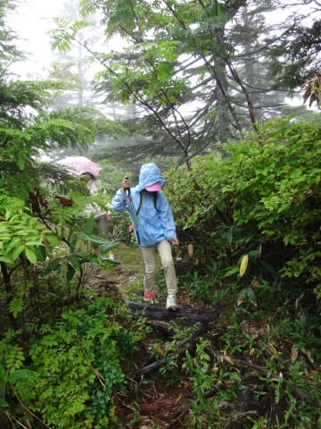

# 夏の志賀高原へ行ってみた…そして，焼額

📅 投稿日時: 2015-09-03 02:14:32

ということで．

昨日はスキー場オープン情報で一回スキップしましたが．

まだ続く，夏の志賀高原レポート．

今回が最終回です…

---

で．

雨の中，いろいろ夏の志賀高原を巡ってみている

わけですが．

次にやってきたのは，本命の焼額山！

夏の焼額って，一体どんなのかしらん？

って好奇心を満たすのが，今回の旅行の目的．

やはり，わがホームゲレンデですから．

しっかり拝んで帰らねばっ！

ってことで．

夏山営業をしている，焼額第1ゴンドラにさっそく乗ってみますが…

いやー．

来シーズンを待たずして，戻ってきたよ，焼額っ！！

夏は，こんななのね…

…しかし．

往復ゴンドラ乗車，割引で1300円か…

冬の間は，シーズン券で乗りたいだけ乗っている私にとって．

たった一往復でこの値段は，ちょっと痛い…

でも．

夏の焼額．

こんななんだ…

ここは，冬はこんな感じですね～

そして．

マニアにしかわからないネタだと思いますが．

すでに営業終了しているけど，設備が残っていた第1ロマンスB線のリフト．

工事が進んでおり，支柱もリフト降り場も，撤去されてました…

（リフト降り場のあと）

そして，やってきた山頂駅．

で．

いつもの温度計と．

久々のご対面～っ！！

山頂の気温は18度．

8月中旬では，かなりひんやりした気温です．

で．

焼額山頂にあるけど．

スキーシーズンには，まず目にできない稚児池．

今日は，焼額山頂と稚児池を見るのが目的．

んでは，山頂へ向かいますか…

と，歩くことしばし．

ゴンドラ降りて，10分ほど．

奥志賀のてっぺんからちょっと登ったところに，見えてきました

稚児池．

そして…

稚児池沿いにある，「焼額山山頂」

ふーむ．

ここが，山頂なのか…

そして，稚児池の祠を見て．

さらに，焼額山頂近辺を散策してみます．

…これは，第2ゴンドラ山頂駅ですね．

山頂付近は，きれいなお花畑状態…

うーむ．

天気がいいときに歩きたいなぁ…

って感じで．

夏のゲレンデの雰囲気を堪能します．

…ここは，冬はこんな感じなんだよなぁ…．

と，いろいろと楽しんだ後，下山です．

そのあとは，第2高速リフト乗り場なんかも見て回りましたが…

あー．

夏のスキー場，やっぱりちょっと寂しげ…

という感じで．

夏の志賀高原，いろいろ見て回ったのですが．

スキー場以外，見て楽しめるところが多く．

予想以上に，面白かったですね～！

娘も，「また行きたいー」

と言っていたので．

我が家の定番となりそうな，夏の志賀高原ツアーでした…
