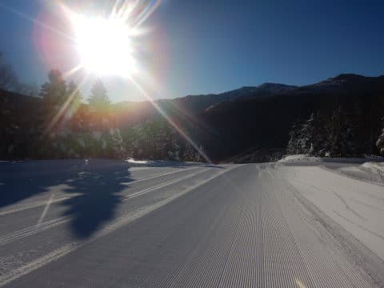

# 2022/1/2の志賀高原スキー場は…久々の晴天！最高シマシマ！でも焼額は激混み(涙)

📅 投稿日時: 2022-01-03 00:04:33

🏷️ カテゴリ: [2022スキー滑走日記](cc9cb73e4320f6a97af6fccc37587a61a.md)

ってなわけで．

今日も志賀高原で滑ってたわけですが…

今日の志賀高原は，実に久しぶりの晴天でスタート！

こんなに晴れたのはいつ以来の

ことか…！

そして，いつも通りの8:30営業開始の

ゴンドラで山頂に出ると…

晴れているのに気温は-12℃と

冷え冷えで．

だもんで，朝の雪質はトップシーズンの

激冷えで，柔らかいながらもキュッと

締まった，激烈ハイクオリティー超勘違い

シマシマバーン！！！

ぐほほほほ！

今日はファーストトラックもなかったので，

シーズンに数回あるかないかの晴天の

ノートラックの最高級シマシマ！！！

いただきま～す！！

うおおおおお！シマシマっ！

最高級のシマシマっ！！

美味すぎるっ！

こんな美味のシマシマを思いっきり

切り刻んでいけるとは．

これ以上の快楽が人生にあるだろうか…！！

昨日は最高パウダー，

今日は最高晴天シマシマ…

この2日間，両極端のシアワセ最高バーンが

続き，なんと恵まれていることか！！

と，最高の幸せを感じていたのも

1時間ほど…

9時半になると，第1ゴンドラの列が

すごいことになってきました(涙)

一応，今日から焼額第1ゴンドラは，

『相乗りしたくない人』

『相乗りしてもいい人』

の2レーンに分かれ，相乗りしてもいい

レーン側は，なるべく5-6人で詰めて

乗車するように係の人がコントロール

するようになったので，

これまでの基本的に相乗り無しに比べれば

列の長さのわりに待ち時間は短くなった

ものの…

それでも10時ごろには，ゴンドラ待ちが

20分を越えてきました(泣）

そして，今日は昨日の大雪の後始末

(駐車場の除雪等）で人手が足りず，

第3高速リフトが営業しなかった影響も

あり，第2高速もかなりの混雑となり…

ゲレンデも，ところどころ人口密度が

高い状況に…(涙)

せっかくの晴天・最高雪質なのに…

リフト待ちが惜しい．惜しすぎる！！

午前中は，第1ゴンドラが30分待ち，

第2ゴンドラが45分待ちまでいった

ようです…

ただ，お昼休みの11:40～13時頃までは，

相乗りレーンの効果もあってか，

第1ゴンドラの待ちがゲートを出るか

どうかくらいまで短くなったので．

この瞬間にゴンドラグルグルするのだ！

昼間の最高気温は-5℃と，

ここ数日から比べればあったかいけど…

でも，雪はしっかり冷えたままを

キープする冷え冷え気温で雪質は

終日最高をキープしてくれたし．

さらに，第3高速が動いてなかったので，

SGSコースから第3高速沿いのイースト

コースに降りると，午後1時になっても

まだシマシマが楽しめる，恵まれた

バーンコンディションの一日！

…でも．

午後1時を過ぎると．

午後3:30までは，10分程度のゴンドラ待ちが

続き…

コースも，ちょっと飛ばすには怖い

人口密度が続きました…(涙）

とはいえ．

今日はラストまでいい天気で，

さらに雪もやわらかいトップシーズン雪質

だったのに，最後までそれほど荒れず，

フラットをキープし続けてくれて．

今日も日が傾く，16時の営業終了まで，

ひたすら滑り続けたのでした…

いやー．天気，雪質は最高だった…

ホントに久しぶりの晴天の下，滑れました…

混雑したのだけが残念…っ！

…あと．

今日もナイター営業が，昨日の大雪の

後処理のために中止になったのが

惜しい…っ！

明日は3連休最終日なので，今日より

ちょっと空いてくれると嬉しいな…

PS.今日は志賀高原全体に混んだようで

　一の瀬ファミリーや奥志賀ゴンドラも

　かなり待ち時間があったようです…

　寺小屋，西舘フーディーも混み気味で，

　ゲートくらいまで人がいっぱい．

　ブナ平ゴンドラもそこそこ待ちが

　あったようです．

　でも，丸池・サンバレーや西館クワッドは

　ガラガラだったみたいなので，混んでいても

　どこかに逃げるところがあるのが志賀高原の

　いいところ…

## 💬 コメント一覧

### 💬 コメント by (たぉ)
**タイトル**: Unknown
**投稿日**: 2022-01-03 02:32:51

今日（昨日）はゴンドラ凄い混んでましたね!私はお昼帰宅のため午前の1ゴン、2ゴン各1回しか乗れずでした。2泊中でやっとの晴天だったんですがね～。ヤケビの景色とコース気持ち良かったです。また2月に行こうと思います。それまでSさんのブログ参考に♪

### 💬 コメント by (レインボー74)
**タイトル**: Unknown
**投稿日**: 2022-01-03 08:23:17

確かに、未踏のしましまを踏みつける時、未踏の新雪を削れる時、これ以上の快感はないっすね。羨ましくてたまりまセブン！

### 💬 コメント by (アリス)
**タイトル**: 年始は混みましたね
**投稿日**: 2022-01-03 16:54:47

S様

やはり、年始は混みましたね♪

私もランチ抜きでひたすら滑っていましたが、Sさんがどの人なのか認識できず仕舞いでした・・・

寺子屋のリフト上から、Goku様ご家族が滑っているのが確認できましたが、皆さんコース上では停止しないかたばかりですので、お声かけずに終わりでした・・・

平日のガラガラばかり経験すると休日のゲレンデで人が多くなると怖さを感じてしまいますね♪

来週もまた平日狙いで参戦を考えています♪

### 💬 コメント by (かず)
**タイトル**: Unknown
**投稿日**: 2022-01-03 19:29:32

本日1日ツリー入ってました！通常の5倍位足動かすので疲れます笑  折りたたみストックってSさん専門外ですか？安くていいメーカーあったら教えて下さい

### 💬 コメント by (Skier_S)
**タイトル**: 今日も良かった
**投稿日**: 2022-01-04 02:38:52

＞たぉさま

あら．ゴンドラ2階しか乗れずですか…

かなり混んでたのがちょっと残念でしたね．

また2月，志賀高原でお待ちしてます～！

＞レインボー74さま

レインボーさん不在の焼額は私が守ります！

私のレポートでうらやましがってください…

じゃなかった．私のレポートを楽しんでください！！

＞アリスさま

混みましたね～！

私は今シーズン，ちょっと見た目が変わっているので発見しにくいかもです．

私は土日しか来れないので，また土日にいらっしゃることがあればお会いしましょう…！

＞かずさま

折り畳みストックは残念ながら専門外です…

おススメはわからないです．すみません…

