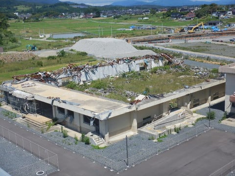
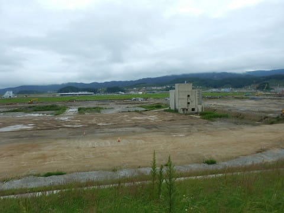
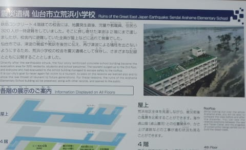

# この3連休，LEVORGに車中泊で出かけてみた

📅 投稿日時: 2019-07-19 02:22:17

🏷️ カテゴリ: [登山・旅行](c1d637a11a25b457ac978d197adbdafc5.md)

というわけで．

先週末は3連休だったわけなのですが．

…この3連休のうち2日間，娘に予定が

入っているので，残念ながら

家族で遠出はできず．

そして．この2日間．

昼間は娘と妻が外出しているので．

…家にいても，どうせ家族サービスが

できるわけでも無い．

…となれば．

自分一人で，1泊2日でぶらっと出かけよう！

それも．

久しぶりのスキー以外の一人旅行だし．

車にシュラフを積んで，車中泊だ！

…と．

初めてのLEVORGでの車中泊にチャレンジ

してみました～！

とりあえず．

BRレガシィ君より，ちょいとだけ荷室の

長さが短く感じる，VMGレヴォーグ君．

身体を伸ばせるか，ちょっと心配だったけど．

夜になってシュラフを準備してみると…

うん．

ちょいと平均より背が高い程度の

私なら，ちょいとだけ斜めにすれば，

完全に身体を伸ばして寝れましたね…！

…ってことで．

荷室床面も思ったよりフラットだし．

朝まで快適に寝て過ごせました…

ってことで．

まぁ，LEVORGでも問題なく車中泊

できるな…

ということが分かったわけですが．

さて．

車中泊で一体どこに行ってきたのかというと…

なぜか．

あまり時間が経たないうちに．

人として，これらを見ておかなくてはならない

気がして．

知っておかなくてはならない気がして．

見に行ってきました…

あえて，何もコメントしません．

何をコメントしても，安っぽくなりそうなので…

しかし．

これだけだとちょっと重くなりそうなので．

一か所だけ，震災と関係ないところを

見に行ってきました．

…これが，国土地理院が日本で一番低い山と

しているらしい，日和山です！

登山口から一瞬で山頂に着きます（笑）．

それも，このバス停．

こんなサイズなので…

実際は，こんな感じのスケール．

地震前は6mあったらしいですが…

地震後は標高3m．

とりあえず．

低いほうの日本一ですが．

日本一の山に登ってきた，

この3連休でした…

## 💬 コメント一覧

### 💬 コメント by (megalith)
**タイトル**: Unknown
**投稿日**: 2019-07-19 12:08:27

Skier_Sさんご無沙汰しています。

ぶらり旅いいですね。

自分は今年母が急逝した関係で父の面倒を見ているため当分の間はどこも行けなくなりました。

行かれた場所についてはコメントは控えます。

ただただご冥福をお祈りするのみです。

スバリストにはある意味「聖地」と言われる場所があります。(賛否両論あるようですが)

岐阜県の中津川市にある中津スバルというディーラーなのですが、ここに現在から過去までのスバル車が多数展示されているそうです。

ディーラー内ですが、見学だけもできるそうですが、念の為事前確認したほうが良いかもしれません。

家族連れにはちょっとかもしれませんがもぶらり旅としてはこんなものはどうでしょう。(^_^;)

### 💬 コメント by (おおすぎ)
**タイトル**: Unknown
**投稿日**: 2019-07-19 13:07:31

お久しぶりです。

いつもいつもS様の行動力には頭が下がります・・・

わたしも、子供たちを連れて、いつか行こうと思いはやウン年・・・

決して忘れてはならない記憶を、この目で見て来ます。

日本一低い山が有るのを、初めて知りました！！

### 💬 コメント by (ほっぽ)
**タイトル**: Unknown
**投稿日**: 2019-07-20 00:11:37

Ｓさん

私も当時、微力ながらも震災ボランティアに参加し、

３年前には家族旅行で東北の地を訪れました。

家族、特に娘たちにここで起こったことを自分の目で見て、

何かを感じてもらいたいと思ったからです。

### 💬 コメント by (Skier_S)
**タイトル**: 東北旅行
**投稿日**: 2019-07-20 02:07:47

＞megalithさま

ご無沙汰です～！

岐阜県に，そんな聖地があるんですね…

私は筋金入りのスバル乗りでは無くて，にわかスバル乗りなので，

うかつに聖地には行けないです（笑）．

でも，どこに泊まるかも決めないで，ぶらり出かける

一人旅はいいものです．

＞おおすぎさま

いや～．

ホントなら，もっと前に行きたかったのですが…

とりあえず，我が家から往復1200kmを1泊2日で走り切りました．

ぜひ，おおすぎさんもいろいろ見て，感じてきてください．

＞ほっぽさま

震災ボランティア，行かれたのですね…

今は被災地も整備が進み，陸前高田などは

高い盛り土に新しい街が作られ始めてました．

地震・津波の被害もですが，原発事故もいろいろ

考えさせられました．

ちょっと人と観点が違うかもしれませんが，

自分がその場に立った時に，早い段階での設備の放棄の判断が正しく下せるか，

部下への命の危険を伴う突入指示が冷静にできるかどうか．

…今の自分の仕事に照らし合わせて，いろいろ考える

ところがありました…

