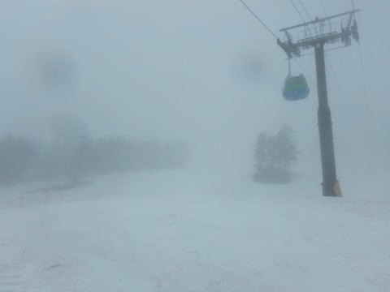

# 4月15日（日）の志賀高原速報モード…午前は雨（涙），1ゴン営業は強風で9:15から…午後は晴れ時々ガス

📅 投稿日時: 2018-04-16 01:24:22

ということで．

本日も帰宅が遅かったので．

はい．

本日も，日曜定番．

速報モードでのレポートにて！

えー．

まず．

朝ですが．

明け方前から，かなりの雨降りで…（涙）

そして，朝は強風のためゴンドラが動かず．

早朝営業は第4ロマンスリフトでの営業と

なりました…

（[焼額山HP](http://www.princehotels.co.jp/ski/shiga/)より）

…かなりの雨の中，雨を避けられるゴンドラではなく．

遅いペアリフトでびしょ濡れになりながら滑るという，

自虐的趣味を私は持っていないので．

早朝は行きませんでした…

ええ．行きませんでした…

昼間，リフト係員に聞いてみたのですが．

私「この雨の中，4ロマの早朝で滑るお客さん，いたんですか？」

係員「全部合わせて，10人ほどしかいなかったです…」

…いや，それ．

10人しかいなかったというより．

雨に打たれ続けるリフトに乗って，

びしょ濡れになりながら滑ろうという人が10人もいた

というほうが驚きなんですが…

私ですら絶対滑りたくない状況で滑ろうという

猛者が，そんなにいるとは…（感動）

この人たちこそ．

スキーに命を捧げる真のスキーヤー

と認めましょう．

というか…

おそらく．

史上最強のスキー○カに違いありません…

…ってな感じで．

早朝はゴンドラ営業できなかった本日．

通常営業開始時間になってもゴンドラは動かず…（涙）

（[焼額山HP](http://www.princehotels.co.jp/ski/shiga/)より）

結局，ゴンドラが営業開始したのは，

予定より45分遅れの，9:15過ぎでした（涙）．

まぁ，動いてくれただけマシかな…

奥志賀は朝からゴンドラもリフトも予定通り

動いていたようなんですが…

しかし．

営業開始したゴンドラに乗ったものの．

…雨だよ…（泣）

そして，午前中はずっと雨が降ったりやんだり．

そのせいで，ゲレンデに人がいません…

貸し切りゲレンデだ！

楽しいぞ！

楽しいんだっ！！！

…と，自己暗示をかけて．

シマシマというより，圧雪車のキャタピラ跡が残る

朝イチゲレンデを滑ります…

午前中は雨だけじゃなく，ガスも出て．

うーーーん．

なんだか，楽しいというより．

修行感を感じるのは，気のせいか…

さらに．

この雨で，また雪が減った気が…（涙）

GSコース，来週まではもつだろうけど…

GW，大丈夫かなぁ…

昼になって，ようやく雨がやみ始め．

ガスも切れてきました…

午後には，時折日が射したり…

ガスったりを繰り返す感じで．

すっきり晴れと言うわけにはいかなかったけど．

時折青空も顔を出してくれたし．

人が少なくて雪は荒れず．

汚れは多少浮いていたものの，

結構板が滑る雪だったので．

まぁ，雨の午前中に比べれば，

楽しめたかな～．

…ってな感じで．

微妙の感じの本日でしたが．

また明日，詳細レポートやります～！

## 💬 コメント一覧

### 💬 コメント by (Seeker.NT)
**タイトル**: いよいよ
**投稿日**: 2018-04-16 06:32:20

一晩中の雨降り。覚悟して準備はしていましたが、ゲレンデ状況はかなり悪化しましたね。

タンネスタートでコース規制された一の瀬へ。最後の下地の氷が露出してました。

ダイヤモンド経由でヤケビへ。うーむ、ほんと人がいなかったですね。1ゴン復旧したのでいきましたが、3本滑りましたが、閑散としていて、Sさんも見当たらないなぁ、と思いつつ土曜日に通常営業開始直前にさしたる強風でもないのにまた営業中止になった奥志賀へ。

おっ！いいじゃないですか！いいですよ。奥志賀。

ザブザブにもならず、足場を作れる程度にしっかりしており、結局奥志賀の状態が1番良かったです。板をたわませて傾いて飛ばせましたよ。

でも、奥志賀は結構寒くて、雨もあいまって全身防水ウェアでしたがかなり体温を奪われました。寒っ！

### 💬 コメント by (筋 肥大)
**タイトル**: ２７年振りのスキー
**投稿日**: 2018-04-16 14:52:19

初めまして。２１０９モデル試乗レポート御苦労様です。アトミック購入を検討していたので、参考になりました。有り難うございます。２７年振りにスキーをして、おおはまりした、５６才親父です。

昨日は、私は栂池スキー場に行きましたが、ゴンドラ強風の為、運休で、１１時から１４時３０分まで待ちましたが、泣く泣く引き上げてきました(笑)焼額はゲレンデ整備が丁寧で良いですね。この後も、お身体に気をつけて、スキー楽しんでください。お疲れ様でした。

### 💬 コメント by (Goku)
**タイトル**: Unknown
**投稿日**: 2018-04-16 21:02:41

雨の４ロマ早朝に１０人も滑ってるとは『おったまげ～』です。

もしかしたら、志賀高原には私達が知らないツワモノ達がまだまだ沢山いるのかもしれませんね。

それにしても、通常営業の焼額山、だれもいませんね。

### 💬 コメント by (しんちゃん)
**タイトル**: すげぇ
**投稿日**: 2018-04-16 22:00:52

雨の中、早朝に10人いたんですね。

すげぇ人が世の中に入るんですね。

Ｓさんが普通の、一般スキーヤーに感じてきますね(笑)

### 💬 コメント by (はなげ親分)
**タイトル**: 実は・・・
**投稿日**: 2018-04-16 22:39:11

今回土曜日帰りだったんですが

金曜日にホテルの予約の電話を入れたとき、フロントの人に

『今週末はやめたほうがいい』と

忠告されなければ、雨具の準備万端だった私は朝練に行ってたかも・・・（笑）

### 💬 コメント by (ほっぽ)
**タイトル**: 土曜日にお見かけしました
**投稿日**: 2018-04-17 00:30:55

Ｓさん

土曜日の１４時半過ぎに１ゴン山頂駅付近で、土曜日は居ないはずのＳさんを見かけたときは衝撃的でした。(^^;

スキーへの情熱、素晴らしいです。

日曜日の早朝、「くに~」さんは１０人のうちの１人だったようです。

この方の熱意もＳさんとは違う意味で凄いと思っています。

私も漸く土曜日の滑走レポートをアップしました。

今週末は家庭の事情で行けても日曜日帰り、もしかしたら土日ともにお休みかもしれません。

折角試乗会にエントリーしてあって残念ですが。

もしも日曜日にお会い出来たらよろしくお願いします。

### 💬 コメント by (Skier_S)
**タイトル**: これからGWまで，冷え冷え踊りを踊り続けるのだっ！！
**投稿日**: 2018-04-17 03:12:40

＞Seeker-NTさま

あの雨の中，滑ってらしたのですね…

奥志賀は行かなかったのですが，

奥志賀，良かったんですね…

行けばよかったです…

エキスパ，ダウンヒルとも雪の量は

まだ大丈夫な感じでしょうか？

＞筋 肥大さま

はじめまして～！

コメントありがとうございます．

27年ぶりのスキーですか！

そのころとは道具も全く変わったと

思いますが…

今の道具は良くなったので，

かなり楽になって，楽しめると思います．

まだGWまで志賀高原のシーズンは続きますので，

また志賀高原にもお越しください～！

＞Gokuさま

あの雨の中，びしょ濡れリフトで早朝を

滑るとは，信じられません（笑）

どんなツワモノなんでしょうか…

＞しんちゃんさま

あの日の早朝で滑る人に比べれば，

私は凡人です．

ってか，私はそもそも普通の人ですからっ！

＞はなげ親分さま

ぜひ，日曜早朝に滑って

伝説を残してほしかったです…

地球上で10人の選ばれし民に

なってほしかった…

＞ほっぽさま

あら！

目撃されてましたか…

日曜が天気が悪いなら，土曜のうちに

ちょっとでも滑らないと…と必死でした（笑）

私も今週は日曜試乗会の予定です．

またお越しの際はよろしくお願いします！

