# 2016シーズンモデルのスキー試乗レポート，始まりますよ～！

📅 投稿日時: 2015-03-11 02:24:36

えー．

ってことで．

この土曜日に，白馬五竜で開催されていた，アルペン主催の

来シーズン…2016シーズンモデルのスキー試乗会に参加してきたわけですが．

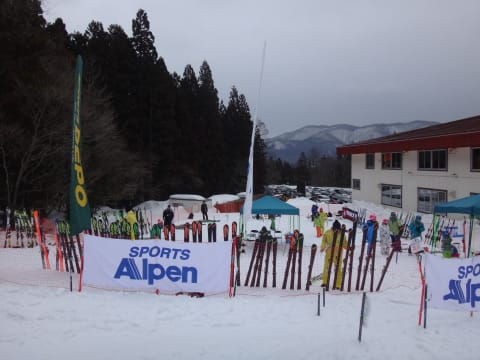

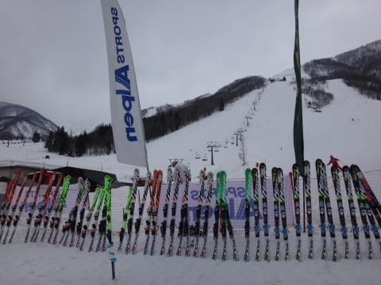

いやー．

今回もかなりの数の板に乗ってきましたよ～．

OGASAKA TC-MF FL585 172cm

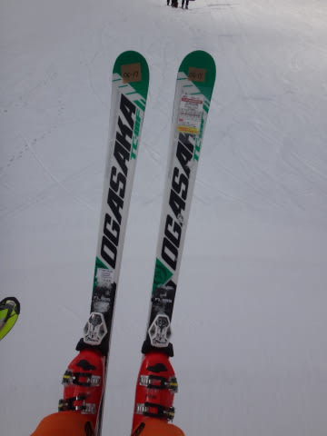

OGASAKA TC-SF GR585 165cm

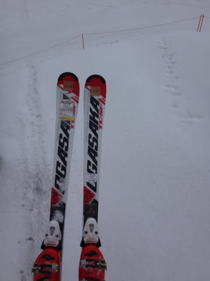

OGASAKA KS-RV+FL585 165cm

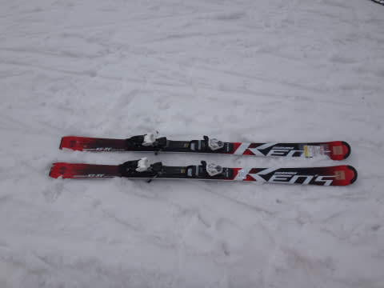

ATOMIC BLUESTER DD3.0 SX X12TL 165cm

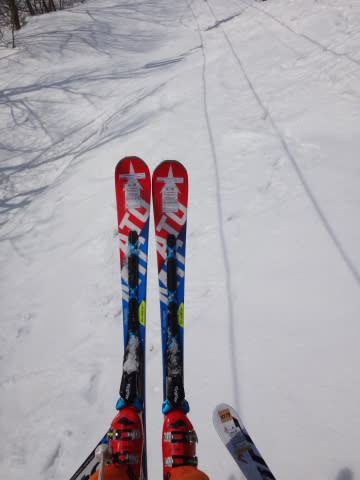

ATOMIC BLUESTER DD3.0 LX X12TL 166cm

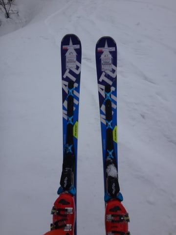

SALOMON GS LAB MASTER X 175cm

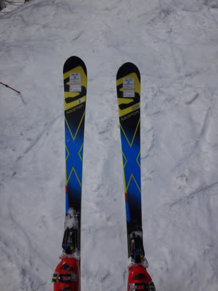

SALOMON X-RACE 175cm

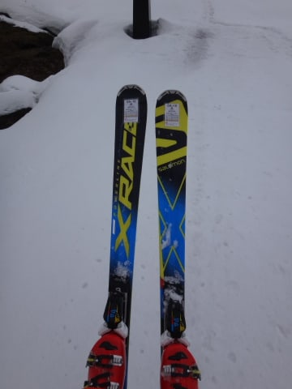

SALOMON X-MAX 160cm

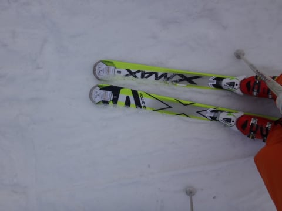

ROSSIGNOL HERO Master R21 WC 175cm

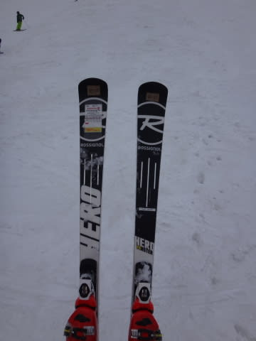

ROSSIGNOL DEMO ALPHA R21 Racing 167cm

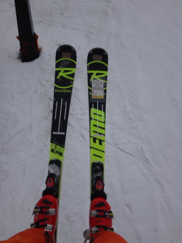

VOLKL PLATINUM GD 175cm

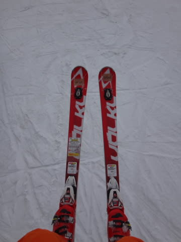

VOLKL PLATINUM SD 165cm

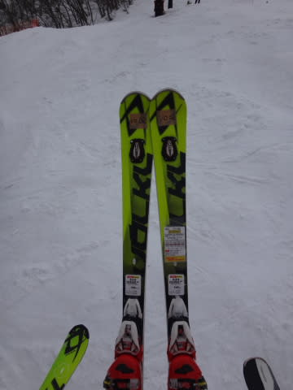

FISCHER RC4 SUPERIOR PRO Racetrack 165cm

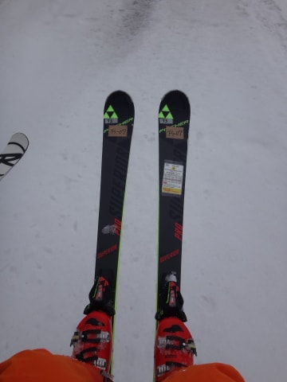

BLIZZARD WRC RACING 176cm

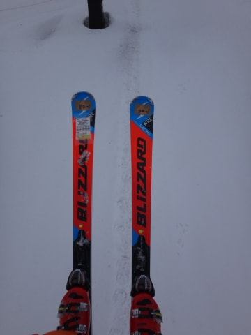

…乗りに乗ったり，14機種！

…だけど．今回，残念ながら．

あまりゲレンデコンディションが良くなく．

朝のうちは固いアイスバーンと重い雪のミックス，

昼ごろからは重い雪で荒れたコンディション…

と．

整地のグリップ重視の板には厳しいバーン状況での

試乗でした…

で．

これから試乗レポートを書いていく予定なんですが．

…試乗レポートに向けた，いつもの注意書きをば…

この試乗レポートを書いているのは，

テククラも指導員資格も一切持っていない，

単なるお気楽レジャースキーヤーです（笑）．

そんなにうまくない素人スキーヤーが，個人的な感想を

書いただけのモノなので…

私が「これ，いい！」とホメた板でも，他の人には

「なぜ，この板を誉める…」ってのもあるでしょうし．

その逆に，私が気に入らなかった板でも，他の人には

すごくいい板もあると思います…

ちなみに，私は

・比較的滑走スピードは高め

・グリップが強め，全体のたわみで回る板が好き

・すっとたわむけど，比較的強い返りがある，ばね感の強い板が好み

・どちらかというと，小回りの板をメインで使っている

という感じなので．

レポートを読む際の参考になれば…

って感じで．

また，今後試乗レポートを書いていきますので，

お楽しみに！
