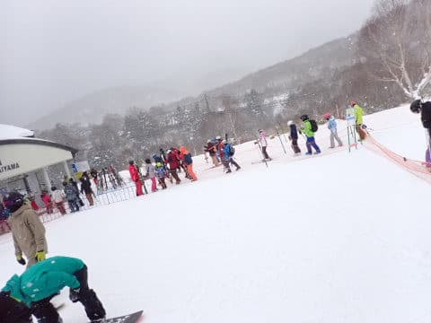
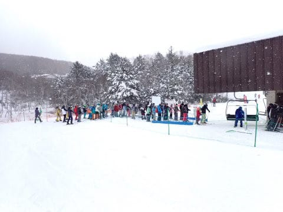

# 2022/12/29(木)の志賀高原焼額山スキー場は…曇り時々雪，ゴンドラはちょっと混んだよ．雪質はいいけど量はもう少し…

📅 投稿日時: 2022-12-30 00:06:20

🏷️ カテゴリ: [2023スキー滑走日記](cd943df30cfcc3d0896469e2ff98720cd.md)

えー．

本日から年末年始休みに入り．

今日から志賀高原を滑ってます～！

本日から，焼額は第3高速が動き出し，

イーストやミドル，そしてSGSコースも

オープンしたようなので…

ヤケビウォール以外，ほぼ全面オープンに

なったのかな？？？

ってなことで．

いつも通り昨日深夜まで仕事していたのに，

8:30のゴンドラ営業開始前には志賀高原

に到着しているという，

ワープ状態で焼額第1ゴンドラに並びますが…

今日はそれ程列が長くないですね．

本格的に混むのは明日からなのかな…

で．

朝イチゴンドラで山頂に登ると…

気温は-9℃で，まぁまぁの冷え込み

ですね…

なので．

あさイチの雪質は冷え冷え最高！

天気は曇り空で，昨日から積雪はなかった

ようなのが残念ですが…

あさイチは締まったいい圧雪で，

人もガラガラで最高！！！

GSコースはまだ雪が少なくて，

草のてっぺんがちょっと出ている

ところもあったものの．

石が出ているようなところはなく，

あさイチは人が少ないのもあって，

いい感じで滑れます！！

そして，今日は第1ゴンドラの待ち時間は

短めで．

9時半まではこんな感じで，ゲート内に

列が収まる程度．

どうやら今シーズンから，相乗りレーンを

復活させたようで．

混み始めると，乗車人数が少ない搬器には

最大6人まで突っ込むオペレーションに

なってました…

混雑してくると，乗車人数の少ない搬器は，

この空席待ちレーンからスタッフが

「○人まで乗れます」と案内する形で

8人乗りゴンドラに最大6人まで

乗せていて．

そのため，昨年までよりも待ち時間が

少なくなった感じで．

午前中のピークでも，数回ほどゲートの外に

ちょっと列が伸びる程度で収まっていて．

午後は搬器数台待ちで乗れた感じで．

ゴンドラ待ちはそれ程ひどくなかったです～！

第2高速リフトは，午前10時過ぎに一の瀬から

流れてくる人のピークでこのくらい混みましたが…

それ以外は，待ち時間も少なめ．

午後はガラガラで．

今日はリフトはそんなに待たなかった

感じですね～．

ただ，第2ゴンドラは最大10分待ちを

超えるくらい並んだようで…

それに加え，輸送力の高い第1ゴンドラが

相乗りOKになり，ゲレンデに大量に人を

送り込むようになってきたので…

コース上の人口密度はちょいと高め(涙)

雪質は悪くないし．

第2ゴンドラ以外，リフトもゴンドラも

それ程待ち時間がなくて，快適だったん

だけど…

コース上の人が多いよ…（ちょい涙）

特に，第1ゴンドラ側のGSコースが，

全体的に人が多かった感…

GSコースは，午後になるとちょいと

バーンが凸凹気味になってきました…（涙）

でも．

パノラマコースや白樺コースは，

夕方までそんなに荒れずに，

ラストまで大回り可能だったので．

いい感じで楽しめましたよ～！！！

そして．

本日オープンのオリンピックコースですが…

非圧雪で，雪もモサモサだし．

まだ草の頭も隠れきってなくて，

そこら中から突き出してたし．

うーん．

まだ，快適に滑るには早すぎるかな…

という感じ．

だもんで．

今日はパノラマ・唐松が最後まで

荒れず，いい感じでしたね～…！！

で．

今日の天気は，おおむね一日曇り．

時折強く雪が降ったものの，

積もるほどではなく…

それどころか，時折薄日が射す

くらいで．

今日は全然積雪の積みましがありません

でした…（涙）

とはいえ．

今日は焼額も全リフトが動きだし，

ゴンドラ・リフトもそれほど混まず．

ほぼすべてのコースが滑れるし．

終日気温も冷えて雪が良かったので．

トップシーズンが始まったなぁ…

という感じで，営業終了の16時まで，

結構楽しめた一日だったのでした～！

…ってなことで．

雪も良くいい日だったので．

こんな日には，当然のごとく

ナイターに行くしかない！！！！

やってきました，ダイヤモンドナイター！！

今シーズンは，本日から1月2日までの

5日間しか営業しないので．

これがチャンスとばかりに，ダイヤナイターを

滑ってきました～！！！

もう，ナイターは最高シマシマ圧雪！！

冷えて締まった，最高の雪質！！

…圧雪のクオリティがヤケビほど

高くないのが惜しいけど…

いい感じのシマシマがお出迎え！！！

ぐほほほー

まだ誰も滑ってない，今シーズンのダイヤナイターの

初滑り，いただきま～す！！

ナイター開始後15分ほどは完全貸し切りで，

他のお客さんが一人もおらず．

自分のシュプールだけがゲレンデに残る，

この快感！！

今日は結局，10数人程度しかナイターに

来ておらず．

18:30のナイタースタートから21:00の

最後までの2時間半．

気持ちよく人のいないフラットバーンを

かっ飛ばせたのでした…

いや…満足．

今日はあさイチからナイターまで，かなりの量を

滑れて満足だったよ…

また明日も焼額滑ってます！！
