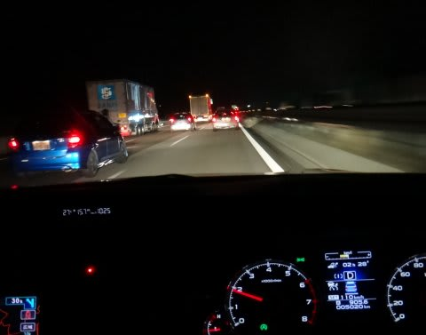
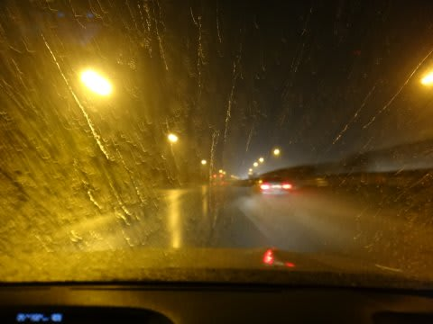
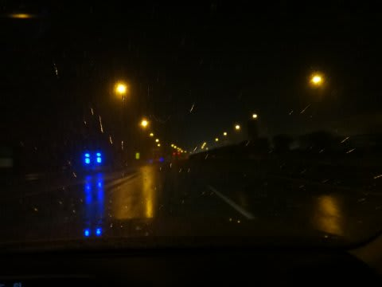
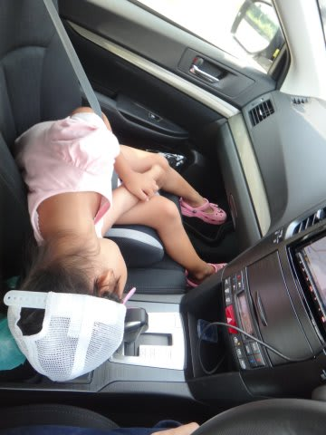
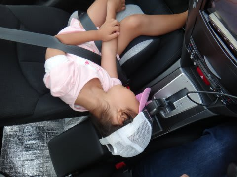

# お盆の道路は混んでいた…

📅 投稿日時: 2013-08-13 02:39:32

えー．

実はこの週末．

また，BRレガシィ君(名前募集中)に乗って，

往復1200kmほど走ってきたわけですが…

さすがお盆なわけで．

深夜移動したにもかかわらず，かなりの交通量…

…

だが．こういうシチュエーションは．

アイサイト様のもっとも得意とするところなのだ．

ふははは．

もう，ひたすら前の車について行ってくれるので，

交通量の多い高速でも疲れないのだ…

さらに．

今回も途中でかなりの豪雨に降られましたが…

前の車の水しぶきがフロントガラスにかかって前が見えないこんな状況や…

ライトが役立たないほどの状態になっても．

(この写真だと結構先まで見通せるみたいにみえるなぁ…)

今日は，アイサイト様はご機嫌を損ねることなく．

最後まで無事動いてました．

いやー．

アイサイト．

お盆とか，こういうときには無敵だわ…

そして．

長距離移動に疲れ，不思議な格好で寝る娘．

…そんな格好で寝て，疲れないの？
