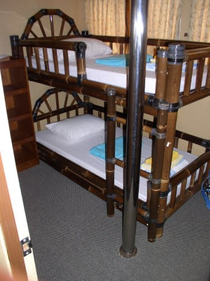
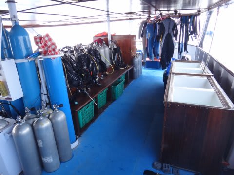

# 子連れコモドダイビングクルーズagain　その3　サザンスタークルーズの船について

📅 投稿日時: 2011-08-29 00:30:38

🏷️ カテゴリ: [ダイビング日記](ce3a7a8d424d112fce83ee85c81a0e344.md)

あー．

このあたりで．

昨年のコモドダイブクルーズのレポートでは，サザンスタークルーズの船について，

詳しく説明しなかったので．

今回，改めてクルーズ船の詳細を説明してみましょうか…

…ちなみに，船は「サザンスター号」と言われてますが，

「しまじ」号が正式名称です．

ナビゲーションデッキの側面に，「KM.Shimaji」と小さく書かれています．

…かつて．

三重県の鳥羽で，観光船として使われていた船だそうで．

鳥羽湾めぐり観光船からダイビングクルーズ船って，華麗な転職ですね～

で…我々ゲストは「サザンスター」って呼びますが，現地では「Shimaji」で

通っています．

ところどころ，「しまじ」と書かれた痕跡が…

船は，全長35m，3層構造．最大ゲスト定員18人．

数字上は，小さい船に感じますが．

乗ってみると，40m超のクルーズ船より大きく感じます…

船の内部の詳細ですが．

水線下の最下層は，エンジンとスタッフの部屋なので，ゲストが出入りできません．

で，水面の上，1階に当たる部分は．

前半は，ゲストルーム．

こんな廊下の左右に，4人部屋が2室，2人部屋が6室．

あー．

船首部分の突き当たりに，これまでに何度も出てきた6号室があります．

フルだと20人入りますが，18人で満員にしてます．

これまで写真に出てきた6号室は異常に広いけど，普通の部屋はこんな感じですね．

残念ながら，各部屋にトイレやシャワーはありません．

でも，ゲストルームが完全水線上で大きな窓があるし…

すべてのゲストルームには個別にエアコンがあって，温度調整も自由だし．

結構快適です．

客室スペースから後ろへ行って…

後半がダイビングデッキ．

ダイブデッキは，長さ10mほど．

トイレ，シャワー，洗面台はダイブデッキにあります．

[前回の](ef6aaa395ef3f16cee0740449ca3175a0.md)ウォシュレットの写真にでてきた，シャワー兼用トイレが2室．

このほか，洋式トイレ1室，シャワー専用2室です．

シャワーには，ボディーソープとシャンプーが備え付けられてます．

…この船の唯一の欠点は，トイレの少なさでしょうかねぇ．

ゲスト10人くらいまでは快適ですが，満室になってくると

やっぱりトイレ3個だとちょっと待つことも．

このほか，船尾には水シャワーが3つあります．

んで…

ダイブデッキ真ん中にタンクが並んでおり，器材は常に

タンクにつけっぱなしです．マスク・フィンなどの軽器材は，

タンク台の下の籠に入れておきます．

ダイビング時には，スタッフがダイビングボートに

機材をつんでくれるので，3点セットとカメラを持って

ボートに乗ればOK！

ダイビング終了後も，機材はスタッフがボートから降ろして

タンクの付け替えまでやってくれるので，ゲストは何もしない

王侯貴族の気分でOKです．

で，器材洗いの水桶が4個，うち3個はカメラ洗い専用で…

さらにエアガンが備え付けられた大きなカメラ置き台もあり，

カメラ派には嬉しい感じ．

で，階段を上って2階にあがると…

まずは食堂．広い4人がけテーブルが6席．

ゲスト18人しか乗れないのに十分な広さ．

共有のコンセントが食堂に2箇所あり，バッテリーのチャージなんかは

ここでできます．

100V（日本と同じ），丸ピン2本の220V（B，BFのどちらも刺さるタイプ）の

両方があります．

100Vがあるのが，さすが日本製の船だなぁ…

こういう感じの充電スペースが左右に1個ずつの計2箇所あります．

食堂のうしろ，キッチンカウンター部分には…

いつでも自由に食べていいお菓子とか果物，

インスタントコーヒーやお茶なんかが準備されてます．

んで．食堂の前には，6-7人はゆったりと寝っころがれる

カーペット敷きのスペース．

カーペットスペースの前にはドアがあって，舳先の上のテラスに

出られます．

このテラスは，娘お気に入りの空間．

共有スペースの広さは，日本人向けクルーズ船としては広いほうでは

ないでしょうか．

さて．船の一番てっぺん，屋上部分に登ると…．

操舵室の後ろのスペースがサンデッキになっています．

サンデッキの後ろに紐が張ってあって，ここで水着などを

干すことが可能です．

昔は，ここにジャグジーがあったんですけどね～．

(5年前の写真)

水しか張れないし，船が揺れて水があふれるので，あんまり

利用者がいなくて，撤去されちゃいました．

そのほか…

・スーツケースや器材バッグは，部屋の外においておく場所があるので，

　部屋が広く使えます．

・一日の予定は，ダイブデッキに出る手前のホワイトボードに

　かかれるので，ここで食事や次のダイビング時間をチェック！

・水，お湯，インスタントコーヒー，お茶，紅茶はのみ放題．

　お菓子も24時間いつでも食べ放題．

・ただし，冷蔵庫内のビール，ジュース，ワインなどは有料．

　各自勝手に冷蔵庫から取り出し，自己申告で紙に記入！

 

って感じです．

私もクルーズ船は3隻しか知りませんが．

「しまじ」は，ダイバー向けに結構よくできていて．

子連れで過ごしても問題ないくらい，十分広くて，快適な船です．

私は好きです．

＃でも，ゲスト15人以上になってくると，子連れはきついかな…

（おまけ）

この船．日本の船だったので．

エンジンルームや…

ナビゲーションデッキに…

日本語がいっぱいあります．

インドネシア人には読めないと思いますがね～（笑）
