# 2020/12/13(日)の志賀高原，焼額山スキー場の速報レポート！…4ロマのみ営業で午前はリフト待ち15分（涙），午後は空いて雪も良くなりいい感じ！

📅 投稿日時: 2020-12-14 01:08:32

ということで．

本日も志賀高原の焼額山を滑って

来たわけですが…

やはり今日も予告通り，第4ロマンスリフト

1本しか動きませんでした（涙）

で．

本日の焼額山スキー場の案内によると…

…18日の金曜までは，第4ロマンス1本

しか営業しないようです（残念）

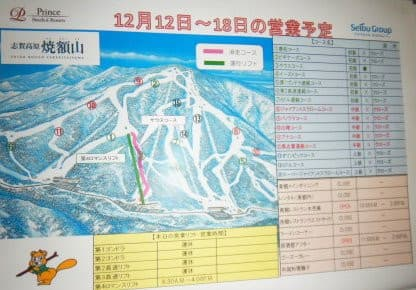

…とはいえ．

予告した通り，月曜からはしばらく，

冷え冷え祭り

が始まりますっ！！

今晩から雪が降り，月曜朝までには

そこそこ積もるはず…っ！

そして，それから先も一週間ずっと冷え続け，

雪が降り続けます！積もりますっ！！

14日以降，週末の19，20日まで

ずっと冷えて降り続けますよ～！！

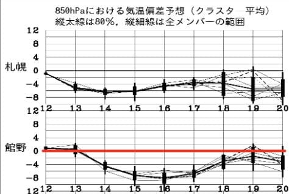

次の週末の焼額．

第2高速は間違いなく動くでしょうし，

第2ゴンドラも動くだろうと思ってます…！

それ以外も，多くのスキー場がオープン

するはず…！！

ってなことで．

今日もラストまで滑り，帰宅が遅かったので．

本日の志賀高原，日曜定例の速報レポートにて…

えー．

まず．

今日は昨日とうって変わり．

営業前から，かなりのリフト列…

これは，今日は混みそうな予感…

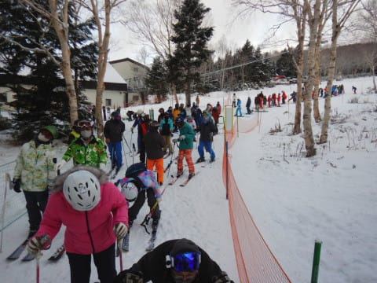

でも．

朝イチは数mmながら，うっすら新雪が

コース上に乗っていて，

いい感じのシマシマバーンっ！！

…わずかながらも天然雪が

しっかり締まった圧雪の上に乗って

いて，昨日のカリカリした感じの

バーンに比べれば，ガッツリエッジが

食い込んでくれて，ずっと滑りやすい

朝イチバーンっ！

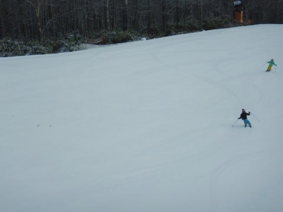

…けど．

今日は朝イチからリフト待ちが長く．

営業開始1時間も経った9:30ごろには…

うぎゃーーーー！！

なんだこりゃーーー！！？？

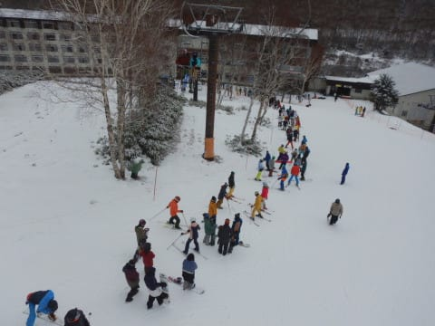

さらに列はこれだけで済まない．

この上にもまだこれだけの列が

続いてます…！！

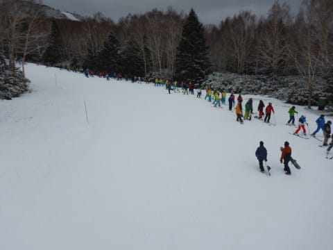

結局今日は，営業開始からずっと

リフト待ちが10分ほどあり，

最大は15分待ち…

なんてこった…！！

ただ，昨日同様，ゲレンデ自体は

コース幅も広く，ペアリフト1本分の

輸送力しかないので，

コース上はそれほどひどい混雑では

なかったのが救いかな…

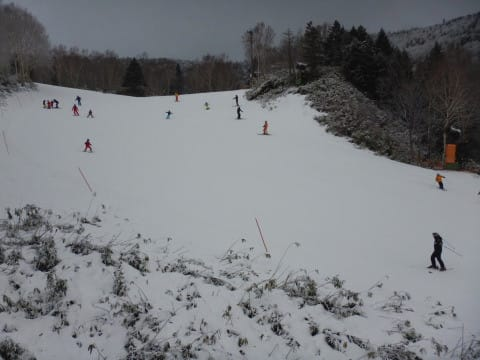

そして．

午前11時を過ぎると一気にリフト待ちは

短くなり．

11時半には…

あれ？飛び乗り？？

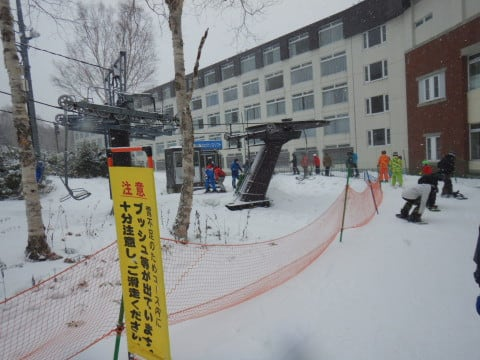

このあとは結局，最大リフト待ち1-2分，

時折飛び乗りという感じで．

午後はリフト待ちもなく快適でした～！

で．

11時から午後1時くらいまでは

結構な勢いで雪が降り…

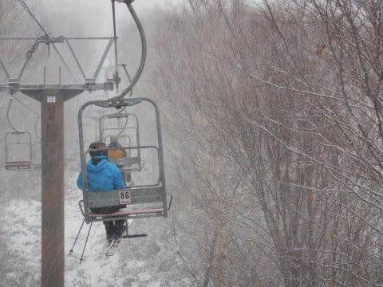

ゲレンデには冷え冷え新雪が

2-3cmほど積もってきましたよ！？

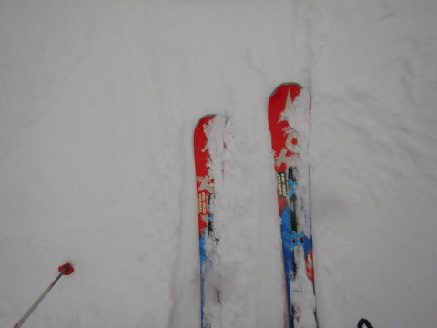

さらに，午後2時過ぎには日も射しはじめ．

いい感じに冷えたうっすら新雪で

覆われたバーンに日が射して．

…これはかなりいい感じなのでは！？

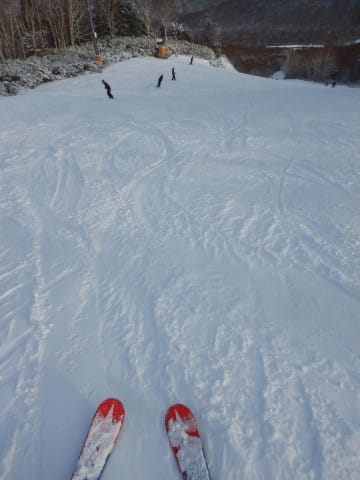

ってなことで．

午前中は激込みでどうなることかと

思ったけど．

午後はリフト待ちもほぼ無く，

さらに雪質がよくなっていき，

最後は晴れてくるというボーナスが

あり．

午前中で帰ってしまった人，

午後は思いっきり楽しくてゴメンナサイ

という感じの一日だったのでした…

いや．ホントに午前中はどうなるかと

思っていたけど．

午後は楽しかったーー！

また明日，ちゃんと起きていれば詳細レポートやりますので，

お楽しみに！

## 💬 コメント一覧

### 💬 コメント by (かず)
**タイトル**: Unknown
**投稿日**: 2020-12-14 17:00:18

寒波来てますが不安で全然テンション上がりません… ホントにGOTO祭りで年末年始？？

### 💬 コメント by (アリス)
**タイトル**: 後半2時間幸せ
**投稿日**: 2020-12-14 20:16:02

Skier_S様

朝一のシマシマ、後半のうっすら新雪とヤケビの良さを堪能できたこととお察しします。

Sさん、ところで寝ているのですか？

土、日も一日スキーをしてブログ投稿時間が驚異的なのですが・・・

### 💬 コメント by (あっきー)
**タイトル**: Unknown
**投稿日**: 2020-12-14 21:24:59

こんばんは。

現在進行形で焼額(志賀高原プリンスホテル二泊目)にいます。

今日は一日中雪でしたが、ガスっているわけでもなく、視界も良好で風もほとんど吹いていませんでした。

締まった圧雪の上に常に新雪が積もり、なかなか気持ちよかったですよ。

### 💬 コメント by (Skier_S)
**タイトル**: 日曜は午後は良かった…
**投稿日**: 2020-12-15 06:25:44

＞かずさま

GoTo中止になりましたね…

年末年始はこれで混雑は緩和されそうですね．

＞アリスさま

日曜の午後は最高でしたよ！！

…そして．

一応寝てはいます．

寝てはいますが…睡眠時間は短めです（涙）

＞あっきーさま

おっと．

月曜まで滞在ですか！

月曜は雪質は良かったようで，うらやましいです…

雪が降るのが一日遅かった（泣）

