# 我が家のデジカメ増殖中…使わなくなったデジカメをもらったよ

📅 投稿日時: 2018-08-12 01:15:25

えー．

実は先日．

とあるダイビング仲間に．

「新しいデジカメ買ったんで，使わなくなった

　ダイビング用古いカメラあるんだけど…欲しい？」

と聞かれ．

今シーズン，娘もダイビングを始めるようになり．

かねてシュノーケリングをやっていた時から，

「水中カメラが欲しい，欲しい～！」

と言い続けていた娘の顔が思い浮かび．

反射的に．

「欲しい！欲しい！」

と言ったわけですが…

なんと．

OlympusのTG-2じゃないですか！

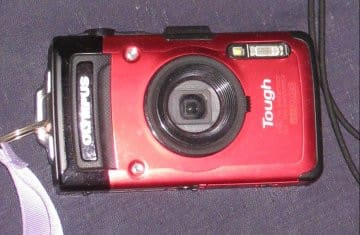

もう，4年半前の古いカメラですが．

15m防水で，フルハイビジョン動画も撮影できる

結構いいカメラで．

まだ全然現役で使えそうですが…

…新しく出た，このシリーズの最新型．

性能アップしたTG-5に買い替えたようで，

TG-2は使わないカメラとして，余っちゃった

ようです…

ってことで．

我が家の防水カメラが，2台に増えましたね～．

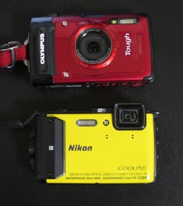

さらに，このTG-2．

水中ハウジングも一緒についてきたので．

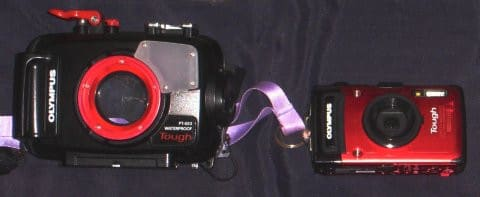

40mまで潜っても大丈夫です…

…すでに，私用のS120と，妻用のS90用の

2台のハウジングを持っていたわが家．

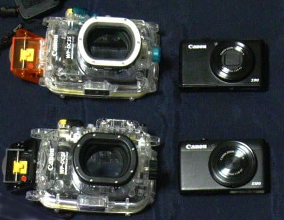

なんと，3台目のハウジングか…？

と，思っていたら．

「もっと古くて使ってないデジカメもあるけど…いる？」

ということで．

出てきたのは…

をを！！

2008年発売．

すでに9年モノとなっている，懐かしの

Fujifilm F100fdではないですか！

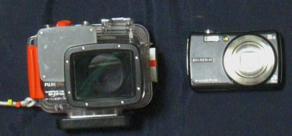

…それも，ご丁寧にハウジング付き…

要らないってなら，これももらっちゃいましょう．

ええ．もらっちゃいます．

ってことで．

なぜか我が家．

水中ハウジング付きカメラが4台，

30m防水カメラが1台で．

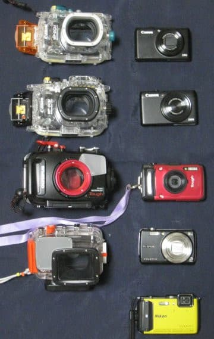

どうしたことか．

計5台も，ダイビングに使えるカメラが

揃ってしまった…

しかし．

それだけでなく．

なぜかカメラが我が家に集まる運命だったのか．

わが親戚から．

「新しいデジカメ買ったので，古いやつ要らない？」

と．

また同じようなことを言われ…

手にしたのが．

なんと．

Canon S100じゃないですか！

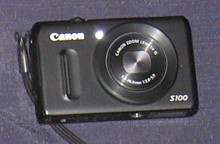

…まぁ，もう6年前のカメラなので．

ちょっと古くはありますが．

でも，大型撮像素子搭載の比較的いいカメラ．

ってか…

我が家にすでに，S90とS120があったので．

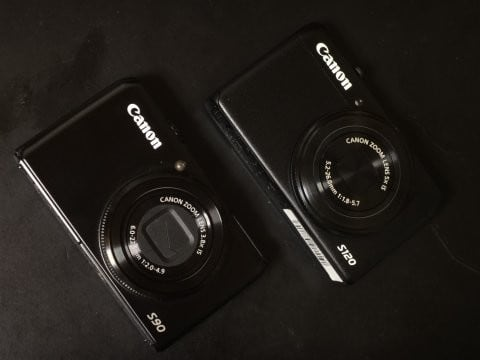

CanonのSシリーズが．

これでS90,S100,S120と3台揃っちゃいました…

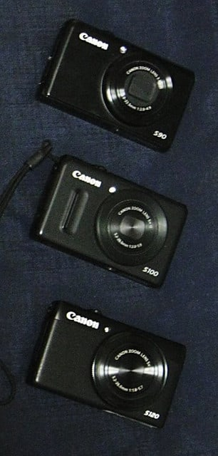

で．

我が家には，このほかに．

妻用のカメラと，[電池＆充電器Get用に買って](e38787d602a04193de6393f34154f0b04.md)，

今は娘用となっているカメラがあるので．

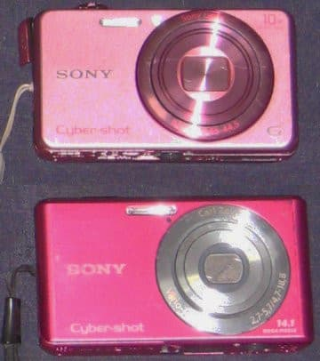

なんだか，わけ分からない台数のデジカメが

揃ってしまいました…

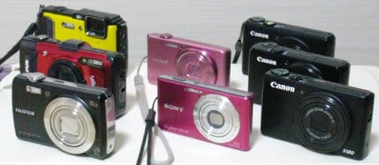

なぜ，3人家族の我が家に．

コンパクトデジカメが8台．

それも防水デジカメ2台，

ハウジングが4台もあるのだ…！？？

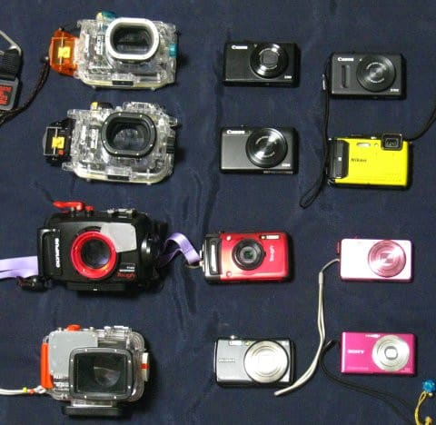

…このうち，タダでもらったのが3台，

中古で買ったのが2台で，

新品で買ったのは3台しかないのが

我が家らしいけど…

まぁ．

これで．

当分カメラは買わずに済みそうですね…

## 💬 コメント一覧

### 💬 コメント by (つーちゃん)
**タイトル**: Unknown
**投稿日**: 2018-08-12 23:39:49

えー。

ニッチな中古カメラ屋でも始めますか？笑

TGシリーズかっこいいですよね

AW130とTG-5で迷って価格でAWにしましたが

レンズが左上にあるので指が写りこむ事故が多発します(笑)

### 💬 コメント by (Skier_S)
**タイトル**: つーちゃんさま
**投稿日**: 2018-08-13 08:47:05

30m潜るのでなければ，カメラの使い勝手としては

TGシリーズのほうが優れている感じがします…

AWの指の写りこみ，やりますよね．

私はAWを使う前に，TX10,20,30…

と，レンズが左上にあるカメラを

使い続けてきたので慣れてますが，

最初はよく指を写してました…

### 💬 コメント by (しんちゃん)
**タイトル**: いろいろ増殖
**投稿日**: 2018-08-13 09:39:45

スキー板に続き、カメラも増殖するお家。

特殊な風水でもしてるのでしょうか(笑)

お金だけは簡単に増殖しないですね（汗）

### 💬 コメント by (Skier_S)
**タイトル**: しんちゃんさま
**投稿日**: 2018-08-13 14:59:40

我が家は確かにいろんなものが増殖していくかも…

お金が増殖してくれると嬉しいんですけどね～

10億円ほどに増えたら，志賀高原に何本か

リフトとゴンドラを寄付したいところ…（夢物語）

### 💬 コメント by (おおすぎ)
**タイトル**: 実にタイムリーな・・・
**投稿日**: 2018-08-14 14:32:08

Ｓ様こんにちは！

無事に台風を避けながら、宮古から帰宅して来まして、ただいま社内1人だけの電話当番（当直）です！

皆さんのお盆休み前に休みを貰う、案外ずる賢い作戦で、夏休み終わってしまいましたが、宮古ロス真っ只中、水中カメラを探しておりました！！

まだ息子小１なので、シュノーケリング中心ではありますが、息子ともども宮古のサンゴにやられてしまい、

「次はいつ出来るの？」と夢物語を聴いてくる今日この頃です・・・

本当に綺麗だったのと、やはり息子もＳ様のお嬢様と性格が似ているのでしょうか、昼ごはんも食べずひたすら水面を漂っていること5時間・・・そろそろ日が暮れちゃうよ～という親の言葉も耳に入らず、最後は「

お腹減った」で帰還してきましたよ（トホホ）

すみません、いつも前置きが長くて・・・

本題なのですが、オススメの水中デジカメと、実は膝小僧を私がサンゴの岩にぶつけてしまい結構切ってしまいました・・・何かオススメのスイムウエアーが御座いましたらお教えください（シュノーケルのみなので本格的なものは要らないのですが・・・ちょっと海をなめておりました（反省））

### 💬 コメント by (Skier_S)
**タイトル**: おおすぎさま
**投稿日**: 2018-08-15 00:43:35

おおっと！

宮古島楽しんで来られたのですね．

お子さんもハマったみたいで…

何度も連れて行くと，あっという間に親より

上手く海に潜ったりするようになりますよ（笑）．

水中デジカメですが，本格的水中写真を撮りたい…

ってのでなければ．

そこそこの動画が撮れて（水中は動画も面白いです），

20m防水で，

液晶もそこそこの解像度できれいで…

というと．

FujiのFinePix XP120程度があれば，必要十分かと思います…

将来，ダイビングを始めるとか，写真が好きで

陸上でもいろいろ使えるカメラ…

となると．

ちょっと高くなりますが，OlympusのTG-5が

おススメです．

これなら，あとでハウジングを買い足せば，

40mまで潜れますし．

ハウジングを水没させても防水カメラなので，

カメラ自体が死ぬ心配が少ない…

ってのがメリットです．

あと，マクロが異常に強いです．

で．

おススメのスイムウェアですが．

安く上げたいなら，海パンの下にこんな感じの

タイツを履くのがひとつの手かと…

https://item.rakuten.co.jp/b-oceans/rtr-ra5205/

ただ，これだと強く岩場で擦れたり，

引っかかったりすると破れるかも．

こういうウェットパンツだと，岩場に膝立ちしようが

とがったサンゴの先に引っかかろうが，大丈夫です．

https://item.rakuten.co.jp/b-oceans/ist-16-wp-5/

4000円以上しますが…

そうそう．

お子さんにもウェットスーツがあったらいいかも．

http://www.aqros.jp/shopdetail/000000011843/wetsuit07/page1/recommend/

結構浮力があるので，ライフベストが要らないです．

ライフベストだと動きにくいですが，ウェットスーツだと

動きやすいし，体も冷えにくいし．

うちの娘は，幼稚園のころからウェットスーツ派です．

### 💬 コメント by (おおすぎ)
**タイトル**: Unknown
**投稿日**: 2018-08-16 05:00:20

Ｓ様、大変有意義な情報有難う御座いました。

ＸＰ１２０の在庫がなくなり、後継機種のＸＰ１３０をＧＥＴして来ました（中身は一緒とのこと・・・）

子どものウエットスーツは必要と思っていたので、大変ありがたいです。

### 💬 コメント by (Skier_S)
**タイトル**: おおすぎさま
**投稿日**: 2018-08-17 04:29:00

早くもデジカメ買われたのですか！！

XP120，もう後継機の世代になっていたのですね…

情報が古くてすみません．

ウェットスーツ＆デジカメで，これからも

シュノーケリングを存分に楽しんでください！

