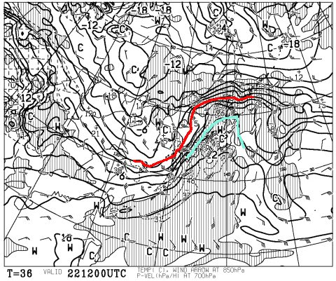
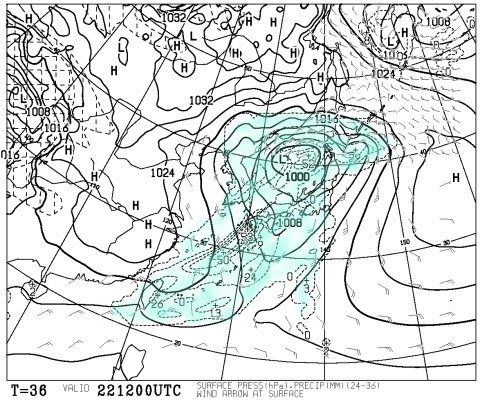
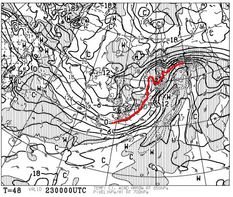
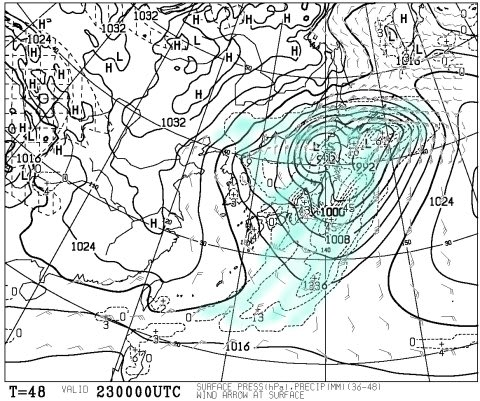
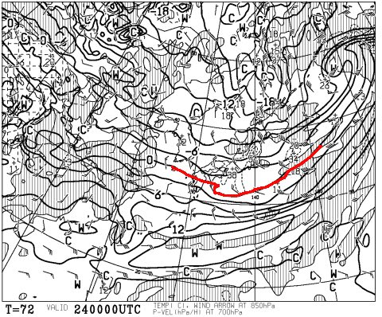
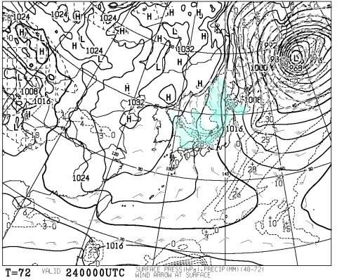
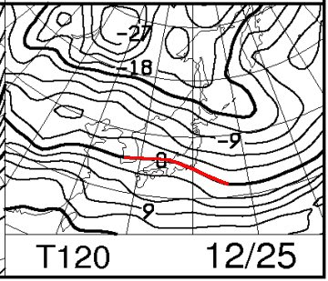
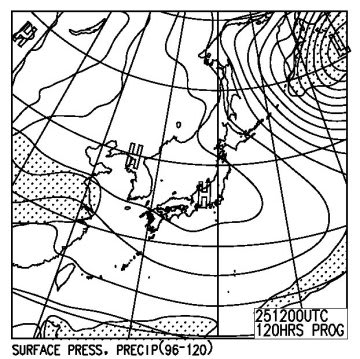

# 12月23，24，25日の3連休の天気，志賀高原は雪が積もるのか？

📅 投稿日時: 2016-12-22 02:24:45

🏷️ カテゴリ: [スキー天気予想](c6554f5c3c106093b511a8daae23757e8.md)

ということで．

昨日はご無体時間帰宅で1時間ちょいしか寝てないのに．

今日もこんな時間に帰宅…（涙）．

でも．

ちゃんとBlog更新する自分，エラい！！←自分で誉めておく

…でも．

死ぬほど眠い…（涙）

ということで．

今週末は3連休なわけですが．

そして．

3連休前日は雨確実な状況なのですが（涙）

その後の3連休にちゃんと雪が積もり，

ゲレンデ状況が回復するのか…？？

…このあたりを読み解いてみましょう．

さて．

肝心な3連休前日，22日午後9時の850hpa気温図ですが…

あう…（涙）．

赤くマークした0℃線ははるか北…

というより．

水色にマークした+9℃線が志賀高原に

近づいてるのですが？？

すごい高温なんですが！！？？

で．地上天気図は…

あぁ…全国雨ですか（涙）．

でも，降水量は10mm未満みたいですので．

22日昼過ぎごろから志賀高原に降り出す雨．

夕方～23日朝にかけて，パラパラと降る程度で収まりそうです．

ただ，22日午後は南風が強いので…

ゴンドラは止まるんじゃないかな？？？

そして．

3連休初日，23日の850hpa図は…

うむ．朝9時で0℃線がぎりぎり信州．

そして，地上天気図を見ると…

降水域が西日本近辺を広く覆い．

前日夜から朝9時近くまで，志賀でも

雨が降り続けそう（涙）

この雨も，一瞬強まるかもしれないけど．

ひどい雨が降り続ける，って感じにならずに済むかな…

9時以降は，雪になります．

一日パラパラと降ったりやんだりの雪になりそう．

続いて，3連休の中日は…

をを！

この日は冷えるよ！

赤くマークした0℃線は本州の南海上，

志賀高原は-6℃線がかかってます！

地上天気図は…

日本海側に降水域がかかる冬型！

この日は，終日冷え冷えの雪降りになりそう…

昼間もそこそこ積もる感じ！

で．3連休最終日．

850hpa気温は…

まぁ，赤くマークした0℃線，ぎりぎり信州．

そして，地上天気図は…

…高気圧が覆ってるので，終日晴れそうですね～！

ということで．

まとめると

22日（木曜）

　3連休前日は，午前中は降らずにもつけど．

　午後からパラパラと雨．

　高温の強い南風で，ゴンドラは止まりそう．

　雨がそれほどひどくならないのが救いか…

23日（金曜）

　前の日から降り続け，朝まで雨（涙）．

　午前9時ごろには雪に変わり，

　そのあとは終日雪が降ったりやんだり．

　朝のうちは気温0℃くらいだが，だんだん冷え込む．

　雪は冷えてアイスバーンになり，その上に

　うっすら新雪が積もっていく

24日（土曜）

　朝から雪．気温は-10℃近くまで冷え込む朝．

　終日雪が降り続ける，寒い一日．

　朝は10cm～20cmの積雪かな？

　昨晩からの雪で，朝はアイスバーンが隠れる．

　だもんで，朝はやわらか圧雪のいい感じ！

　昼間もそこそこ積もるが，午後は人が多いコースは

　下地のアイスバーンが出てきちゃうかな…

　午後のコースは荒れ荒れ，所により

　アイスバーン（涙）．

25日（日曜）

　朝から晴れ！

　放射冷却で冷えた朝．ゲレンデはしっかり圧雪．

　終日晴れて，気温もそれほど上がらずゲレンデは

　比較的いいコンディション．

　ただ，やはり午後に向かってところどころ下地の

　アイスバーンが出てくるか…

といった感じでしょうか．

うーむ．

22日から23日，それほどひどい雨にならずに済みそうで．

雪が解けまくってコースがクローズになる…

ということはなさそうな感じになってきましたが．

でも，雨になることは間違いなく．

融けた雪が凍ったアイスバーンになっちゃいます．

アイスバーンが完全に隠れるほどの積雪になるのか…？

というところが，3連休がいいコースコンディションに

なるかどうかの分かれ目ですな…

どっさり積もって，アイスバーンが隠れて

くれることを願うばかり…

## 💬 コメント一覧

### 💬 コメント by (アール)
**タイトル**: お疲れ様です。
**投稿日**: 2016-12-22 09:58:21

んん...厳しそうですね...(><)

イブに苗場に行くか、都内に行くか揺れているんですが…よりによって雨とは...

それはそうと、一日ずれてません？

23(金) 24(土) 25(日)では...？？

### 💬 コメント by (Skier_S)
**タイトル**: アールさま
**投稿日**: 2016-12-22 11:10:20

24日、25日はコンディションまあまあ良さそうなのですが…

ご指摘のように、曜日ズレてました。

直しました…

ありがとうごさいます！

### 💬 コメント by (アール)
**タイトル**: Unknown
**投稿日**: 2016-12-22 16:12:12

s様

雨で濡れたゲレンデも24、25には回復すると考えて大丈夫ですかね？

### 💬 コメント by (Skier_S)
**タイトル**: アールさま
**投稿日**: 2016-12-23 00:14:07

私としては，24日には回復すると

信じたいところですが…

志賀は微妙ですが，日本海側に近い

苗場なら23日から24日にかけて，

そこそこ積もりそうな感じですが．

100%保証できるか？？

と言われると微妙なところです．

雪が積もっても，急斜面で雪付きが悪いところは

下地の固いのが出てくるでしょうし…

ただ，今後は27日に雨になる可能性が高く．

次に完全にゲレンデがGoodコンディションに

なるのがいつかは読めない状態です…

とりあえず，今は私も「24日にゲレンデ状況

回復して～！！！」と祈っている状況です（；_；

