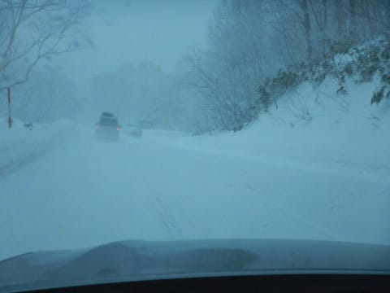
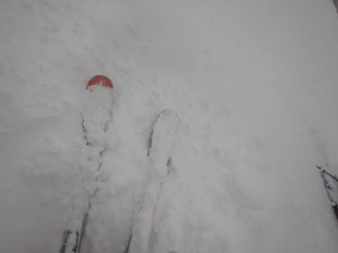

# 12月28日（木）の平日スキーは…朝はひざパフっ！終日冷え冷え雪の一日．でも，先週末より混んでる…（涙）．

📅 投稿日時: 2017-12-29 00:26:14

🏷️ カテゴリ: [2018スキー滑走日記](c11b88dc181f34079ab41db74a3587646.md)

ということで．

昨日予告した通り．

本日日帰りにて，志賀高原へ行ってきました～！！

今シーズン初の，平日スキーだ！

…と，期待して行ったところ．

意外と混んでました…（涙）．

今日から休みって人が，こんなに多いと

思わなかった…

ってことで．

まず，今日の朝．

上信越道は坂城からチェーン規制で．

中野市街から，しっかり雪が積もってますよ…！

当然，志賀高原の登り坂は本格積雪．

登っていくにつれ，雪が強く降ってきました…

んで．

いつもの焼額第1ゴンドラ駐車場に

到着すると．

なんと．

昨日から止まっていた車はオブジェ化

しています…

これは．

昨日から，かなり降ったようですな．

これは…

パフパフだ．

ゲレンデは，パフパフに違いないっ！！

…と．

コース整備のため，開始予定時刻の8:30から数分遅れで

動いた第1ゴンドラに乗り，山頂へ出てみると…

激しく雪が降っていて．

ゲレンデはパフパフの気配！

山頂の気温は，-13度と．

予想の-15度より2℃高いものの．

冷え冷え！

これは，かなり軽いパウダーに違いないっ！！

いざ，出動だ，太板っ！

そして，新雪のオリンピックコースへ

飛び込むと…

をを！！！

膝パフ！

それも，結構軽い！！

うははははは！

パフパフだぁ！

[先々週日曜](eedb8406ad5759338420bfcda34461353.md)の，今シーズン初パフは．

いきなり下地の固い凸凹の突き上げを食らう，

かなりのバランストレーニングバーンだったけど．

今日は軽い新雪！

リアルパフ！

うひょーー！

12月から，こんな軽いひざパフが

楽しめるとは…っ！！！

…と，

喜んでパフパフを滑ること．

約1時間．

…あれ？なんだか人が増えてきたのですが…

ってことで．

美味しかったのは1時間．

10時近くになると，大勢の人で

かなり踏み荒らされちゃった感…

で．

第1ゴンドラも．

10時を過ぎると，ゲート外まで

人が並ぶこともあり…

あれれれれ？

平日のはずなのに．

先週の土日より，人が多いよ！？？？

天気が悪くて激寒なので．

リフトはそれほど混まなかったけど…

第2ゴンドラ側のパノラマ・サウスコースも．

ありゃ．

ありゃりゃりゃ…

人口密度が高い…（ちょっと涙）．

先週までの土日より．

平日の今日の方が混んでるんですけど…（泣）．

でも．

それでも，先週までより混んでる，という

だけで．

コースやタイミングによってはガラガラだし．

そして．

昨晩からの積雪量も多く，

終日雪がちらついていたので…

午後になっても，コース上，ところどころ

パフパフが残ってるし．

昼間も気温は-10℃を上回ることなく．

おかげで，雪質は終日激冷え最高だったし．

で．

やはりこの日も，午後3時を過ぎると…

そうです．

コースはゴーストタウン化して．

誰もいない貸し切りバーンを滑れます！

…そして．

最後まで，ところどころに残るパフパフを

楽しんで．

今日も16:15のリフトストップまで滑ってきたのでした…

いやー．

今日は終日冷え冷え，雪降りで．

ゴンドラが無いと死にそうな一日だったけど．

軽いパフパフが一日楽しめて良かったな～．

これで，志賀高原はほぼ全面可能！

積雪不足の心配は無くなりました…

年末年始は，グッドコンディションで

楽しめそうですよ～！

（混みそうだけど…）

## 💬 コメント一覧

### 💬 コメント by (おおすぎ)
**タイトル**: Unknown
**投稿日**: 2017-12-29 12:28:54

Ｓ様が、もう仕事納めｋとおもいました・・・

日帰りともなると、睡眠時間もだいぶ削るとおもうのですが、何処にそんな体力（気力）が出てくるのでしょう・・・

羨ましいです！！

やはり、道路はかなりの積雪ですね、いまからわたし正月スキーの道のりが憂鬱になって来てしまいました・・・

ＦＦミニバンフル乗車に、ちょっとやばめのスタッドレスなので、、はたして現地にたどり着けるか心配です・・・

宿は、一ノ瀬ファミリーの真ん前なのですが、Ｓ様どこのタイミングでチェーンを装着したらよいか、アドバイスをお願いいたします

（出来たら、あんまり雪のないひろ～い🅿所で装着したいの

ですが・・・ムリですよね？！）

### 💬 コメント by (れお)
**タイトル**: パフパフ最高でした～(^O^)v
**投稿日**: 2017-12-29 17:12:18

昨日もご一緒させて頂きありがとうございました～。Sさんの仲間の方も良い方で、楽しかったです(≧∇≦)b

ダイヤモンドの圧雪ナイターも良かったのですが、やっぱり日帰りでナイターまで滑るのは、凡人には堪えますね…。

ナイターまで滑った後に、Ｓさんみたいにブログ更新とか絶対無理です～(汗)

また、志賀でお会いした際は、よろしくお願いします～

### 💬 コメント by (かず)
**タイトル**: 28日も寒かったですね
**投稿日**: 2017-12-29 17:50:50

朝一本目のオリンピック最高でした　他のコースは埋まることが多かったですが…寒さに耐えきれず15時に終了　本日は朝雪が降ってたので残りを期待して奥志賀に　山頂で-8℃位でしたので寒くなく板も走り楽しめました　またよろしくお願いします

### 💬 コメント by (yumi)
**タイトル**: Ｓさんの頭上に・・・！？
**投稿日**: 2017-12-29 18:13:06

Ｓさぁ～ん。

昨日はさぞやご満悦の事と存じます。☃️

朝一、「ゴキブリホイホイ状態・・・」の話しを隣で聴いていて、クスクスしていたら⁉️

ホイホイ状態に・・・（涙）

ベストショット、有り難うございます。

でも、私の横をピューと抜いて行ったＳさんの頭上に沢山の🎵マークが踊っているが見えてました。

### 💬 コメント by (いか)
**タイトル**: Unknown
**投稿日**: 2017-12-29 19:53:26

太板、楽しめたようでなによりです(^^) 志賀は混んでいたんですね。白馬支部は27日よりも28日のほうが空いておりました。午前中だけでしたが、太板でバンバンかっ飛んでおりました(*^^)v

P.S. 志賀の1日券を2枚ゲットしたので、1月か2月にはお邪魔させていただきます〜

### 💬 コメント by (Goku)
**タイトル**: パフパフ祭り
**投稿日**: 2017-12-29 21:44:41

雪も志賀らしい軽い雪だったんですね。

太板いいな～。

### 💬 コメント by (はなげ親分)
**タイトル**: 飯山は
**投稿日**: 2017-12-29 22:06:36

現在、結構な降りからやっと優しい降りになりました。

この様子だと明日の志賀はどんなになっちゃんだろう!!

### 💬 コメント by (Skier_S)
**タイトル**: 明日から5日間志賀高原！
**投稿日**: 2017-12-29 22:55:55

＞おおすぎさま

今回は3人で乗りあっていったので，

運転手が複数いたので楽でした…

FFミニバンフル乗車ですか．

ツルツルになると厳しいですが…

チェーン装着場所は，「上林チェーンベース」

があります．

係の人が立って，チェーン装着場所へ誘導して

いる場所があるので，そこでチェーンを

着けるのをおススメ．

平らな広い場所でチェーンが着けられますし，

そこからは山道になるので，そこから

チェーン装着するのが一番安心です．

＞れおさま

昨日はお世話になりました～！

ダイヤナイター，私も行きたかったなぁ…

30日からは家族スキーですので，

また志賀で息子さんと一緒にお会いしたいですね～！

＞かずさま

28日のパフパフは良かったですね～！

荒れるのが意外と早かったですが…

明日もパフパフ行けそうですよ！

＞yumiさま

昨日はお世話になりました！

いやーーー．

楽しかったですね～．

あのオリンピックコースのパフパフ…

私より前にコースインされていたので，

激写してしまいました（笑）

あの1本目，もう叫びながら滑っちゃいました．

最高でしたよ～♪♪♪

＞いかさま

八方もすごかったんですね…

動画見ましたが，確かに思わず叫んでしまう

コンディションですね．

焼額もオープンから1時間はあんな感じでした．

志賀へお越しとのこと，楽しみにお待ちしています！

＞Gokuさま

明日もパウダー行けますよ～！

今シーズンは太板の出番がたくさんありそうで，

買ってよかったと思ってます…

ぜひ，物欲に負けてください（笑）

＞はなげ親分さま

すごく降ったんですね…

ライブカメラと雨雲レーダー見ながら，

これは明日の朝までにかなり積もりそうだと

思ってましたが…

明日もオリンピックコースの朝イチパフパフ

狙いに行きます～！！

また明日お会いしましょう！

### 💬 コメント by (しんちゃん)
**タイトル**: 日帰りして30日は餅つき
**投稿日**: 2017-12-30 11:49:21

私はまたもや日帰りヤケビスキーしてしまいました。12/3は早朝から実家に向かい、親族集まって餅つきしています！

皆様良いお年を！

### 💬 コメント by (Skier_S)
**タイトル**: しんちゃんさま
**投稿日**: 2017-12-30 22:57:16

29日日帰りですか…

お疲れ様でした．

お餅つき，頑張ってきたください！

年始はまた泊まりで志賀に復活してください．

お待ちしています（笑）

