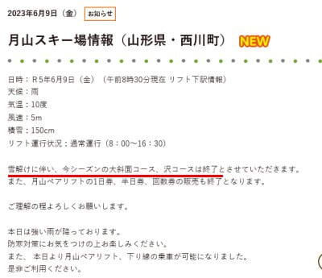

# え？月山スキー場，沢コースだけじゃなく大斜面も今シーズン終了！？？それもいきなり当日(6/9)朝に通知（泣）

📅 投稿日時: 2023-06-10 00:22:08

🏷️ カテゴリ: [日記](cc4b5682fb7b8b144980957a978653fb0.md)

なんということだ！！！

先週末の月山レポートで．

大斜面はまだ雪がたっぷりあり，

沢コースもまだまだ行けそう…

とレポートしたばかりなのに．

リフトの冬→夏位置への架け替えが

終わった本日朝，いきなり

「雪解けにより大斜面・沢コースとも終了」

という案内が出たようです…（激涙）

（[月山朝日観光情報ホームページ](https://www.gassan-info.com/news/1480)より）

そして，それに伴いリフト券の1日券・半日券も

販売終了…

例年ならまだ全然滑れる雪の量だし，

本日現地に行っていた特派員より，

「まだまだ滑れそうに見えるんだけどなぁ…」

というコメントも来ているのですが．

今シーズンの月山．

例年ならまだクローズにしない雪の量ですが，

なぜかいきなりコースクローズにしちゃった

みたいです…（涙）

うーん．

昨年度のパトロール長さんが亡くなった事故の

影響なのか，あるいはコース整備（立ち入り

禁止場所の竹竿立てとか…）をする人手が

不足しているからとかなのか．

あぁ…今週末どころか，来週くらいまでは

大斜面が行けるんじゃないかと思っていた

のに…（泣）

うーん．あと1回，Tバーだけの月山に行く

かどうしようか…

もしかするとこれで私のシーズンは終了かも．

残念…

しかし．

本日月山に行った特派員．

「いきなり当日朝に終了ってアナウンスでした」

ってことで，かなりの交通費を払って

現地へ行ってから，この事実を知ったようですが．

なんだか，事前に通知ができないほど何か

突発的な事態でいきなりクローズが決まった

んだろうか…？？

何があったのか，気になる…
