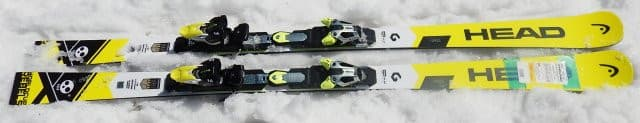
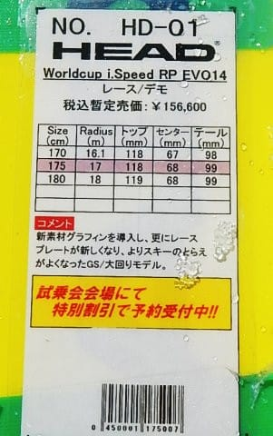
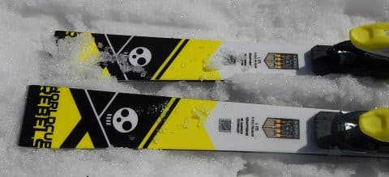
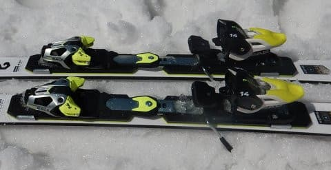
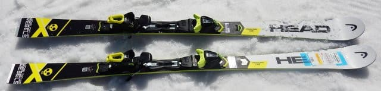
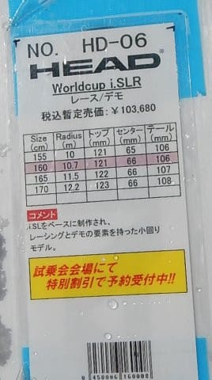
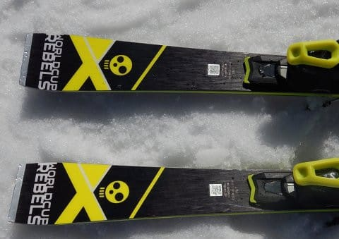
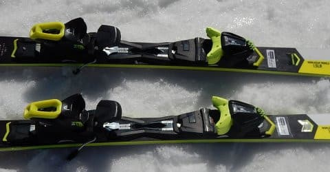

# 2019シーズンのスキー板，試乗レポート第5回…HEAD編その1

📅 投稿日時: 2018-04-14 00:22:36

🏷️ カテゴリ: [スキー板試乗](c0bd8048615710cee890e403a36cc9a2b.md)

えー．

読者の皆さんは．

この週末も，当たり前のように．

そう，太陽が東から登るのが当然のごとく．

私が土日で志賀高原に行くと

お思いでしょうが…

だのに．

なんということか！！

今週は土曜に用事があるので，

日曜のみ志賀高原の参加の予定です…（涙）

しかし．

私が行けない土曜は天気がもちそうで．

滑りに行ける日曜は，早朝から強風＆雨で，

昼ごろまで雨が降り続けそう…というのは．

これはいったい，何の嫌がらせだ～っ！！！！

なんてこった…（激泣）

でも．雨の日曜に滑るしかないのだ（泣）

あぁ…もう一度，フカフカパウダーでパフパフ

したい…（昔を懐かしむ目）

ということで．

今日も2019シーズンモデルのスキー板の試乗レポート．

本日はヘッド編．

では，どうぞ～！

---

○HEAD Worldcup iSPEED 175cm

大回りベース基礎・レース

と分類されているけど…

ゲレンデ上級者向けのSuperShapeシリーズより

もう少しアグレッシブな板，って位置づけなのかな…

ちなみに，WC iSPEEDには，RACE PLATEがついたiSPEED PROと，

プレートの無い，素のiSPEEDがありますが．

今回試乗したのは，PROではない方．

トゥピース・ヒールピース分離型のかさ上げ

プレートの上にビンディングが乗った，

RP FreeFlexビンディングがついてます…

谷回りでタングを押す感じでトップを抑えに行くと，

すごくよく切れて，気もしいいくらいの安定感で

むちゃくちゃ気持ちよくす――――ッと谷回りが

決まります．

普段私が履いている，トップを抑える必要の全くない

ATOMICやSALOMONのロッカー系の板と，かなり違うなぁ…

谷回りでトップを，山回りでテールと

前後動を使って行く感じの板．

でも，前後動を使っていくと，ものすごくスムースに

切れて行って，気持ちよく丸く回っていきます．

振動も少なく，すごく滑らかに大回りで落ちていく

板．

さらに，リアルな重量は決して軽くないんですが，

履いた感じ，板がかなり軽く感じます．

しかし，軽く感じるのに，板が叩かれてバタバタ

することもなく，

荒れた雪でも滑らかな感じで滑っていきます…

R17ですが，プレートがない分フレックスが優しく感じて．

スピードを出していくと，ロングターンというより

ミドルっぽくなっていきますが…

でも，トーションはしっかりしているので，エッジグリップは

しっかりしていて，決してスピード耐性が弱いというわけでは

ありません．

うむ．

大回りベースのオールラウンドとしては結構イケるかも．

レースプレートありのProを履いてみたかった…

○HEAD Worldcup iSLR 160cm

競技・基礎用小回りセカンドモデル

i-SLのフレックスをマイルドにして，

取り扱いやすくしたモデルですが…

去年もこんなビンディングだったっけ？

なんだか，昔のサロモンっぽい，滑るとカラカラいう

板でしたが…

履いた感じ，すごい軽い！

そして，ずらしのコントロールがすごくしやすい…

むちゃくちゃ動かしやすい板．

ずれていくというより，ズレの中で上手くコントロール

できる板．

WC iSPEEDと同じく，谷回りではトップを抑え気味に滑る板．

山回りでテールを抑えて行けば，しっかりエッジに

乗って切っていくこともできるけど．

エッジがそれほど頑張らない板なので，

切っていこうと思わなければ，簡単にずれて滑って

いけます…

かなり優し目の板．

だもんで．160cmって長さもあり．

トップスピードを出すと，私にとっては

ちょっと板が弱い感じ…

体重が軽い，体力がそれほどない人が，

小回りベースの軽快な板が欲しいなぁ…

って人にちょうど良さそう．
