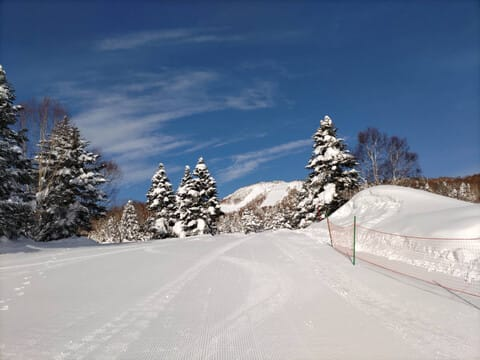

# 2月15，16日の週末の志賀高原スキー場の天気は…土曜は晴れ，日曜は曇り～小雪．

📅 投稿日時: 2025-02-13 01:17:57

🏷️ カテゴリ: [スキー天気予想](c6554f5c3c106093b511a8daae23757e8.md)

えー．

本日もいつも通り，志賀高原の特派員から

送られてきた写真を見てみると…

ふぎゃーーーー！！

すごいいい天気じゃないですか！！！

そして，見事なシマシマじゃないですか！！！

気温も結構冷えて，雪質もよさそうじゃ

ないですか！！！

…なぜ，自分が帰った翌日にこんなに

いい天気になるんだ…

…と，思っていたら．

昼前から曇りはじめ，風も強くなり…

午後1時ごろには，焼額は第1，第2ゴンドラ

ともに止まるほどの強風になったようです…

（[焼額山スキー場Facebook](https://www.facebook.com/yakebitaiyama/posts/pfbid024rQcnB14Jjnt7CwCMZLiB4RBKihqzARA7pFLyGJvkriJfv7feErEJkHXvsoE2bL2l)より）

ちなみに，今日の午後は奥志賀ゴンドラ，

寺小屋，東舘ゴンドラ，横手第2，第3

なんかも運休だったみたいで．

やはり，私がいなくなってから天気も

雪も良くなるのは許さん！！

という，私の心の中の何かが悪天候を

引き起こしたのか…←違うから

で．

危惧された本日夜の雨の危険性ですが…

うーん．

13日1:00現在の道路気象状況カメラを

見ると，気温は+1.7℃もあるし．

路面の雪が融けていっているので…

うーん．雨が降ってる可能性も

高い…

（[北信建設事務道路気象状況カメラ](http://hokushin.pref-nagano-roadcamera.jp/)より）

でも，焼額ライブカメラだと，

気温は-3℃と低く．雨が降ってるように

見えないなぁ…

（[焼額山スキー場ライブカメラ](https://www.princehotels.co.jp/ski/shiga/livecamera/)より）

まぁ，深夜の降りはじめは雨でも，

朝早くに雪に変わって，13日は一日

積もりそうなので…

最悪，雨でアイスバーンになっても

13日の朝の雪で覆い隠されそうだけど．

ガチガチの下地がところどころ顔を

出したり，コース脇の新雪が楽しめ

ないようになっちゃうのはちょっと

悲しい…

志賀高原は雨じゃなく，雪になって

いますように…！！

ってなことで．

12日深夜は雨か雪か微妙な感じでは

ありますが．

水曜深夜恒例，これから週末までの

志賀高原の天気を読み解いてみます…！！

えー．

まず．

13日(木)の850hPa図を見ると…

水色の-9℃線が志賀より南に下がって

いるので，結構冷えますね…

今，雨が降ってたら，ガチガチに

凍り付いちゃう気温です．

そして．この日の午後9時の地上天気図を

見てみると，新潟の日本海側に降水域が

予想されているので，終日雪が降りそう…

というか，午前は風も結構強そうです．

続いて，14日(金)の850hPa図は…

水色の線は-6℃線なので，木曜よりは

気温が上がりそう．

14日の地上天気図を見てみると．

この日も新潟付近にわずかに

降水域があるので．

昼過ぎくらいまでは雪がぱらつく

感じかな…

そして，週末の15日(土)の850hPa図は…

うーん．志賀高原は赤い0℃線と水色の

-3℃線の間なので．

この時期としては高めの気温．

昼間はプラスまで気温が上がるかも…

で，土曜の地上天気図を見ると．

この日は高気圧に覆われて晴れそう！

晴れて穏やかなスキー日和ですね！！

続けて16日(日)の850hPa気温を見ると…

この日も志賀高原には赤い0℃線が

近づくほどなので，この時期としては

気温が上がりそう…

ただ，液体が降るほどではない感じ．

地上天気図を見ると，

一見，志賀高原には降水域を示す

網掛けがかかっていないので，

降らなさそうに見えるけど…

この網掛けは，24時間で5mm以上の

降水域．積雪で言えば，24時間で

5cm以上積もるところを示していて．

5cm以下の積雪があっても，網掛けの

領域には入りません．

で，[週間天気予報解説資料](https://n-kishou.com/ee/image4/lfax/skaisetu_202502121000.pdf)を見ると．

赤枠の16日の天気図で，

水色の部分は4mm以下の降水域を

示していて．

志賀高原はこの水色のエリアに

入っているので…

この日はパラパラ雪が降るかな．

ということで．

まとめると．

13日(木)：深夜，標高が低いところは雨．

　明け方前から雪になり，終日降り続ける．

　朝はかなり強く降る．

　というか，朝は激烈吹雪．

　朝までに10～20cmくらい積もるか．

　強風で動かないゴンドラ・リフトが多数．

　深夜に雨が降るほどだった気温は朝に

　一気に下がり，-10℃以下になる．

　昼間も10cmくらい積もる．

　午後になると，風も雪も弱まっていく．

14日(金)：昼頃までぱらぱら雪，

　時折日も射す．

　午後も雪がぱらついたり日が射したり…

　朝イチの気温は-9℃くらい．

　朝までの積雪は5cmくらいか？

　朝イチはシマシマ圧雪にわずかに

　雪が乗ってる感じ．

　標高が低いところは，急斜面とかで

　木曜の雨で硬くなった下地が出てくる

　場所が一部あるかも…

15日(土)：朝から晴れ！朝の積雪0．

　朝の気温は-7℃程度．

　朝イチは締まり気味のいい感じの

　シマシマ！

　晴れたシマシマが滑れる最高の朝！

　昼間は気温も0℃近くまで上がり，

　日差しもありかなり暖かく感じる，

　穏やかなスキー日和．

　午後は木曜の雨で硬くなった下地が

　出てくるところがあるかもしれない

　けど，バーンもそこまで荒れず

　いい感じの一日になりそう．

16日(日)：微妙．まだ予想は正確じゃないけど，

　朝から曇り時々雪の天気．

　朝の気温は-5℃程度？

　朝までの積雪は数cm程度で，

　そんなに積もるほど降らない感じ．

　雪は悪くないけど，終日曇りで

　視界もそれほど良くなく，

　ヘタするとガスが出るかも…

　でも，雪は良いのでそこそこ

　楽しめそう．

ってな感じでしょうか…

土曜はスキー日和になりそうな予感！！

…ってな感じの週末までの予想ですが．

週末を過ぎると…

なんだか，17，18，19日とすごい冷えそう

なんですが…！？？

また，平年より-5℃くらい寒い激冷えに

なりそう…！！

この3日間，志賀高原には水色の

-12℃線が近づくレベルなので…

これはかなり本気の冷え込みです！！

とりあえず．

来週の月～木曜，2月17~20日のあたりは，

また先週と同じくらい積もりそうな

勢いです…！！

でも…

こんな一気に降らなくていいんだけどな…

この冷え込みと積雪を，後々のために

取っておきたい…

この積雪をとっておいて，

GW前にスキー場に降らせるとか

できるといいんだけどな

と，間に1週間置いただけでまた

豪雪になるという天気図を見ながら

考えずにはいられない，Skier_S

だったのでした…

## 💬 コメント一覧

### 💬 コメント by (ももも)
**タイトル**: Unknown
**投稿日**: 2025-02-13 08:19:44

現在の雪情報

山の駅、雪が横殴りで降ってます。

ゴンドラは運転見合わせ。リフトは動くようです。

レインボー様とお友達様　昨日は楽しいお話ありがとうございます。

### 💬 コメント by (レインボー77)
**タイトル**: Unknown
**投稿日**: 2025-02-13 18:55:34

お借りいたします。

ももも様、こんな嵐の日でもご出陣とは！恐れ入ります。ももも、もも鯱、も、ももた様。皆様ご一党様ですよね？

今日は休場して小布施の竹風堂に行ってきましたが、外にいることだけで苦痛で、ましてや滑るなんて、どこぞのスキーヤーさんみたいで驚きです。恐れ入りました。

### 💬 コメント by (ももも)
**タイトル**: Unknown
**投稿日**: 2025-02-13 22:12:14

私もお借りします。

レインボー様

あのお方とは違います笑。でも息子のウェアはあのお方とペアルックです…

明日までいますのでよろしくお願いします。

### 💬 コメント by (Skier_S)
**タイトル**: 2月いっぱい冷え続けるよ！
**投稿日**: 2025-02-14 01:32:36

＞もももさま

今日はすごい天気だったようですね…

それでも滑っている人が結構いたのがすごい．

というか，こんな日でも講習をやらねばならない日体大の学生さんにちょっと同情…

＞レインボー77さま

こんな悪天候で滑るどこぞのスキーヤーって…

今日滑っていた，伊豆から来られるあの方かな？？

そうですよね．そうに違いない…

