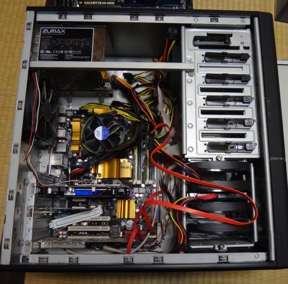
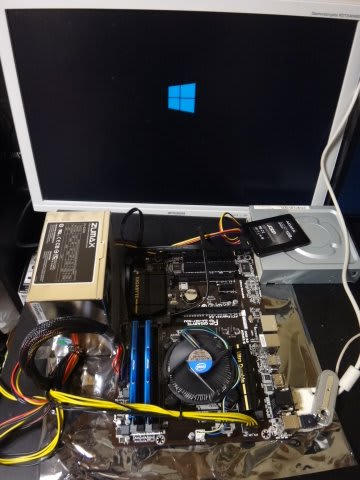

# ということで，スキーに行けない週末にPC構築＆セットアップ！

📅 投稿日時: 2014-02-19 00:26:03

えー．

今のところ．

危惧されていた19，20日ごろの関東の積雪はなく．

今週末は，冷え冷え晴天の.

絶好のスキー日和になりそうな気配ですっ！！！

＃でも，まだ上信越道が通行止めなんだけど…

＃いつ開通するんだろう？？

ってことで．

スキーに行けなかった(;_;)この週末．

[昨日書いたように](e4597ee7c2cdc43cce4bd9c3cbd6a5a15.md)，自作PCの内蔵移植作業とWindowsの

バージョンアップを図ったわけで．

そろえたパーツは，コストパフォーマンス重視．

マザーはH87を，7000円台の格安でGet.

CPUはこれまでPentiumE6200を使っていたけど．

今回はちょっと奢って，Core i3 4130．

…とはいえ，Coreシリーズ最安のCPUですが…

そして，メモリはDDR3-1866 4Gx2枚が，DDR3-1600の最安値より

安かったという，わけのわからん掘り出し物を見つけたのでGet.

あとはシステム用の128GのSSDと…

写真データ用の2TのHDD.

どっちも7000円台の掘り出し物．

さらに，TV録画データ用＆写真バックアップ用の3TのHDD．

これも，価格.comの最安値より安い，驚き価格の「タイムセールもの」を発見．

…でも．

HDDは，3年半ほど値段が下がってないなぁ…（涙）．

そして．

Windows8.1 64bitのDSP版．

…ってパーツを買い揃え．

5年ぶりに，わが自作機を大手術です．

さらば，PentiumE6200+P45マザー…

＃WinXPで使うには，まったく不足を感じないスペックだった…

まず，マザーボードと…

CPUを取り出して．

マザーボードのソケットに…

CPUの電極面を合わせるように…

セットします．

んで，CPUと同梱されているファンを取り付けたら…

メモリを…

取り付けて．

あとは，SSDを差し込んで，

旧マシンから流用の電源，DVDドライブをつなぐと…

起動できる状態になるので．

Win8.1のインストールディスクを突っ込んで，起動だ！

あとはさくさくWin8.1のインストールを終えて．

うーん．

意外と早い．

30分ほどでインストール完了しちゃった…

動作を確認したら，ケースに組み込んで．

あとは，地デジチューナーカードなど，各種ドライバのインストール＆

旧PCからのデータ移行作業と環境構築をやって．

これで一丁あがり，と．

うーむ．

Win8.1の使い勝手は「微妙」だけど．

SSDのおかげで，10秒ちょいで起動するし．

重い作業をやってもCPU負荷は1桁％で，動作はサクサク速いし．

心配の種だったHDDも，システムSSD＆2T＆3Tの3台体制となり，

容量も十分．

片方がクラッシュしても大丈夫なようになったし．

サポート切れのXPを使い続けることもなくなったし．

とりあえず，休日を1日つぶした甲斐はあったかな～

## 💬 コメント一覧

### 💬 コメント by (megalith)
**タイトル**: Unknown
**投稿日**: 2014-02-20 00:34:15

>>あとは，地デジチューナーカードなど，各種ドライバのインストール＆

もしやPT2or3でしょうか。（笑）

自分は、今回サブPCに初めてPT3入れました。(^_^;)

現在テスト運用中です。

### 💬 コメント by (Skier_S)
**タイトル**: megalithさま
**投稿日**: 2014-02-21 01:01:21

いや…

そんなマニアックな地デジカードじゃなくて（笑）．

軟弱なI/Oデータ製のやつです…

これで録画番組のスマホ持ち出しもできるので，

私にはこれで十分です（＾＾

