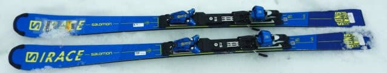
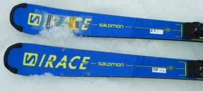
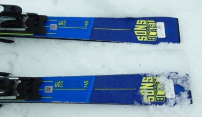
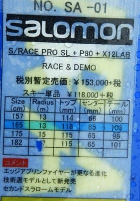
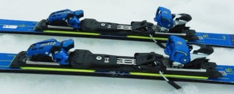

# 2022シーズンモデルのスキー板，試乗レポートその18…SALOMON S/RACE PRO SL P80

📅 投稿日時: 2021-07-09 01:33:40

えー．

ここ2週間，なかなか香ばしい毎日を送り．

家から一歩も出ていない日が11日間も

続いていたのですが…

なんとかこの週末は，仕事をせずに

過ごせそう…←いや，明日何が起こるか分からないから安心は早いぞ！

だもんで．

この週末は12日ぶりに家の玄関から外に出るぞ！←なんか引きこもりの人みたいな宣言だ…

どこか山登りか何かしたい…つ！！

身体を動かさないと死ぬっ！！！

…と，思っていたら．

まだ梅雨が明けず，今週末も雨っぽいんですが…（涙）

かといって，またずっと家にいると死にそうだし．

あぁ…12日ぶりに太陽を浴びて外を歩きたかった…

果たして．

次にアウトドアに行けるのは

いつの日か？？

これでこの週末も外に出ず，

20日近く連続で家にこもり続けたら

人間としてダメになりそう…←まだダメになってないつもりだったの？？

ってなことで．

早く梅雨明けを願う今日この頃ですが．

天気図を見てると，まだしばらく

雨が続きそう…（涙）

とりあえず．

せめて気分だけでもスキー気分を，

という感じで．

今日も2022シーズンモデルのスキー板の

試乗レポート．

今回はサロモン編です．

では，どうぞ～！

○SALOMON S/RACE PRO SL P80 X12LAB 165cm

SL競技用，基礎小回り用

SL競技用としては，この上にSL FISがあるので，

SLセカンドモデルになるこの板．

P80プレート付きとプレート無しがあるのかな？

この板は，P80プレートがついてます．

ビンディングはX12LAB．

ATOMICのVARビンディングと

同じやつですね．

黄色いエッジアンプリファイヤは

RUSH SLと違って，トゥピース側と

ヒールピース側の2分割になって

ますね…

滑ってみると．

最初，谷回りでかなりまっすぐ進んだので

ちょっとびっくりしたのですが．

たわませるというより，角づけを深めて

いくと，ググッと回り始めます．

谷回りで傾けていくと，「おぉ！？？」

というくらい小さく回ります．

傾きを出したまま，山回りをしっかり

仕上げていくと，ガッツリ雪面を捉えて

驚くほどの小さい半径でカービング

します．

たわみでも，板を動かすのでもなく．

板の傾きで弧が深くなるタイプ．

谷回りで足場を作って板を傾けて

行ければ，しっかりしたグリップで，

驚くほど深い小回りができます．

荒れた斜面とかで傾きを作りにくい

場合は，板を動かして滑ることに

なるので，荒れた斜面はあまり面白く

ないです．

しっかり整地されたバーンで実力を

発揮する板ですね…

傾けない斜面で滑っていてもそれほど

楽しくなく，やはり整地で思いっきり

板を傾けて滑りたくなる板．

硬い整地でしっかり傾けば，

深い小回りができます．

傾きを出さなければ弧は大きく

なっていくので，弧の自由度は高く，

小回り強制マシンではありません．

あまり傾けなければ驚くほどまっすぐ

進むので，大回りから小回りまで

行けそう．

ただ，傾けていかないとグリップが

ちょっと弱めに感じます．

谷回りでは板のズラシはやりやすいけど，

雪面を捉えると，ターン中のグリップが

かなりしっかりしているので，スピードを

かなり高めていっても，板が逃げるような

板の弱さは全く感じません．

ただ，オートマチック性がちょっと弱く．

傾けないと，エッジの捉えが弱く，

小回り板と思えないほどまっすぐ進みます．

でも，傾けられれば，ガッツリグリップして

驚くほど深いターンが決められるので，

この板の評価は両極端にわかれそう…

ある程度以上の技量は必要で万人向けの

板ではない感じですが，

この板の特性をつかめれば，整地では

かなり楽しいカービング小回りができそうです．

## 💬 コメント一覧

### 💬 コメント by (まーくん)
**タイトル**: Unknown
**投稿日**: 2021-07-09 07:25:52

たわませる→面に加重する

板を動かす→迎え角をつける

傾く→角付けをする

…で合ってますか？😅

特に板を動かすというのがよく分かってなくて

### 💬 コメント by (ikkun)
**タイトル**: Unknown
**投稿日**: 2021-07-09 15:06:23

ぇ？そんなに？それはストレス満タンですね(・・;)しかし凄いですね！私し外に出ないと仕事にならないので(笑) 遠い昔のスキーナウの海和さん効果でも増えて行ったサロモンでしたね？……私しはどちらかといえば4S?なあのLiteグリーンを買った事思い出します(笑)昔のいわいる「直輸入品」だった事を思い出しました☺️古い

てかそういう板は履いてみたいですねって…立てた脚立取られたりして(笑)

### 💬 コメント by (m00308)
**タイトル**: エキップ長岡さんについて教えて下さい
**投稿日**: 2021-07-09 16:46:14

はじめまして、はじめてコメントさせていただきます。

いつもブログ拝見しています。特にシーズン中は日課のようになっており、スキー場天気予想、試乗レポートなどスキー先輩のご意見とても参考にさせていただいており、大変ありがたく思っております。

実はエキップ長岡さんについて教えていただきたく、コメントいたしました。

なんとか上手くなるように練習しているのですが、へなちょこで、ブログでのちょっとしたアドバイスを試してみたりしてるのですが、

このたびブーツを新調して、しっかり調整してもらおうと思っているのですが、経験がなく勝手がよくわかりません。

エキップ長岡さんに行ってブーツを作りたいのですが、どのようにすればよいかご教授おねがいできないでしょうか？

よろしくお願いいたします。

お忙しいのに長文失礼いたしました。

佐藤　長野市在住です。

### 💬 コメント by (Skier_S)
**タイトル**: やっとのんびりできる週末
**投稿日**: 2021-07-10 01:34:11

＞まーくんさま

たわませる→面に加重する

板を動かす→迎え角をつける

傾く→角付けをする

はい，正解です！

表現が分かりにくくてすみません…

＞ikkunさま

実は私がこれまでに履いた板は，SALOMONが一番多いです．4Sは名機ですよね…

4S現役時代はまだ子供だったので，私は履いたことがありませんが…

＞m00308さま

いつもご愛読ありがとうございます～！！

エキップさんに行くのには，そんなに難しく考えなくても大丈夫かと．

普通のスキー用具屋さんに行く感覚で行ってもらえれば．

1．まず，エキップさんに行きたい日を電話で伝え，予約します．ブーツを買いたい旨

言っておけば大丈夫！

2．当日行く際には，今履いているブーツをもっていってください．ブーツを作る参考になります．

3．あと，自分が滑っているビデオ（後ろから写っている奴が分かりやすくていいみたいですが…）

　があると，さらに参考になっていいです！

　スマホか何かで撮ったやつで大丈夫だと思います．

4．現地では，鈴木社長に足型や骨格を見てもらって，どんなブーツが合うか

　何種類か選んでもらって試し履きをする感じです．その中からあったやつを選べばOK!

　インソールを作るかどうかとか，細かいところは当日いろいろアドバイスもらえるので，それを基に

　当日現地で判断すればいいです．

5．シェルの加工が少なければ，当日のうちに出来上がります！加工が多いと，後日もう一度来店になるかも…

6．お金は現金払いがGood．ブーツの定価からちょっとだけ値引きあり，加工賃は０です．

　欲しいブーツの定価を調べて，それくらいのお金をもっていけばいいです．

　インソールを作るなら，もう少しかかりますが．

場所，電話番号は

http://www.equipe.jp/

へ！

間違いなく，スキーが上手くなります…

