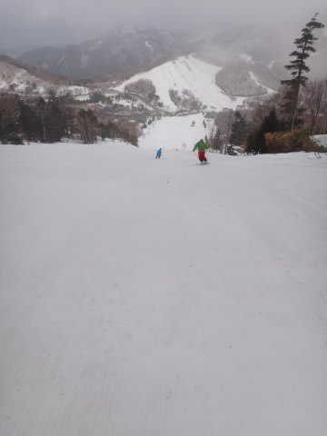

# 4月6日土曜日の志賀高原は…悲惨（涙）．

📅 投稿日時: 2013-04-06 16:35:34

えー．

今日の志賀高原は．

悲惨でした(泣）．

以上．

…

…で，終わっても．

今日の読者は「あー，そうだよね」って感じで，文句を言わないんじゃないかな～．

って気がしますが．

いや．

朝のうちは天気予想通り，薄日も射し，南風が暖かい穏やかな天気だな～…

…って，思ったら．

…ちょっと

なんだか．

…風が予想より強く．

朝からヤケビゴンドラ，奥志賀ゴンドラ，山の神＆ダイヤ全面，寺子屋，一の瀬ペアがストップ．

…動いてるのは，ヤケビ第2高速＆第4ロマンス，

そして，一の瀬ファミリークワッド，タンネクワッド，高天ヶ原クワッドのみ（泣）．

うーむ．

仕方が無い…

焼額をあきらめて，一の瀬で滑るか…

と，一の瀬へ出ると．

なんだか，すごい雪が減った？？

ダイヤモンド，山頂に近い部分，もうコースに穴があいてるんですがっ！！

例年なら，4月下旬レベルの雪の量なんですけどっ！

愕然としつつ，ゲレンデへ．朝イチは薄日も射し…

メインバーンは雪の量もばっちり．

水を吸った重い雪ですが，しっかり圧雪されて比較的締まったバーン．

…ほっ．

朝のうちはよさそうだなぁ…

と，思ったら．

動いているリフトが少ないので，一の瀬クワッドに人が集中してきたんですが…

隣のペアリフトも動いてないので，待ち時間が5分以上…(;_;)

そして，ゲレンデも…

動いている一の瀬クワッドのメインバーンに集中します…

人をよけてんだか，滑ってるんだか…

そして．

昼過ぎには．

天気予想のとおり，雲が出始め…

午後2時ごろ．

来ちゃいました．

予想通り，．

雨が…(激泣)

当然，雪はこんな感じで…

あっという間にぼこぼこに

ぼこぼこだし，ゴーグルに水滴がついて見えないし，ガスは出るし…（涙)．

ぐおおお～っ！

なぜここまでひどい目に！

私が，私が何を悪いことをしたというんだっ！

＃いっぱいしまくってるってば←自己突っ込み

…

そして．

パーフェクターコースは．

なんか，コースの真ん中，雪が薄くなってませんか？？

なんか，出てきちゃってませんか…？？？(涙)

…パーフェクターコース，もって来週まででしょう(悲)．

顔に大粒の雨が痛いほどぶつかるような強風の

土砂降りの中，午後は滑る人も無く…

さっきまであれだけいた人はどこへ？

って感じの，ゴーストタウン化．

おーい．

みんなー．

どこ行っちゃったの？？

＃普通の神経の人はこの状況で滑るわけがない

って感じで．

本来午後4時50分までの営業だったけども，

4時に強風のため全リフトがストップ…

こーゆー感じで．

苦行の一日が終わったのでした…

うーん．

志賀高原．今もすごい強風で横殴りの雨が降っています．

山頂付近では，ちょっと霙っぽかったんですけどね～．

これから奇跡が起きて，これが雪になって積もってくれないかな～？？

…これから，ちょっと祈ってみます．

PS.明日は，

・何があっても雪上に立たないと禁断症状で死ぬ方

・雨が降ろうが槍が降ろうがミサイルが降ろうが滑る根性を持った方

・怖いものみたさを装備されている方．悲惨さを自分で体験したい方

以上の方のみ，志賀高原に来ることをお勧めします（涙）．

## 💬 コメント一覧

### 💬 コメント by (gokuraku skier)
**タイトル**: Unknown
**投稿日**: 2013-04-06 18:27:06

今日は仕事だったのですが、山がそんなに酷い状況だったとは・・・長野市はそんなでも無かったので想像すらできませんでした。

私は明日も所用があってお休みです。

明日も風邪などひかないよう気を付けて滑ってくださいね。

### 💬 コメント by (ＴＭ)
**タイトル**: 試乗会
**投稿日**: 2013-04-06 20:58:49

勇気を出してお声掛けさせていただいたＴＭです。

ポイントは、可愛いお嬢様連れで黄色いシールつきのBLUESTER-SXでした。

しかし、なんとも苦行な一日でしたね。試乗会は、頑張って8本(HAFFSVEF)借りましたが、はっきり言ってじっくり試せるゲレンデ状況じゃないし、歩道橋の往来は疲れるし、最後はずぶ濡れだし…

### 💬 コメント by (mari)
**タイトル**: 今日はお休みでした
**投稿日**: 2013-04-06 23:42:29

大変な状況だったようですね。

友人夫婦も試乗会に参加してて状況をmixiで実況してましたが、

写真見てなんでサンベルト乗ってるんだろうと思ってた疑問が

Sさんの日記で謎がとけました。

友人夫婦は雨でもへっちゃらな山ウェアですが、

Sさんどうか風邪引かないでくださいね～(^_^;)

我が家は来週行こうかどうしようか悩み中です。

コブ練したい人がうちに2名いますが、

果たして来週末コブどころか雪はあるのでしょうか…(T_T)

### 💬 コメント by (ひろりん)
**タイトル**: Unknown
**投稿日**: 2013-04-07 20:06:28

今帰宅したトコです。

ひどかった・・・orz

サンバレーも・・・orz

コブも穴があいてしまいコース閉鎖（TT)

昨日は2時過ぎから雨と強風、今日はガスが出たと思ったら雹がっ・・・

まぁ、ガラガラだったのは救いでしたけど、せっかくの試乗会、何を履いてもよくわからないという（爆）

オガのET-9.0　183cmが一番調子よかったという状況でして（笑）

良かったのは昨晩のジャンケン大会でBRIKOのサングラスを勝ち取ったくらいです（笑）

よくわからんけど、にまんえんもするのよ・・・自分じゃ買えませんｗｗｗｗ

### 💬 コメント by (ゆうこ)
**タイトル**: 不安です
**投稿日**: 2013-04-07 21:48:49

4週間もスキー場いってなくて、最近体調悪くなって来ました。

運動不足か、疲れやすく肩こりがひどいです。

しかも、しばらく行ってないうちに本当に雪がなくなりそうで、心配です。

GW、雪がなかったときのために信州のガイドブック買いました。

雪がなかったら、何やるか考えないと。

### 💬 コメント by (Skier_S)
**タイトル**: みなさま，お疲れ様でした
**投稿日**: 2013-04-07 23:38:44

いやー．

昨日はナイターが無く，早くに寝ちゃったのでコメントの

回答が遅くなりました…すみません

>gokuraku skierさま

いやー．

ひどかったですよ…(涙)

かなり雪が減った感じがします…

今シーズンは，あと何回くらい滑るんですか？

とりあえず，今日は第一ゴンドラに今シーズンの

お別れをしてきました…

>TMさま

いやー．

お声をかけていただき，ありがとうございます．

こんなBlogをご愛読いただき感謝です．

しかし．

この日は，修行の一日でしたね～(涙)．

ダイヤモンドで板を借りて，ファミリーで試乗って…

つらすぎました(笑）．

>mariさま

そーなんですよ．

ダイヤモンドで板を借りて，ファミリーで試乗．

板をかえるごとに，あのベルトコンベアーに乗って

スキー場を往復するという…

この日は2時間で5セット試乗して，死ぬかと思いました．

…来週まで，雪は十分あると思いますよ．

ぜひ，来週は山へ復活してください！

ただ，GW後半くらいになると危険かもです…

>ひろりんさま

あれれ？？

サンバレー，まだオープンしてましたっけ？

何か，貸切試乗会かなんかですか？？

サンバレーのゲレンデ，そろそろやばそうな感じ

でしたけど…

サングラス勝利，おめでとうございます(笑）．

>ゆうこさま

うーん．

GWまで待たずに，ぜひ4月中に志賀へどうぞ(笑)．

来週も再来週もありますよ～．

今週もかなり雪が解けちゃいました…(涙)．

これから冷えてくれればまだ何とかなりそうですが…

GWはどうなることやら．

### 💬 コメント by (千春)
**タイトル**: またまたお邪魔しました
**投稿日**: 2013-04-08 11:07:12

こんにちは、千春です。

週末、Skier_Sさんはどうされたかなー？と気になって、

またブログを見に来ました。

私は、土曜日猫魔、日曜日ハンターマウンテンでした。

猫魔は３時ごろまで満足、ハンターは土砂降りでミジメでした。

　・何があっても雪上に立たないと禁断症状で死ぬ方

　・雨が降ろうが槍が降ろうがミサイルが降ろうが滑る根性を持った方

　・怖いものみたさを装備されている方．悲惨さを自分で体験したい方

に大ウケしましたー。

私の日記にコピペ、もしくはリンク張ってもよろしいでしょうか？？？

### 💬 コメント by (Skier_S)
**タイトル**: 千春さま
**投稿日**: 2013-04-08 22:25:52

あらら～

この週末に行っちゃいましたか…スキーに．

これだけの天気予報が出ていたにもかかわらず…

この週末，スキーに行っちゃったのは，逝っちゃってる人かと(笑）．

で．

私のブログは，引用元さえ明記してもらえれば

写真だろうが文章だろうが勝手に引用・リンクOKです～．

お好きなだけ引用してくださいね～．

### 💬 コメント by (千春)
**タイトル**: ありがとうございます！
**投稿日**: 2013-04-09 00:32:11

早速、リンクを貼らせていただきます！

Skier_S さんと違って、私は日記書くのに１週間くらいかかるし、

ただの自己満足日記（備忘録）なんですけど☆

許可くださってありがとうございます。

### 💬 コメント by (千春)
**タイトル**: 間違えました
**投稿日**: 2013-04-09 00:33:10

×リンクを貼る

○リンクを張る

ですね、失礼いたしました。

### 💬 コメント by (Skier_S)
**タイトル**: 千春さま
**投稿日**: 2013-04-09 23:20:05

URLありがとうございました～

コメントはリクエストどおり消しておきました…

でも，恥ずかしくは無いのでは，って思いましたが…

また，今後もリンク・引用してやってください！

### 💬 コメント by (千春)
**タイトル**: ありがとうございます！
**投稿日**: 2013-04-11 12:01:03

私の日記、どーでもいいことしか書いてないので、

Skier_S さんのブログにURLを載せっぱなしは

恥ずかしいですー。

### 💬 コメント by (Skier_S)
**タイトル**: こちらこそ！
**投稿日**: 2013-04-12 00:58:27

はいはい～読ませてもらいました(^^

こちらのブログも，引き続きご愛読のほど，よろしくです！

