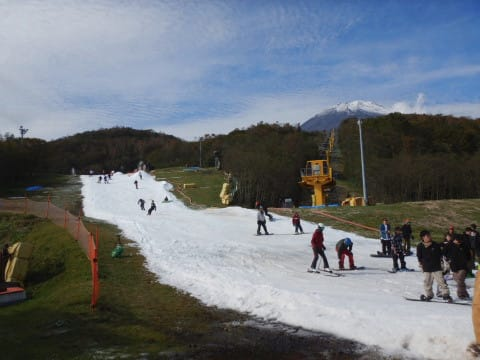

# 2019/10/27(日)，2020シーズンオープン3日目のイエティのゲレンデ状況の動画

📅 投稿日時: 2019-10-29 00:31:47

ってなわけで．

[昨日レポートした](e3fb4e2394b3e9d3cfdada594678dab69.md)ように，イエティで

ついに私の2020スキーシーズンが

始まったわけですが…

イエティで私が滑ってきたときの恒例，

ゲレンデ幅や乗り場・降り場付近での

積雪量が分かるように，コース状況の

動画を撮ってきたので，載せておきます～！

撮影したのは，10時半くらい．

ゲレンデ混雑はほぼピークに

達していた時間で，

結構人口密度高いです(笑)．

動画の最後に写っているリフト待ちは，

この日のピーク待ち時間の半分弱

くらいでしょうか．

11時くらいにピークで，動画の倍以上の

リフト待ち列がついてましたが，

大体この日は平均的にこのくらいの

待ち時間だったかな．

コースはまだ穴が開いて土が出ている

状況にはなっておらず，

まだコースコンディションは

悪くない時間帯ですが．

リフト乗り場に近い下の方に行くと，

ところどころ雪が薄くなっている

ところがあるのが分かります…

いや．

しかし．

こうやって動画で見返してみると．

すごい狭いし，人が多いし．

とても滑れたもんじゃない…

と，滑った本人が見ても

思っちゃいますね(笑)．

でも，

それでも．

滑れるだけ，ありがたいのだ．

もう，雪があれば．

スキーを履いて，雪の上を

滑れるってだけで，どんなだって

いいんです！←麻薬中毒患者の言い分みたい…

ってなことで．

これからしばらく，ひどい雨も

降らなさそうなので．

今週末にかけては，それほど

コンディションは悪化しなさ

そうなので．

当然のごとく，この週末も

Yetiに出没予定です～！

## 💬 コメント一覧

### 💬 コメント by (おおすぎ)
**タイトル**: Unknown
**投稿日**: 2019-10-29 10:53:26

遅ればせながら・・・シーズン’20　の始まりおめでとうございます！

yetyは１度も試したことがないので、今年はシーズン真っ最中に行ってみようかな！！と思ったりしました。

これから、半年以上のスキーシーズン、楽しみにしております。

（わたしは、某オクで、安めの板を３本も漁ってしまいました！！）

### 💬 コメント by (naoちゃんねる)
**タイトル**: Unknown
**投稿日**: 2019-10-29 18:10:00

日曜日はありがとうございました。

Yeti…予想以上に良かったです😆

リフト待ちは少ないし、斜度はシーズンインには十分だし、ゲレンデは混むけどたまにはクリアな瞬間もあるし…

軽井沢より全～然快適でした。

ただ…遠い😱

いや～、近くにスキー場があるのにわざわざ250キロ遠方のスキー場に行きたがるとは…終わってる子どもですね😨(娘のせいにしてみる)

今シーズンも、宜しくお願いしま～す！

### 💬 コメント by (ほっぽ)
**タイトル**: イエティ
**投稿日**: 2019-10-29 23:42:54

Ｓさん

遅ればせながら昨夜シーズンインしました。

例年より１週間OPENが遅かったのに、雨の影響ですかね。

雪は少なく最後の落ち込みは土出まくりで迂回するのに精いっぱい、

それでも何かを踏んだ嫌な音が足元からしていました。

10月から滑れることに感謝して、明日のナイターも出撃予定です。

http://www2.tokai.or.jp/nana_hoppo/

### 💬 コメント by (Skier_S)
**タイトル**: 祝！初滑り
**投稿日**: 2019-10-30 00:12:23

＞おおすぎさま

Yetiは…トップシーズンはガラガラらしいので，

いいかもしれません．

ただ，全面アイスバーンで硬いと聞いています（笑）．

私は，Yetiは11月下旬まで，紐ゲレンデ状態しか

知らないので，全面雪が着いた状態が想像つきません（笑）

＞naoちゃんねるさま

日曜はお疲れ様でした～！！

それほど混まないし，コースも長いし，軽井沢よりはいいと

思います．

しかし，往復500km運転でナイターまで，お疲れ様でした（笑）．

今シーズンもよろしくお願いします～！

＞ほっぽさま

シーズンイン，おめでとうございます！

今シーズンはライバルの狭山が早々に脱落したからか，

雪の造りがちょっと甘いような気がしますね（笑）．

私も石を結構踏みました…（涙）

でも，ナイター2連発うらやましいです…

今シーズンもよろしくお願いします～！！

### 💬 コメント by (しんちゃん)
**タイトル**: 初すべり動画～
**投稿日**: 2019-10-30 01:38:27

貴重なＳさんの動画、さっそく拝見しました。

今年は往復５００㎞のはるか長野からスーパーキッズを呼び寄せるは、滑りもしないのに見学にだけ２時間もかけて有料道路費用を払ってまで来る人(笑)もいるはで、イエティから集客料として、Ｓさんは何かもらってもいいんじゃないかと思っちゃっています。

昨シーズンは怪我人続出でしたが、今シーズン、最後まで怪我無くいきたいですね。

### 💬 コメント by (カンタロス)
**タイトル**: Unknown
**投稿日**: 2019-10-30 06:28:01

シーズンインおめでとうございます！

金曜日、オープンにいく予定でしたが、ご存知のように大雨が降りましたので、中止(泣) 

なんかシーズンの出鼻をくじかれました。

仕事で腰もちょっと痛めてしまったので暫くはおとなしくしてます。

### 💬 コメント by (炎の北海道民)
**タイトル**: Unknown
**投稿日**: 2019-10-30 19:13:39

シーズンインおめでとうございます。

ボードの挙動が予測できない感じで、接触してコース外に落ちる人が続出しそうな感じですね。

### 💬 コメント by (プチ)
**タイトル**: Unknown
**投稿日**: 2019-10-30 23:41:23

Sさん初めまして。初コメント失礼します。

2年ほど前から毎日楽しく拝見させていただいています。2年も読者を続けているとSさんの影響を受けてamazfit GTAを買ってしまいました。

さらにさらに影響を受けたのか、月曜日にはイエティへ午前中だけですが滑りに行きました。その際にアクティビティーログの動作チェックをしましたので参考程度ではありますが以下に記載させていただきます。

まず、Pauseについてですが、リフト前で並ぶことやトイレ休憩、写真撮影をコース上で行うなど歩行スピード以下の時は頻繁にありましたが私のamazfit GTAは止まることがありませんでした。滑り始めから滑り終わりまで常にログを取り続けていたためどのような条件下でPauseが出てしまうのか気になるところです。

また、リフト途中でGPSをキャッチし、最後のリフト途中でログ取得を停止したため正確ではありませんがこんな記録が取れたんだと参考程度にしていただけると嬉しいです。

滑走距離　9.17km

リフト本数　15本

積算標高差　1044m

### 💬 コメント by (プチ)
**タイトル**: Unknown
**投稿日**: 2019-10-30 23:44:18

Sさんすみません。

次回にコメントすべきamazfit GTAのことについてこちらでコメントしてしまいました。申し訳ございません。

### 💬 コメント by (ほっぽ)
**タイトル**: 10/30　イエティナイター
**投稿日**: 2019-10-31 00:17:34

Ｓさん

予定通り今夜ナイターに出撃してきました。

一昨日よりゲレンデコンディションが改善されており、

今夜は一段と楽しく滑れました。

週末に向けて天気は悪く無さそうなので、順調に氷が増えることを期待しています。

日月の雨マークが気になる所ですが。

http://www2.tokai.or.jp/nana_hoppo/

### 💬 コメント by (Skier_S)
**タイトル**: コメント回答朝になっちゃいました
**投稿日**: 2019-10-31 08:24:16

＞しんちゃんさま

いやー．焼額からならお金もらってもよさそうですが（笑）．

今シーズンはみなさん怪我なくいきましょう！

＞カンタロスさま

あら．

腰怪我しちゃいましたか…

腰は大切ですから，無理せずお大事に！

＞炎の北海道民さま

ボードの動きは，慣れれば分かってきます．

何かやろうとするときは，その予兆の動きがありますから…

でも，どっちにしろそんなに飛ばせないので，

ゆっくり滑ってるから十分回避可能ですよ（笑）．

＞プチさま

Amazfit GTRの記事の方にお返事しました～！

＞ほっぽさま

2連チャンナイターですか！

週末も行かれるなら，またお会いしましょう～！

