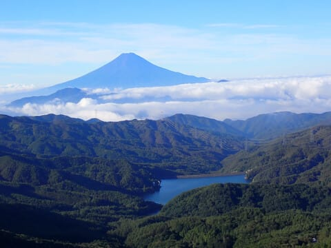
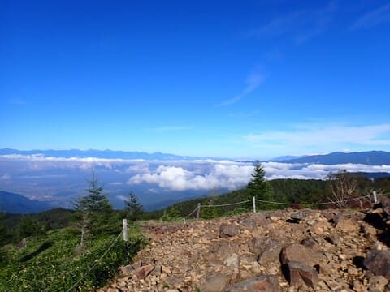

# 2023年9月，今度は大菩薩嶺へ行ってみた，その3 …親不知の頭から大菩薩峠までも快適なハイキングコース

📅 投稿日時: 2024-08-09 01:54:24

🏷️ カテゴリ: [登山・旅行](c1d637a11a25b457ac978d197adbdafc5.md)

えー．

そろそろ仕事が夏休み前のラストスパート

状態で，いつも通りのご無体状態が

続いてますが…

もう夏休みは目の前！

周りに〇日から×日まで休むと宣言したし．

お盆の来襲は会議もないし．

夏休みは休むぞ～！！

…と思っていたら．

「夏休み明けに回答必須な宿題なので…」と．

夏休み中にWeb会議を入れられてしまったん

ですが…（泣）

いいんだ．

どうせ最近は，休みの日でも仕事が追いかけて

くるのはあたりまえなので，もうあきらめてる

から……

とりあえず．

リモートの働き方が普及した最近．

「休みたくても会議やら何やらで休めない」

という状態から，

「休めるけど，休みの間も会議やら何やらが

追いかけてくる」

という恐ろしい状態になりつつあり．

果たして，どっちが幸せだろう…

と考えずにいられない今日この頃．

皆様いかがお過ごしでしょうか（すごく長い時候の挨拶）

ということで．

もうすぐ夏休み（仕事はあるけど）！

ご無体に一息ついて，深夜までの仕事はなく，

夜はちゃんと寝ることができる夏休みがやってきます！

（昼間に会議はあるし，宿題はあるけど）

とりあえず，夏休みはちゃんと夜は寝るぞ！

ってな感じの長い時候のあいさつの後は

本題へ．

昨日はスキーネタでしたが．

今日はまた山歩きネタです…

ーーー

大菩薩嶺を過ぎた雷岩から先，かなりいい感じの

景色の，理想的な山歩きルートともいうべき

コースを足取りも軽く歩いているわけですが．

ごく一部だけ，ちょっと急なところも

あったものの…

それ以外は，こんな感じのゆったりした

ルートが続く山道で…

振り返るとこんな感じの道を

歩いてきたのがわかります．

右を見ると，南アルプスのいい景色が

見えるし…

いや～．いいね…！

ってな感じで，雷岩から快適ルートを

歩くこと20分ほど．

なんだか，ところどころケルンが積まれた

ゴロゴロ小石の坂を下りると…

何か，小屋が見えてきました．

ここが賽の河原という場所らしく．

小石ゴロゴロなのがそれっぽい…

賽の河原からは，わずか標高差20m

ほどの登り返しがありますが…

これを登りきったところが

「親不知の頭」という場所らしく．

ここまで，駐車場から2時間33分．

ここからは，周りをぐるっと見渡せる

パノラマ…！！

うん．

間違いなく，大菩薩嶺よりここの方が

景色がいいよね…！

この日で一番景色が良かったのは，

間違いなくこの場所だった気がする…

この写真の向こうのピークが大菩薩嶺

ですかね．

あそこから歩いてきたんですね…

ってなことで．

親不知の頭からの景色を堪能したら…

そこから5分ほど，こんなガレ場を下って

行くと．

やってきました，大菩薩峠！！

（[続く](e1816163d74d4d15a0d8aa80d07515629.md)）
